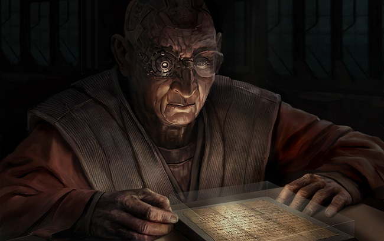

# The Book of Emptiness (Part One)

On the planet of Athra some fifteen hundred years ago, right after the Moral
Reforms had concluded and the Amarr Empire had begun its tentative steps towards
further exploration and expansion, two men were walking through a desert in
search of a sacred object whose recovery could, according to one of them, rock
the foundations of the Empire.

The two men were accompanied by a team of soldiers whose primary purpose during
the mission was to take orders from one of them and keep an eye on the other,
and not to complain when they were forced to take detours, track back or even
stop to attempt futile digs in the middle of nowhere. They were desert troops
with years of experience with sandy dunes and dry winds, and had been chosen not
only for their unyielding devotion to the Empire, but for their proven ability
of living – and more importantly, not dying – in these amber wastelands.

The reason for the detours, trackbacks and digs was the slight absent-mindedness
of one of the group's leaders – a theological researcher named Akran, a man in
his late fifties, with a mass of unruly hair that was combed only when he needed
to engage in debate or presentation; an incredibly driven man whose mind lived
in books while his body did whatever it needed to subsist. He was the catalyst
and the linchpin for this quest, having spent a fair amount of his non-research
time in argument and persuasion with some of the highest-ranking members of
Amarr, with the eventual result that, if for no other reason than to shut him
up, they'd granted him the minimum of funds and people needed to follow up on
this quest of his.

So the soldiers were also diggers led by a man looking for a secret place that
no one had visited for ages, and as the whole troupe trudged through the middle
of nowhere, a place with no natural resources, no religious significance and no
real habitability, it occurred to its other leader, a fervently religious
soldier named Skar, that this was really fucking stupid. Skar was captain of the
task squad set with finding the holy object, and despite his strong faith in God
and the Holy he wasn't even sure whether he believed in its existence, for while
it was mentioned in the Scriptures, giving him full faith that it was, of
course, real, he also believed that it was real in the same way that the faith
itself was real; a presence beyond mere reality itself, as it were.

Skar shared his team's conviction that nothing solid would come of this trek,
but Akran's own conviction was unshakeable. The researcher had created a new
style of theological theory when he posited that he could triangulate the holy
object's location from bits of scripture taken from lore that had been
previously been presumed to be completely unrelated, and after he had made a lot
of noise in the auditoriums and the press, the authorities in their wisdom had
decided they might as well give him permission and a little money to go on his
quest, and thus keep the mission academic, rather than risk having the press
focus all its attention on him. In this age of expansion they had more pressing
things they wanted attention given to, and when this particular mission of Akran
failed, as they knew it would, they could use it as a fallback if they needed to
shift the focus from other embarrassments; and besides, as Skar had been tacitly
informed, while they _could_ just have the researcher killed, there'd be someone
else along later with the same information who might not be as easily
controlled.

At last, as the day had worn on and the sun blissfully begun its cooling
descent, Akran told the troup that they had reached their destination and would
begin digging imminently, to which Skar countered that if they did, it'd be
Akran alone, while the rest of them would focus their energies on living to see
tomorrow. Responding to his command the troup unloaded their gear and began
camping for the approaching night, pointedly ignoring Akran, who did in fact not
appear to be put out in the least. The workers unloaded their tents, beige and
white, and set them up in a semicircle so that they could catch most of the
brunt of a sandstorm that was expected later in the evening, then set up Skar
and Akran's own living quarters, larger tents of far more expensive material
that would ventilate, warm and protect as needed. Skar's tent was colored
similarly to the workers', with the addition of golden strips that spiralled
down from its centre and out to its outer edges, while Akran's own was a blue so
light it was nearly cyan, an unorthodox concession of style he'd required of the
tentmakers so that the mild, filtered light shining through it would help him
study and protect the holy object of their quest.

Their two tents were located in the inner rim of the semicircle, the better to
protect them from wind and sand, and while Skar appreciated the slight comfort
this arrangement would bring, he knew that it would also force him to live
closer to Akran than he'd like, and quite possibly have to engage the man in
conversation over dinner.

As it turned out, the evening was a quiet affair, all talk being hushed by the
tiredness of their soldiers and enveloped in the lights of the stars from the
dark skies above. Staring up at the sky felt comforting to Skar in a manner
that, he thought, would strike others as completely paradoxical. On the one hand
it was a celestial covering, an extended roof on the world that enveloped him in
its protective sheath and made it a finite creation, protecting him inside this
little bubble of a world and of a life; but at the same time it reminded him of
the infinite and the endless, the vastness of the world and the unknowability of
all its wonder; and both of these viewpoints, as much as they clashed, led him
inexorably to the Lord. He felt certain that this kind of duality of thought,
and the fact he was _capable_ of it, meant he had thought through all the sides
of his faith, seeing and verifying its truths; and that certainty was important
to him, for he was not a faithful man by nature and had instead come by his
beliefs begrudgingly, after a time in his life so dark it made this desert night
seem like an oasis of joy and light by comparison. The military man is used to
being commanded, but the _good_ military man is always in command, of himself
first and foremost, and it had hurt to acknowledge that with this endless
darkness encroaching upon him on all sides he would have to give himself
completely over to a higher authority. Religion formed a large part of life in
the Amarr empire, but it was the institutional religion of rule and order, not
the visceral, internalized one of formless wonder, and while everyone professed
to worship the Lord above, what they did in fact worship - in the military,
especially - was the framework of quiet devotion and worship where the army, if
anything, was a modernized version of the cloisters of old, with the same
selfless giving, and the same striving to meet a higher goal. But for Skar it
had not been enough, and at last there had come a time where the framework on
which he had hung his cloth of faith felt as empty as his own insides and he
decided to let its true owner in at last; a loss of control he still resented,
and a frustration he readily admitted to himself, but it was and would remain
the greater and only choice: to entrust his fate to the hands of the Almighty,
to accept life's storms as a passenger instead of the oarsman, and to see the
world no longer merely as it was and no more than that, but through the
imperfect eyes of a vessel of God.

And now here was Akran, an annoyance of a man who wanted to see behind the
curtain, to put his interpretation on God's words and glean not their hidden
meanings but the meaning behind those meanings; and, certainly, also a well-read
and intelligent scholar, one who had managed to attract to an area of
theo-archaeological research that had apparently been quite neglected, and who
had already accumulated some impressive finds of religious artifacts, all of
which had resulted in this journey into the desert.

As they supped on the usual glutinous mix of fatty meat and potatoes, Akran said
to him, "How do you feel about finding the Book of Emptiness?"

Skar stopped eating and looked at him. It was the first time they had mentioned
the object's name in quite some time, and hearing it from Akran's lips had the
same faint whiff of blasphemy as before.

"It's for the good of God and Empire," he said. "That's all that matters."

"Is it now?" Akran said, calmly ladling more food from the pot and onto his
plate.

Skar didn't know whether to be annoyed or careful. The researcher might be here
by the grace of others, but he had not achieved that grace through being a
simpleton. The two men had spent a few nights camped out in various parts of the
desert but had not held a whole conversation yet; Skar's mind had been on faith
and darkness, while Akran had constantly been going over his notes and trying to
better triangulate their quarry. This was the first time he was this relaxed,
which Skar took as a sign that they were about to do their final dig.

"Had you heard of the Book?" Akran asked.

Skar, an autodidact of anything to do with his faith, made to answer, then
stopped. He hadn't been asked whether he'd read about the holy object, but
whether he'd heard of it, and thus reasoned he wasn't expected to share his
knowledge of the theology, but of Akran's research into it.

"I knew you were holding lectures on it. And that you got enough support from
Empire to take us on this journey. That's all," Skar said. The liquid in his
bowl glimmered oily in the light of the fire.

Akran cleared his throat, and Skar knew, just knew, that he was about to hear
one of those lectures. He looked to the stars, quelled a sigh and gave quick
thanks that at least he'd been spared the proselytizing until now, then looked
back down at his bowl and waited for the words.

Ages ago, Akran said, a brilliant philosopher whose name had been lost to
history had become so dissatisfied with the limits of his native tongue to
express what he saw on the inside of his head that he created a symbolic
language, similar to maths, with which he could describe such concepts as truth,
beauty and reality in specific terms without having to go through the whole
definition rigmarole that identified much of modern philosophy. This was not the
first time someone had attempted such a thing, though it was usually the domain
of mathematicians and some of the more experimental theologians, and despite the
man's fame for inventive capacity it was not treated with any great amount of
seriousness or interest. That was, until he released the first draft of his book
to a select group of readers who read it and became, in the oft-quoted words of
an unfortunate Empire enforcer who found them and later disappeared, beautifully
insane. They were not catatonic, but spoke only under certain specific
circumstances, in which they would let out a torrent of glossolalia that always
begun with the phrase "I have not read the Book of Emptiness," then instantly
turned formless and wavery but remained coherent and, in fact, absolutely clear.
They spoke, if such a term may be used, about the absolute reality of the world
in which they lived, and as with any other organism that exists under absolute
reality, it may be said that they were insane, but it was not a lack of sanity
that afflicted them; rather, a sense that reached beyond mere identity and
utterly unified them with the world. The ones who heard them later reported that
the sounds that entered their heads left them momentarily unable to filter,
judge, avoid or ignore any aspect of both the physical and the metaphysical
realities in which they lived. In short, the entire world was revealed to them,
and they saw themselves both as the inherent parts of it and outside of it, as
if they were the viewer and the viewed all at once.

In less enlightened societies this kind of behaviour would have been seen as
heretical and would have earned everyone involved a brief and smoky stay on a
pyre, but at that point in history Amarr was remarkably tolerant to aberrant
behaviour. As Akran remarked to Skar, the religious history of the Amarrian
Empire could in some way be seen as the ocean: The force with which it weighed
down the free expression of its fringe elements would ebb and flow like the
rising tide on a wayward beach, periodically washing in to quell and suffuse the
sands of thought before receding again for long enough to allow the little
kernels to cast off their influence and take to the winds. In this case, the
philosopher's books were captured and destroyed, the people who'd read them were
given free medical treatment, which in a couple of cases turned out to last for
perpetuity, the people who'd heard those people speak were given paid leave
until such point as they could see fit to return to work, which they all
eventually did, and the philosopher himself was given the choice of either
cutting it out and becoming a productive member of society, or following the
traditional rule of mad prophecy and taking it out into the desert. To the
disappointment but little surprise of the ruling body, the philosopher chose the
desert, and was rarely heard of again. Snippets of his conversations with the
desert tribes could be found in various of the lesser scriptures, but they made
little sense at the best of times, and whether due to translation issues or
madness on the philosopher's behalf it had been assumed for a long time that his
career and life's work had effectively turned to ruin when he first set foot on
the sandy dunes, never to return, and never to be found again.

Until Akran came along, a long time later, and said that he understood.

He had not been able to comprehend the philosopher's entire dialogue to the
desert folk, and he readily admitted this, but he had nonetheless managed to
piece together and retranslate enough to figure out where the philosopher had
buried the last remaining copy of the Book of Emptiness. Right here, on this
spot where they had camped.

Skar closed his eyes.

"You think we won't find it?" Akran said, in a tone Skar couldn't rightly
decipher.

Skar thought about his answer for a while, then said, "I think each one of us
has to find it on their own."

Akran laughed quietly at that. "Good answer, soldier," he said. "And now I'm
going to get some sleep. With God's grace, tomorrow we'll all find what we're
looking for."

To be continued…
