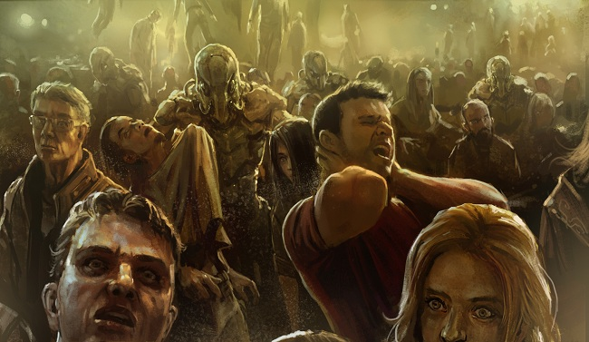

# Uplifted

Anyone who happened to be watching the exact point in space would only have seen
a slight visual distortion against the stars. In the blink of an eye, the
gravitational force of a star was generated over just a few short kilometers,
compressing the fabric of space-time into a temporary singularity. The
reverberation of that mass, when the remote graviton pulse wave that had tricked
the physical laws of the universe subsided, produced a connection between two
non-corresponding locations in the universe: a wormhole.

The event horizon immediately set off early warning sensors on the world below,
basking in the radiance of its warm, yellow sun. Local forces were mobilized,
but before they could act, the Sansha auto-replicating virus batch was already
relayed and being broadcast from every major structure in the system –
stargates, stations, and even planetary networks. The invasive programming
quickly overwhelmed the inferior systems of the civilian infrastructure, local
garrisons, and, though they would not admit it, most of the Gallente
Federation's navy ships.

Then the wormhole let out a searing burst of white light, and they came through,
bulbous metallic vessels covered in wicked, uneven spines. Hundreds poured from
the shimmering portal, covering light years of distance in a single instant to
cloud the skies above the helpless planet. Almost fishlike, darting in loose
formation and changing direction simultaneously, they spread out in all
directions. With synchronized releases of focused electromagnetic blasts, they
smoothly wiped all defensive structures and communications satellites from
orbit. For many people on the surface, the sudden glare of golden laser beams
lancing across the night sky was the first sign that Sansha's Nation had
arrived.

When it had secured the entire lower orbital altitude, the armada held position
until a second wave of ships emerged from the wormhole. These new vessels were
different, though, lacking the bulky warp drives that took up so much space in
the combat vessels; instead, their cavernous cargo holds had a very specific
purpose, housing rows and rows, layer upon layer of holding cells designed to
store humanoid "passengers." The ships dropped through the atmosphere unimpeded,
by squadrons, a perfectly orchestrated meteor shower.

The hypnotizing spectacle of the massive bronze ships, still glowing from the
heat of atmospheric entry, turned to panic as they slowed to hover several
hundred meters above the ground. A horrible grinding rolled forth from each one
as gigantic bay doors slid open, unleashing a barely visible cloud of buzzing
creatures that glittered as they caught the light. Undetectable except in vast
quantities, these tiny cybernetic parasites drifted down over every population
center, almost weightless, wafting in through unshielded windows, exposed
ventilation systems, even exhaust ports that lacked the proper filters used on
more densely populated worlds.

Before the victims below could understand what was happening, the nanites had
already passed through the outer layer of skin, navigated the bloodstream, and
attached themselves to the base of their spinal cords. When enough of the
insidious little things had amassed in a single person, they begin to emit
rhythmic electrical pulses – not enough to disrupt higher brain functions, but
more than enough to overpower the simple neural pathways below the neck. People
screamed and shouted, struggled in vain, and cried pitifully for help, but their
bodies wouldn't respond. They walked out into the green tinted glare of
wide-angle tractor beams, which lifted them off the ground by the thousands.
Their bodies tumbled slowly, out of control, up into the waiting dropships. 

But then the dark sky lit up with different colors. Sparkling blue explosions
and brilliant red contrails streaked across the night. The capsuleers had
arrived.

Arriving sporadically at first, then in greater numbers and with more
organization, they warped onto the battlefield in high orbit above the planet
and opened fire with reckless voracity. Their ships' advanced electronics
systems and powerful defensive measures shrugged off the Nation's viral
broadcast, allowing them to unleash a hail of guided missiles, artillery slugs,
and incorruptible attack drones. They punished the Sansha vessels with their
assault, but suffered a coordinated counterattack as the invading fleet
systematically chose one target at a time, focusing all of its considerable
firepower against the unfortunate subject.

Sensing the imminent danger to their ground operation, the dropships began to
lift off of the surface all at once, not quite full yet, taking tens of
thousands of citizens with them. They rocketed back up through the atmosphere on
solid fuel jets, back to the safety of the wormhole. Stray weapons fire from
both sides caused more than a few of them to explode, get knocked hopelessly off
course, or suffer hull breaches, sending thousands of paralyzed humans spiraling
out into space.

For over an hour the battle raged, until the intervening void was clouded with
dissipating particulate matter, the twisted wreckage of starships, and the
corpses of those who had once crewed them. By that time, capsuleers had gained
the upper hand, their resilient starships taking on many times their number of
antiquated Sansha battleships.

The wormhole pulsed once more, sending static through every local starship's
sensors. When scanners came back online and searched for targets, a new contact
had arrived: The massive carrier was shrouded in a layer of projected energy
shielding so thick that one could barely see the heavy armor plates beneath. The
fighter bays along the monstrosity's hull were closed, for it had no intention
of launching any. Instead, its supplemental capacitors spun to life, sizzling
with an overabundance of power as relay switches connected them directly to the
built-in shield emitters. The field created was far more powerful than a normal
shield but highly unstable. That was the point.

A tremendous blast of energy spread out in a spherical pattern, physically
pushing ships away with the crushing force of charged gravitons. Attack drones
simply evaporated as the weapon, designed to cause significant damage to much
larger ships, reduced them to glittering pieces of superheated metal. Smaller
capsuleer ships survived one or two bursts, perhaps, but by the time five waves
had passed, everything smaller than a cruiser had disintegrated.

The capsuleers adapted to the situation quickly, though, adjusting their
trajectories and cycling new ammunition into their weapons. Mere seconds after
it had arrived, the carrier was inundated with a withering barrage of
destruction. Scorching laser fire, armor piercing projectiles, tactical
warheads, and superheated plasma bolts rained down until even its remarkably
powerful shield system was spent. It listed awkwardly in space after losing
control, but only for a few seconds before the relentless capsuleers closed in
to finish the kill. After a few moments of smaller explosions tearing apart
individual segments of its hull, the Sansha carrier's thermonuclear generator
released a blinding flash of light, incinerating the entire internal structure
of the ship and leaving nothing but a charred husk of superstructure behind,
slowly spinning as pieces continued to break off and drift away.

Unable to sustain a viable signal with the flagship destroyed, the wormhole
wavered slightly, then vanished, abruptly ending the communications static and
returning the system to a tentative state of normalcy. The invasion had ended,
but the war was long from over. The capsuleers who weren't busy salvaging the
wreckage or attacking one another over the right to do so warped away one at a
time or in small groups. They didn't know when or where Sansha would strike
next, but they knew that, with each empire's defenses caught off guard and
rendered all but unable to respond, they were New Eden's only hope for a
sustainable defense.
