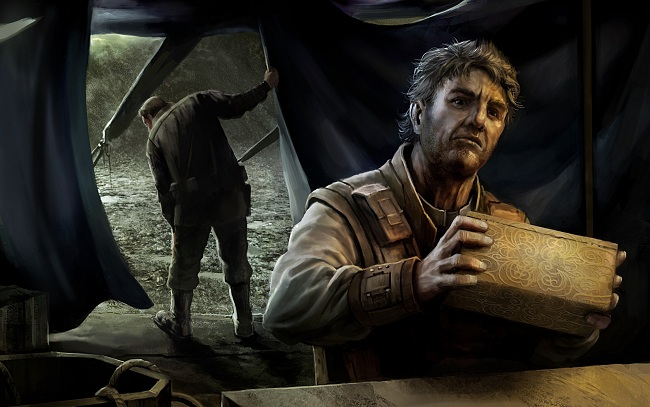

# The Book of Emptiness (Part Two)

They got up while it was still cold and blue, and as the desert sands warmed to
scorching temperatures they dug for the Book. Akran presided over the
excavation, giving out directions that went mostly unheeded, while Skar pitched
in with his men and gave them the orders they obeyed. In the afternoon the heat
was alleviated a little by increasing gusts of wind, but the relief was
short-lived. By early evening the winds had picked up, visibility was dropping,
and clouds had started to pile up on the horizon. The sand got into everything,
and all nonessential conversation faded away as the diggers focused on the
ground, their mouths pinched shut and their eyes narrowed to slits.

The weather got progressively worse. Skar began to wonder whether it was a sign
that they were in the wrong place, or even if they should not be there at all.
The soldiers did their best to shore up what had at first been a deepening hole
but was increasingly turning into a well. Akran was clearly worried that if they
discovered the Book the rain would damage it, and paced around muttering to
himself. The entire thing seemed on all levels to be turning into useless
sludge.

It was just before midnight, as the winds had turned to gales and the rain was
pelting them from all sides, that the soldier at the bottom of the hole stopped
digging and began waving to the people up top. Skar was called over, then Akran,
and together they stood in open-mouthed amazement as the soldier called for
ropes to be tossed down, and for more light, more light.

They worked at it with the fervor of the terrified, pulling because they didn't
dare stop, not even slowing when one soldier pulled so hard he lost his footing
and slid into the hole. He hadn't broken anything, he shouted, though he might
have twisted his ankle, but it seemed to Skar that the rest of them wouldn't
have cared either way. Skar was terrified, too, and felt sick to his stomach.

Eventually the ropes were affixed and the bounty pulled up to ground level. It
was a box about half the size of a man, made of metal and varnished with a
solid, opaque coating that Skar wasn't familiar with. He only had a moment to
regard it before Akran shouldered him aside to get to the box, and he smiled
despite himself, happy that someone in the group was so excited at the
discovery. His stomach felt made of lead. The box shouldn't have been here, or
anywhere except in the text of the scriptures.

Before Akran could do anything foolish, Skar ordered the soldiers to haul the
box into camp. One of the soldiers asked if it should go into Skar's tent, but
Skar shook his head and ordered it placed in Akran's. He saw on their faces that
they agreed with the decision, even if it was edging off protocol; Akran was
fairly hopping about in eagerness while the rest of the troops were exhausted.
In truth, Skar wanted the thing in Akran's tent because he knew he'd get no
peaceable sleep if it were in his own.

The troops dragged the box into the academic's tent, where it dripped mud and
wet sand onto the floor. They left it there and marched out wordlessly, leaving
Akran hunched over the box in rapt fascination and Skar standing behind him not
quite knowing what to do next. His dilemma was resolved when Akran asked him to
pry open the box.

"I'm sorry?"

"This box. I need it opened. I believe we have a pry bar somewhere in the
toolbox." He waved at a large bag sitting in a corner of his tent. The troops
had taken turns carrying it.

Skar couldn't help himself. "Are you sure you should be doing this?"

 Akran gave him a gently admonishing look. "This is why we are here, soldier.
Pry it open, please."

"Is there even a faultline?" Skar said, feeling like a child trying to avoid
going to bed.

The academic pointed at a thin line that circumscribed the middle of the box.
"Halfway through. So long as you hit it on the mark the seal will give, with no
damage to the box."

 "Should you be doing this? If the … if the Book is located inside, it might be
affected by any number of things. The wind, the humidity in the air, anything.
It should be taken out in a -"

"Safe, nice research institute where a lot of boring old men will pore over its
covers until the end of time without ever opening the damned thing," Akran said.
"Open the box, please."

Skar saw no choice but to obey. He retrieved the pry bar and held it in his
hands, regarding the box and Akran, who had stooped over again to study its
inscriptions. Skar stood like that for a moment, lost in dark thought, then
cleared his throat and let the academic step aside before he started working on
the faultline.

The seal cracked easily, and Skar stood back in confusion before realizing that
of course he'd need to help Akran lift the lid off. He made his hands be still
before grasping the lid and holding tight, putting as much effort into it as he
could without embarrassing the thin and reedy academic holding on the other end.
It felt good to use his strength on the box, even if it also felt a fair bit
sacrilegious.

Once the lid was off, he made himself look inside, hoping against hope he would
see emptiness.

The box contained another box, this one made of marble and decorated with
impossibly ornate carvings. Skar looked at them for a few moments and felt
something in his mind begin to drain away, but the gale of the wind and the
patter of the rain brought him back to normal. The marble box also had a
faultline in the centre but was not sealed, and Skar felt his eyes drawn to one
of its corners, where a brownish piece of scroll poked out. A small, tattered
piece of the Book of Emptiness, poking its edges into this world.

Skar walked out swiftly, marched a few steps behind the tent, vomited quietly,
and walked back into the tent. Akran didn't seem to notice.

"Now that you have it, what are you going to do?" Skar said, keeping his voice
as clear as he could. "Open the second box?"

"No. I was almost certain that there'd be a second container inside, and I
wanted to see what it was like. The piece of scroll poking out is certainly
fortunate, so I'm going to snip off a tiny bit and put it to some tests. Other
than that, I'll be focusing on the box, documenting some of its decorations for
future study, and doing some initial tests on the sealant to make sure it's as
old as it should be. I don't expect to sleep much tonight," he added with a wry
grin.

"So you won't be studying the book," Skar said.

"Not until tomorrow." Akran nodded towards another well-stuffed bag in a tent
corner. "I'll have your men set up the surgical tent, the resealable one with
the sterile inner cover, and I'll look into it then. Imagine that. It will be in
our hands tomorrow. Just think what new truths it might hold!"

"There are no new truths," Skar said weakly, but Akran had already turned back
to the box. Seeing he was no longer needed, Skar turned and headed back to his
tent.

He made ready to go to sleep, but couldn't concentrate. He was good at keeping
his mind focused on the task at hand - and after having found religion, he had
become very good indeed at letting go of all interfering thoughts - but his mind
was fast becoming a blur now, and he wasn't sure what to do. The Book shouldn't
exist, he felt. It shouldn't exist on any level, because its mere presence
brought the Lord into this physical world where He had no business being.

The Book was wrong, and Akran was wrong, and this whole thing was wrong.

Skar lay on his blanket, feeling the cold from the midnight sand seep into his
bones.

He couldn't get those marble carvings out of his mind. The grooves that twisted
and turned in on themselves, like snakes eating their tails. The knots and
curlicues that looked like words but on closer inspection would dissolve into
abstract symbols the likes of which he'd never seen in scripture.

And that piece of scroll sticking out, as if trying to squeeze its way from some
terrible beyond and into this world, right into Skar's own head.

He turned to one side, then turned to the other, and then lay on his back,
staring at the roof of his tent, unseeing and near panic.

Years ago, when he'd buckled and become faithful at last, his fall into faith
had been terrifying and liberating all at once. He remembered that feeling,
though he rarely thought of it. There had been a moment of quiet realization,
where he understood that he had made up his mind long ago, and had merely to let
his actions catch up with him.

He lay there on his bed, sleepless and unquiet of mind, and wondered what else
he was waiting to do.

* * *

"The academic is dead."

The soldier assembly stared at him. It was dawn. Skar stood in front of Akran's
tent.

"We need to prepare the corpse for transport," he said. "I want two volunteers
to unwrap the surgical tent and convert it into a shroud. It's careful work, and
if anyone has a problem with the next part - which you all know what'll be -
you're better off abstaining. The rest fills in the pit, preps for leave, and
gets some rest. We leave at sundown."

Two men got up and wordlessly walked past Skar and into Akran's tent. Skar
followed them.

The academic lay on the floor. His skin was white and his lips were blue. There
was no blood and no visible signs of the cause of death. The soldiers got to
work on taking the wrapped tent to pieces without disturbing its disinfected
surfaces. Akran had good standing in Amarr society, and transporting his body
for several days in the desert's sweltering heat wouldn't do anyone's career any
good.

"We're leaving him in here until tonight," Skar said. "I will assemble his
things and say the rites."

The soldiers nodded and finished making the shroud. Together with Skar they
wrapped up Akran's body, sealing him inside the shroud as tightly as possible.
The mummification was vital but had to be done right. Loose ends during
transport could unravel the entire mission.

Once the dead man's body was taken care of, the two soldiers left the tent. Skar
remained, looking around and deciding what to do next. The rites were important,
but they needed to be said with a clear mind. Despite his professional
demeanour, he wasn't anywhere near that point.

Akran was dead. Akran was dead, and the Book of Emptiness lay inside this room.

Skar considered setting fire to it, but broke off that chain of thought. There
was heresy, and there was worse.

He walked over to the marble box, which lay unopened on a makeshift workbench.
The corner of scroll still stuck out from one side. Akran had not gotten to cut
his piece from it. Skar felt remorse about that, for some reason.

The box lay completely still, of course, but the carvings on it made it appear
to be writhing.

Skar wondered about faith, and about tests of faith.

He breathed deep, then reached out, lifted off the top of the box, took hold of
the scroll inside with both hands, lifted it out and began to read.

* * *

It was written in the old tongue, but made sense in the hyperreal way that dated
texts sometimes do, where you understand their meaning without even being able
to comprehend their precise grammar or flow of thought. The content was a litany
of truths, at first establishing the base precepts for a foundation of
philosophy, then the cornerstones of the same foundation. As Skar read he
noticed the sentences getting progressively shorter, the grammar turning not so
much cryptic as purely alien; words were placed together that shouldn't have
been, but that now far better conveyed a higher meaning. The sentences kept
getting shorter as the concepts they described got at one time more abstract and
more specific, adding complexity not only to the concepts but the interplay
between them. Old ideas would reappear in new forms that affected not only the
text surrounding them but chapters that had passed much earlier, including the
original concepts themselves in an infinite recursion. The handwriting changed,
too; words began to mesh, loops and protruberances changed to mirror versions of
themselves, and individual letters were extended, skewed or even drawn only in
part. Skar's mind raced to keep up with the flow of information, but it was not
even a conscious effort. Once the philosophy inevitably turned to God, Skar
began referencing its message to what he remembered from scriptures. Again he
found he didn't have to think about it; it happened automatically, in some part
of his mind he could not reach. Information came in, unfiltered by sense or
synapse, and understanding flowed out in increasing amounts, undeniable and
unstoppable. The sentences melded into whole words, multisyllabic and complex,
each of them stating truths Skar had barely imagined before. The words became
shorter and more ornate, taking on varying dimensions. There would be one that
he knew was truth, and another that was the afterlife, and justice, and
physicality. They did not so much reveal new truths as remind him of what he'd
always known but filtered out. The words became more and more wavy. They looked
as if they were writhing on the page. Skar rubbed his eyes but it didn't help.
It was almost as if he kept reading even when they were closed. The words had
turned into abstract symbols. They had no recognizable lettering. All there was
on the page were lines and dashes. But they managed to convey their essence to
Skar. He kept reading and the symbols began to dissolve. Their lines separated
and took on their true meanings. All were unfettered of interfering context.
Each line had been boiled down to its barest essence. Each line held the
undeniable meaning of a concept. There was Fire. There was Cold. He saw Black
Mountain. A dark Sea. A Flight. This Freedom. This Truth. An Honesty. A Death.

And as Skar came to the end of the scroll he felt everything inside of him give
way, understanding brought to the barest essence at which nothing could stand
between you and the truth, and in which your only possible claim to have read
and understood the Book of Emptiness was to deny it, to kill it, to go beyond it
and into the realm of pure knowledge and being. Skar said out loud, "I have not
read the Book of Emptiness," and it was true; he had not, for the Book now
represented only yet another obstacle on the path he had been on all his life
until reaching this end, this breakthrough, this apostasy; and denying it was as
tantamount to ascendancy as refusing the rest of the world's hold on him. He
felt himself on the edge of reality itself, pressing against it, pushing through
and feeling himself in the other end as a different creation he had been, a
second person, as you would feel when you left behind the final words and rose
beyond reality as it was, seeing it objectively, not as a god of creation but a
god of spirit, an observer through whose thoughts the world is created. You let
go of your tenuous grip and move further, completely beyond that reality and to
a place it can never follow you, a place of godliness and an infinite melancholy
of realization, leaving nothing behind but the symbols and the world that now
has become its inverse and is merely the fading embers of an imagined thought,
your imagined thought, fading away, approaching the end, and now gone at last.
