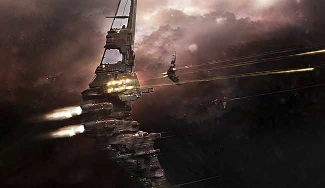

# Particle Tracks

The Glittering Dream. How banal, the man thought. He stepped out of the transit
tube to the top level of perhaps the most famous nightclub in the Federation and
walked over to the bar. The place was, by its standards, quiet and the crowd
parted easily before him. At the bar, he glanced in the vast crystal mirror
behind it and noted his own classically Deteis features with a wry grimace.
Ideal, always ideal without pre-conditioning. He used the mirror to scan the bar
behind him while he gestured to the barman for a drink. May as well play the
game. 

The woman wasn't difficult to pick out. She was looking directly at him with a
faint smile playing about her lips and laughter in her eyes. He shook his head,
picked up his drink and walked over to her table, set at one corner of the vast
western picture window. Ignoring the breathtaking view of Caille by night, the
man looked down at the smiling woman with a frown.

"I'm a busy man, Yani. I can do without the theatrics."

The Gallente smiled more broadly and gestured at the chair opposite her with an
elegant and perfectly manicured hand. "My dear old friend. Always the direct
one. Please sit, talk with me a while and perhaps the, ah, 'theatrics' as you
call them will make a certain amount of sense."

The man remained standing. "I agreed to this meeting for two reasons. First, you
weren't the one who broke contract on me. Second, I'm frankly curious as to what
you've been up to since the takeover. That curiosity is what's keeping me here.
But it has limits, Yani, and you'd best come to whatever point you want to make
quickly." 

Yani sighed and held up her hands in a placatory gesture. "Very well but,
please, sit, "she said. "After all it will be easier on both our necks, no?" The
man grunted and sat down in the indicated seat, at right angles to the woman. He
took a sip of his drink, raised his eyebrows and looked at Yani with renewed
interest. 

"Good, yes?"

"Surprisingly good."

"This is part of what I want to talk to you about. Let me thank you for coming
here. I realize you were taking something of a risk…"

"Minimal," the man interrupted.

"Well, just so, but by coming here you put yourself on my home ground, so to
speak, and I appreciate this."

"_Rare is the chance to destroy your enemy away from his home, therefore
consider his home your ideal ground._"

* * *

The Talos-class battlecruiser banked around the wreckage of its erstwhile
target, riding out the shockwave effortlessly as its blasters swivelled back to
the center line. The Rokh pilot was still cursing over the local band but he
must have understood he hadn't stood a chance. Just thrown in the multi-scenario
mix along with the rest. The Talos pilot smiled in his mind. Pride was a
notorious failing of his kind. He'd fallen prey to it enough times himself. Kind
of pointless to get upset in here, though.

Ah, the controllers were speaking into his mind again. Annoying, like a rasp on
the skin. Something artificial to him. Not like the NeoCom. What's that? They
wanted him to take on a Drake in close-quarters. He locked down the reflex
reaction. This was a job, they were paying and what did it matter in the end?
Maybe the Drake would be a suboptimal fitting. Heavy missiles and slaver's
breakfast shield-tank perhaps? Even so, he didn't fancy his chances.

These basic one-on-one scenarios annoyed him. OK, they happened, sure. Every
variation happened. He guessed that was the point. He was slated to continue
testing for a few more days. Real time. That was a lot of scenarios in here. He
groaned inwardly, partly at the thought of the grind he'd just realized lay
ahead of him, partly at the sight of the Drake accelerating to meet him. Damn.

* * *

"_Rare is the chance to destroy your enemy away from his home, therefore
consider his home your ideal ground._"

"Well, now. Analects of the Raata Empire?"

"No, the War Commentaries of dos Rouvenor. More appropriate to this setting,
surely?" The man suddenly grinned but the smile didn't reach his eyes.

"Your point is well taken. In fact, it is more relevant than you may realize."

"Yani, those limits I spoke about…"

"Of course. First, do you require any further guarantees of security?"

"No. Get on with it."

"As you wish. No doubt you're aware of the latest arms race between the core
empires?"

"I am aware of many arms races, Yani. I make it my business. You know, all this
may not take much time out there," the man gestured vaguely upwards, "but it
does take some time, and yours is running out."

"Understood. I'm speaking of the new battlecruisers. These fast attack,
heavy-hitters the empires have decided are the new paradigm in warfare they're
going to try out."

"Oh, those. Yes, of course I know about them. What of them?"

The woman smiled and unfolded her hands. The Deteis noticed that she was wearing
an exquisitely cut and polished black gemstone on her left ring finger. Despite
himself he smiled too.

"You're familiar with the pattern of this particular escalation. The Amarr came
up with the _Oracle_ – a ship design quite out of character for them – and the
rest either dusted off some old concepts or rushed new designs through. We've
seen this kind of thing before."

The man sighed inwardly, but gestured for Yani to continue.

"The interesting aspect of these ships is that, as an attempt to shake up the
Empyrean War, they're all designed around the capsuleer market and as such…"

"…as such the designs will be on that market very soon. Yani, please tell me you
did not drag me into this ridiculous proscenium in order to breathlessly offer
me advance copies of starship designs that will very shortly be available on the
open market. Please tell me you do not take me so lightly that you imagine I do
not already have copies of said designs. And please, for the love of the Winds,
tell me that you have not completely wasted my time and your own with this
nonsense!"

Yani sat back a moment and regarded the Deteis with hooded eyes.

"Evidently, you take _me_ lightly, old friend."

The man looked down, took a sip of his drink, marvelled at the taste and feel of
it once more, and looked back up at the woman.

"Point. I apologize. Please continue."

"What I was about to say is that as warships intended to upset the balance of
the Empyrean War, each of these designs have been put through a crash program of
testing with capsuleer pilots. The problem, of course, is that to test the
scenarios adequately requires time. But the empires didn't want to wait – each
of them is afraid the others will put these monsters out before themselves. What
could they do?"

An inkling of where the woman was going begain to creep across the man's mind.

"They tested everything in virtuality."

"Precisely so. More than that, they tested everything in the most sophisticated
virtualities available to them."

What Yani had been driving at all along flashed the remainder of the distance
across his mind and stood starkly before his apprehension like a blazon.

"A tank. You're talking about a tank."

* * *

Magnificent, thought the pilot as he took up his position in the ten-strong
attack wing of Oracle-class battlecruiser. He'd fallen in love with this new
design as soon as he'd seen it in holo. To actually fly one and fly alongside
others was wonderful. Well, he caught himself, not _actually_, but near enough.
This virtuality was the best he'd ever experienced. He'd heard of the tanks, of
course. Everyone with practical knowledge of naval warfare in the Empire had.
Combat information virtualities capable of simulating space battles in perfect
resolution, at many times the speed of reality. They were used for research,
testing and, most importantly, during combat itself. All the major powers used
them but he believed the Empire had the edge. How could it be otherwise?

Knowing of the existence of a thing is not the same as experiencing it, though.
Much like God, at that, he mused, before clamping down on that possibly
heretical thought. He didn't think his connection with this virtuality laid bare
his every thought to Pulpit Command, but after all it was best not to take
chances. He brought his concentration back to the attack run. They were closing
on the targets quickly, a group of three Typhoons. Dangerous opponents in the
right hands, but they surely couldn't stand up to this much firepower.

Warp tracks. A lot of them. Small signals. Destroyers. The Typhoons had an
escort group. The Pulpit channel briefly, and slightly irritatingly, confirmed
the attack run was to continue. This was what they wanted to know, then.
Presumably the scenario without the destroyers had been run in several
variations already with other pilots. He'd been rotated in off a very repetitive
sequence of attacks on Tempests at close range. It hadn't gone well for the
artillery-equipped battleships. The pilot mentally shook himself. He needed to
concentrate, treat this as if his implants and clone contract were at stake. The
coming fight promised to be quite interesting.

* * *

"A tank. You're talking about a tank."

"More to the point, I'm talking about several tanks. To be precise, the
Carthum-Viziam Military Research Virtuality, the Duvolle Quantum Holography
Facility, the Hyasyoda Naval Research Cluster, and Project Dreamwalk. That last
one is the rather picturesque name the Minmatar gave to their
military-industrial virtuality program."

"Yes, I know. I also know that any one of the primary tanks operated by those
organizations is as secure as any virtuality gets. I couldn't even speak for my
own primary tank being as secure. Hell, the Duvolle facility is an off-the-books
mirror of the Black Eagles VCIC. There's no way anyone's getting into it."

"Ordinarily, you'd be right, about them all. As it happens, the Duvolle job was
relatively simple and served as the template for the others when it came to
ironing out the technical details."

"You're joking."

"I invite you to consider the design history of the Talos."

"By K'vire!" The man was sitting bolt upright now, his mind racing with the
possibilities of what he was hearing. He had a thousand questions but as of now
there were only two important ones. "Alright then, Yani, you've got my
attention. What are you selling and what are you asking for it?"

The woman smiled.

"Let's start with the price. I recently liquidated some interests in the
planetary development field. As you know, I've always had an interest in
capsuleer infrastructure but generally as a means to an end. It was the same
this time and the handover deal with InterBus was very lucrative indeed."

"InterBus? You mean to say…"

"Just so."

The Deteis shook his head wonderingly. "That was deftly done, Yani. I had my
people look at the conglomerate the SCC brought in to operate the planetary
customs offices. They couldn't find a hint it was anything more than a
partnership of chartered investment trusts."

"In essence, that is all it was. It just so happens that by one means or another
the majority of those trusts are controlled by me. I had them play their part in
setting up the network…"

"…and meanwhile you started the pressure to end the monopoly through political
proxies. No more DED protection in the outer worlds. No more station-grade
shielding. Sell the outer network to a 'neutral party'. Ha! I still can't
believe InterBus took them on."

"They do not understand the outer regions as you and I do, Muryia. They think
they can raise the tariffs and people will respect their neutrality. Alas for
them. But not for me." The woman smiled broadly.

"You must have made an emperor's ransom out of that deal." The Deteis took
another sip of his drink. "So you don't want money. You want a favor."

* * *

The dreamwalker resented the intrusion of these others in the Dream. They had
come with the Tornado and he resented the swift-sailing wing of a ship for it.
Perhaps unreasonably. But he resented the others. They did not even feel the
sting of dreamshock when they failed. How could they possibly try their utmost
without it? Some of the dreamwalkers said these others felt something akin to
it. Something of their own making. He doubted it. They were not dreamwalkers
even if they walked in the Dream.

Yet they did walk in the Dream and they could be the cause of pain if he did not
take care. His charge today was a Zealot. Like the others in the Slaver's Fang
dreamclan, he specialized in the ships and weapons of the Great Enemy. In the
Dream, he knew nothing else but his duty to fly the golden ships to the best of
his ability. That and the dreamshock should he fail in that duty. His fellows
were in a variety of Amarr ships, in close assault formation. Some Crusaders, a
few Retributions and several Zealots. Off in the distance, the others. In their
Tornados. They seemed to sail lazily through space, like birds from a dimly
remembered other time.

The Shamans were speaking. The pattern for the battle was laid out in their
chanting and it signalled a charge on the foe. The Crusaders seemed to skip
ahead, angling to avoid the direct line of approach. The rest of the ships
followed, taking wider angles than their smaller and much faster brothers. The
enemy were approaching, which meant they were using autocannons, but they would
try to turn this into a tail-chase. The Crusaders reported making scramble on
several targets, shutting down their microwarpdrives. Several reported being
counter-scrambled. Interesting. A few also reported webbing and
tracking-disruption. The dreamwalker mentally smiled. Foolishness. The mixed
electronic warfare across the enemy fleet was a good idea in principle, but to
reveal the hand by using it all on the Crusaders indicated panic. The others
would not win this fight.

* * *

"You want a favor."

"Correct." The Gallente woman played with her black gemstone ring. "You know me
well enough to understand that I want back that which was always mine. That
which I built. And I will have it back. The Snake wanted his takeover to be
legal, in his twisted way, so legal it was and the stock is still traded."

"Stock you've been quietly acquiring, I presume."

"Yes, I now control sufficient stock to promote my own proxies to the board.
Crucially, the corporation still controls a large reserve of stock that can be
issued by qualified majority decision of the board."

"You can't have bought enough stock to control that kind of majority… so, you're
going to buy Sarpati's nominees out from under him?"

"Precisely so. Our old foe has one blind spot. Even as corrupt as he is – so
corrupt indeed that he would gladly pay for the pleasure of selling himself –
his pride prevents him from realizing that a bought man, even a man he has
purchased body and soul, can generally be bought more easily the second time."

"And you have the ready cash to do it. I think I see what the favor is. Even
with you two vying for control on the market, all that gives either of you is
legal recognition of sovereign ownership at the Assembly. You need enforcement
and that's where I come in, yes?"

"Yes. I realize that you are heavily engaged with various ongoing contracts but
I am not asking for space superiority coverage."

"Just as well," muttered the Deteis.

"What I need is the wherewithal to board and seize the stations. Once I have
them, my possession combined with legal title and the newly-coded DED-grade
station shields that will come with it, will check the Snake. I would naturally
value your services under an ongoing station defense and patrol contract."

"I bet you would. Well, that's going to depend on what you've got to offer.
They've shut you out of those tanks by now, I take it?"

"Of course. It was to be expected that any intrusion into facilities of that
kind would have a relatively brief half-life." The Gallente woman shrugged
slightly. "Fortunately our bandwidth was wide enough to extract a considerable
volume of tank telemetry in each case."

"Incredible," whispered the man, half to himself. He finished his drink, the
marvellous sensation cutting through his thoughts again, then looked up sharply
at the woman. "That's what all this is about," the man gestured around him and
lifted his empty glass.

* * *

As he adjusted to the virtuality, he realized that the base specs of the
Naga-class had changed since his last session in the tank. OK, they'd fitted
rails to it in this scenario but that wasn't exactly a change. Ah, he chuckled,
so they'd given up on that idea. Yeah, he'd not been entirely impressed by the
suicidal nature of the Naga as giant torpedo bomber himself. He called up the
daily brief. "Unacceptable ratio of losses to tonnage enemy matériel destroyed."
Well that was one way of putting it. Megacorp technocrat-speak could make fedo
crap sound like a mildly annoying stain on the deckplate.

So, today was a basic gunnery run. Test out the new specs with railguns. Opforce
was a bunch of different targets. As much variety as possible. He grinned, yeah
well, he'd seen plenty of FDU fleets as ragtag as this in his time. The variety
was a bit artificial, a bit too much in the one-of-everything vein but it wasn't
entirely unrealistic. Squadron strength for the Nagas and decent range with the
provided setup. This sort of thing he'd do "drive by" strikes usually, but this
scenario was staying basic. No warping. Control test. Free initiative scenarios
when this was over. According to the brief.

Sooner this was over with the better. The squadron lined up at distance and a
primary was called, nice fat Dominix. He wondered why they bothered with using
capsuleers for this calibration stuff. Eliminating variables probably. Oh, look
at that, Dominix down. The Opforce were trying to make transversal but the
bigger stuff wouldn't be able to do much. Some of that stuff could be dangerous
if they got it together though. Apoc, Rokh, Tempest, Mega, even the Raven. Squad
commander must have taken longer adjusting than he had. This target list was
terrible. He thought about saying something, then noticed the long-range stuff
was yellow-boxing him. Check that, they were red-boxing and his shields were
gone. Mentally he grappled with his systems, even as he hoped they'd picked the
squad commander as secondary.

* * *

"That's what all this is about," the man gestured around him and lifted his
empty glass.

"Yes. Long as we've known one another, I did not think you would believe me
unless you experienced our capabilities for yourself, if only in a small way.
The drink is good, is it not?"

"You'd have been fucked if I hadn't been in the mood for one, Yani."

"_In war, risk. So too in life._"

"Hmph, that's the Analects. A pretty trite one too, if you ask me."

"Yes, well, sometimes that's truth for you. As you know, it is important with
the higher-level experiences that immanence be on the terms of the subject.
Otherwise, well, it really never works properly. These things can't be forced."

"Enough of the metapsychology, Yani. That crap always gave me a headache in the
Academy and it's no better coming from you. Worse, if anything. It's time to
deal. Straight and clear, what are you offering me?"

"What am I offering you? Well that's simple enough. I'm offering you this." 

"What the…"

* * *

Heavy assaults pounding his back and belly, immune system failing, nanobots
going inert for lack of sugar, what was that light?

Adrenaline rush as he spat light from his fingers, swatting stinging bugs,
something burning in his vision, heart pumping as energy is injected.

Victory ululating in his mind, the Dream unfolding, birds falling out of the
sky, his legs burning from the microwarpdrive.

Gods-damn that moron to the hells and back, pressure of light and
electromagnetism on his skin, the egg sitting there, comrades taking a vengeance
for him with spears of plasma.

* * *

"What the…"

The woman was suddenly by his side, steadying him in his seat. He looked up at
her, vision unfocused then snapping back to clarity. He drew in a deep breath
and restrained a sudden urge to snap the Gallente's elegant neck.

"My apologies, old friend, but as you have repeatedly reminded me, time is a
valuable commodity and what I could have attempted to explain at tedious length
seemed easier to simply show you."

"What happened to not forcing it?"

"For the purposes of this demonstration, the raw scope of what I am offering,
rather than a synaesthetic accuracy that would have required several baseline
hours of pre-conditioning to appreciate, seemed more convenient. Once again, I
apologize."

"Do I have this right? You have personality-level telemetry of capsuleers
operating in multiple scenarios from no less than four of the most advanced
combat information tanks in the cluster?"

The woman smiled. "Yes, that is precisely what I have."

The man grinned back, and this time his eyes were dancing. "OK, Yani, when do
you want to meet for real? I think I can make some room in my calendar." He
paused and added, "Even if you won't look as good."
