# EVE Chronicles

An archive of the [EVE Online chronicles][1] in markdown format.

[1]: http://community.eveonline.com/backstory/chronicles

## Chronicles

[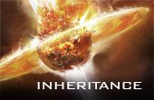](chronicles/217.inheritance.md)
[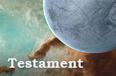](chronicles/216.testament.md)
[](chronicles/215.breathing-space.md)
[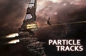](chronicles/214.particle-tracks.md)
[](chronicles/213.welcome-party.md)
[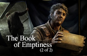](chronicles/212.the-book-of-emptiness-part-two.md)
[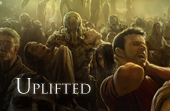](chronicles/211.uplifted.md)
[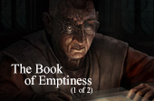](chronicles/210.the-book-of-emptiness-part-one.md)
[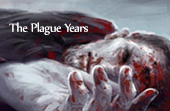](chronicles/209.the-plague-years.md)
[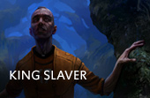](chronicles/208.king-slaver.md)
[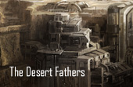](chronicles/207.the-desert-fathers.md)
[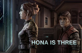](chronicles/206.hona-is-three.md)
[](chronicles/205.rust-creeps.md)
[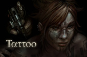](chronicles/204.tattoos.md)
[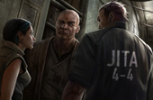](chronicles/203.jita-4-4.md)
[](chronicles/009.outer-ring-excavations.md)
[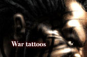](chronicles/008.war-tattoos.md)
[](chronicles/007.fatal-and-the-rabbit.md)
[](chronicles/006.quafe.md)
[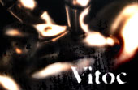](chronicles/005.vitoc.md)
[](chronicles/004.society-of-conscious-thought.md)
[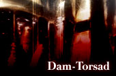](chronicles/003.dam-torsad.md)
[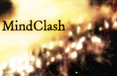](chronicles/002.mind-clash.md)
[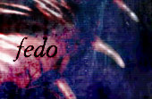](chronicles/001.fedo.md)

## Conversion

To convert from HTML to MD, you can use these helpful vim commands.

The header content goes to approximately line 190, so it and everything above it
can be removed:

```vim
190Gdgg
```

This will make sure the file is UTF-8 and convert html entities into plain text:

```vim
:set fileencoding=utf8 | %s/<p>\n\t\(\_.\{-}\)<\/p>/\1\r/ge |
%s/<em>\(\_.\{-}\)<\/em>/_\1_/ge | %s/\(&ldquo;\|&rdquo;\)/"/ge |
%s/\(&lsquo;\|&rsquo;\)/'/ge | %s/&hellip;/…/ge | %s/ &nbsp;/ /ge |
%s/\.\.\./…/ge | %s/<p align="center">\n\t\*\*\*<\/p>/\* \* \*\r/ge
```

```vim
:%s/\n\t/\r/ge | %s/<p>\(\_.\{-}\)<\/p>/\1\r/ge | %s/&nbsp;/ /ge |
%s/<i>\(\_.\{-}\)<\/i>/_\1_/ge | %s/<em>\(\_.\{-}\)<\/em>/_\1_/ge |
%s/\n\n\n/\r/ge
```

```vim
:%s/\n\s\{-}<h1 class="content-title">\(\_.\{-}\)<\/h1>/# \1\r/ge | %s/\s\{-}<p
class="center"><\/p>//ge
```
