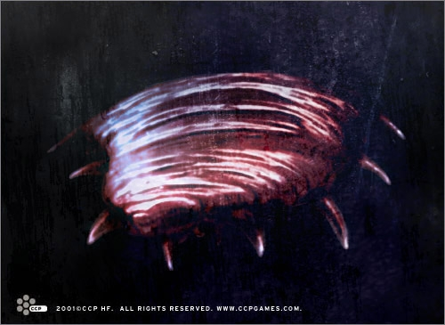

# Fedo

A Fedo is a fairly small (ca. 30-50 cm long, 20-40 cm high) animal originating
in underground caves on the planet Palpis. The planet was settled by the
Amarrians long ago, and the Fedo has spread with Amarr vessels throughout the
galaxy cluster ever since.

The Fedo is an omnivorous, sponge-like creature. It has reddish skin and
numerous small claw-like tentacles which it uses to move around and protect
itself.  A primitive being, the Fedo's method of eating and absorbing nutrition
is slow and inefficient. This means that food stays for a long time in the
Fedo’s body, and will most often have rotted or turned foul before the animal
passes it out of its system. The Fedos eject fumes from their body which, for
the reasons explained above, have a most horrible odor. The Fedos possess a
fantastic sense of smell and so use these fumes to communicate with each other;
they are however both blind and deaf, having no eyes or ears. The mouth is
located on the underside of the beast, and the Fedo feeds by positioning itself
over the food and lowering itself down on it.

Fedos are an incredibly strong and resilient species. They can live in total
vacuum for several hours before succumbing to the cold and lack of oxygen. Some
Matari have used this fact to their advantage, employing Fedos on many of their
ships for cleaning and garbage disposal. The Fedos are especially useful in that
they can clean the ship on the outside as well as the inside; they can get to
hard-to-reach areas on the ship and, most importantly, will exterminate many of
the pesky bacteria commonly found on space ships. The Matari feed the Fedos with
every scrap of waste produced on the ship, letting the beasts roam free around
the vessel and even outside it. This saves money, but the downside is the foul
stench produced by the Fedos, something which discourages most everybody from
using them.

There is a distinct difference between male and female Fedos. The female is
slightly larger and has redder skin. It has a point-like tail or sting, approx.
10 cm long. The female Fedo can emit highly toxic fumes from a small opening at
the end of the tail, which can cause intense skin irritation and discomfort for
a human. For this reason, only male Fedos are used as ship cleaners. Most ships
employing Fedos have a special nursery room where female Fedos are kept to
replenish the on-board Fedo stock. This is necessary as the Fedo's life cycle is
only a few weeks long.
