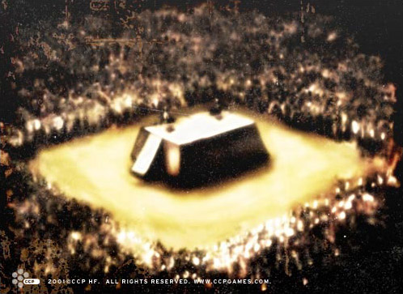

# Mind Clash

Mind Clash is a very popular sport throughout known space. It is as
enthusiastically played in the royal court on Amarr Prime as in the gambling
halls of the Caldari. The Clash Masters – the best players from around the
worlds – are superstars, awed and adored equally among Gallentean yuppies and
Minmatar punks.

The game itself evolved from a simple computer game called Clash of Wits, where
two participants played the roles of puppet masters, using various kinds of
creatures and forces to attack each other until either one of them caved in. The
game was fairly popular among teenagers and young adolescents, but not a
phenomenon in any sense of the word.

The extensive advances made in neural- and cyber-technology through the years
then paved the way for a new version of the game, where the players didn’t
control a computer-generated puppet master, but rather stepped into the role of
puppet-master themselves. The illusions – fantastical creatures, monsters,
phenomena – were still only bits and bytes in a computer, but due to the
strength of the connection between the mind and the machine, this didn’t make
them any less dangerous to a puppet master made of flesh and blood. Even if
participants couldn’t be ripped to pieces in the literal sense, the potential
psycho-trauma caused by the constant barrage on the brain could easily reduce a
stout man to a whimpering wreck in mere moments.

Actually, the illusory creatures and phenomena are only there for the show –
doing nothing by themselves, they simply portray in visual terms what actually
is going on behind the scenes in the minds of the participants. The actions and
state of the illusion give ample indication of the actual events of the struggle
to the spectators. These illusions are, in modern arenas, often projected as
holograms above the participants. All the stars of the game have their own
exclusive repertoire of personally trademarked illusions. This, coupled with
flashy outfits and catchy nicknames, makes each of the major stars easily
distinguishable to the fans. In addition to the illusions huge screens dot the
arenas where duels are held, broadcasting images and information to the masses
ogling the match. These consist mainly of things like facial close-ups of the
sweating contestants, or detailed data-charts on the status of their mental and
bodily state.

The new version of the game was called Mind Clash. Since its release over a
century ago the game has grown into a full-fledged sport, with billions of fans
and billions in revenue generated. The inevitable development has been that Mind
Clash is now one of the biggest entertainment forms around – with all the
stardom, hangers-on, aspiration dreams, gambling and showmanship that goes with
it. For many, the Worlds Championship is the major event of each calendar year.
During that massive event, the sixteen best players from all around the star
cluster gather to slug it out. Although rumors of fixed matches and rigged
results have somewhat tainted the image of the event (and the sport as a whole),
it remains a huge attraction for more or less everybody, and Mind Clash betting
is one of the favorite pastimes of billions of people.

The current Mind Clash Worlds Champion is Joelyn Donalokos, a Gallentean of
Intaki ancestry. Donalokos, a 7-year veteran Clash Master, is the Worlds
Champion of the last two contests and has for the last three years topped the
Clash Masters' income list. Donalokos’ specialty is his Blue Tiger illusion,
something which has become one of the most widely-recognized symbols in the
whole world.

