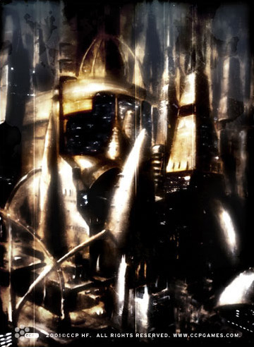

# Dam-Torsad

Dam-Torsad - the Imperial City of the Amarr Empire - marked me. It marked me
even though I consciously tried to fight its corrupted presence. It is built on
memories - nightmares, really - and you can’t stop them from perverting your
mind in the end. For fifty long years I’ve struggled to rid myself of those
haunted memories, memories of a human society turned sour and bitter. I
may have escaped the oppressive walls of the city, but the vivid memories will
always remain. Memories of a city more like a monument than a thriving
metropolis; of people saturated with its sluggish nature, their minds weighed
down with traditions and customs so strong, so dominant, that it was like their
ancestors of a thousand years ago were living their lives through them.

I couldn’t fail to notice - almost immediately - the injustice entrenched in the
society. The Holders tread on the Commoners, which in turn tread on the slaves.
Talent means nothing; people are judged solely by their social position. The
only merits nurtured are backstabbing and back-nagging. The twisted old Holders
are deeply envious of zealous young upstarts and find sick pleasure in
squashing them. And yet the Commoners look with awe up to the Holders, craving
their position and power, but bound still by tradition more sturdy than any
iron shackle.

Progress is a term alien to the Amarrians. It’s almost like this huge empire was
built on pure coincidence and luck. But once you get to know their intricate
system you get the feeling that they’re like this great big beast trudging
heedlessly onwards, trampling any opposition. Their advancements are not
by leaps and bounds, but rather through deliberate and articulate planning that
can span decades, even centuries. Getting caught in the finely woven
spider-webs of a Holder can trap more than just you - it can trap your children
and your children’s children. Getting out is not a problem. It’s getting
out alive that's troublesome.

My years in Dam-Torsad made me loathe and despise the Amarrians. Their society
is in so many ways radically different from the Gallentean one. But I also
learned never to underestimate the Amarrians. In their own way they’re
ruthlessly efficient, and I cannot help but feel in awe of all their
accomplishments through the ages.

* * *

_Excerpt from the autobiography of Yanou Lautere,  
First Gallente ambassador to the Amarrians_
