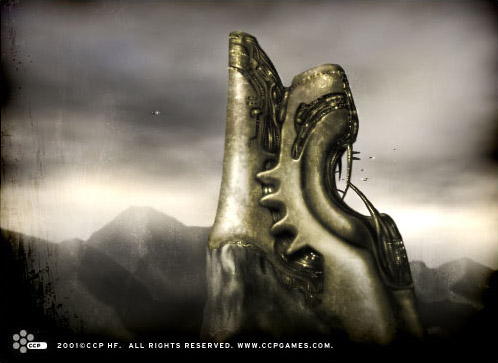

# Society of Conscious Thought

The Society of Conscious Thought, or SCT, was founded three centuries ago by the
Jovian Ior Labron. As a rule, Jovians are not very spiritually inclined, but
those Jovians that are take to their spirituality with the same vigor and zeal
as to everything else. The SCT has, through the ages, acted as the outlet for
the spiritual needs of the Jovians, although that role is only a secondary one
today.

The Society’s story is a long and complex one.  Starting out as a cult created
to explore humanity's spiritual and religious feelings and needs (with the
primary aim of discovering the meaning of life, no less), it later expanded into
the realm of politics and, for a little while, effectively became Jovian
society's shadow government. This, however, did not last for long; other
political factions joined together to break their power, with the result that
the Society was banned for a considerable period of time. Yet they still lurked
in obscurity, reverting back to their mystical past. As the years passed the
Society again began to exert itself, but wisely and carefully this time, making
sure to just skirt the borders of the hostile political arena.

Once again, the search for spiritual enlightenment became the focus of the SCT.
They embarked on a journey of frenzied technological research on the matter,
resulting in some very interesting theories and facts on the nature of man and
his connection to the universe.

The SCT had, in the traditional way of secluded spiritual sects, sought refuge
in remote areas, building their residences there. Even while the Society was
most active in politics, they still maintained their homes far away from large
human settlements, favoring isolated regions planet-side or in deep space. Only
in recent years has the SCT become a little less reclusive, setting up offices
in urban settlements in order to increase their visibility to the general
public.

In their remote abodes the Society has built up mini-societies emphasizing
self-sufficiency; a trait strong among the Jovians. These sprawling places,
often resembling huge fortresses, house everything from living quarters and
food-growing facilities to laboratories and libraries. Each enclave, called a
_kitz_, is a separate entity, but communication between kitzes is frequent.

Each kitz maintains a school for educating their members in the scholarly or
scientific fields. At first, all the students were children of SCT members, but
a few decades ago the Society started admitting, each year, a small number of
children from 'outside,' even non-Jovian ones. The applicants are chosen by the
Society and their choices seem to many to be almost random, because there is no
visible pattern as to who gets in: neither race, gender, social standing, nor
even talent and intelligence by themselves seem to play instrumental roles. Many
wealthy parents have tried to increase their child’s chances by donating large
sums of money to the SCT, but statistics have shown that this has little or no
effect.

In any case, most people agree that the education the children receive within
the Society’s walls is first-class and every graduate is a sought-after employee
anywhere he or she goes. An astonishing proportion of SCT graduates reach a
prominent position later in life, becoming presidents of multi-stellar
corporations or governmental ministers. Little wonder, then, that people regard
the SCT schools as breeding grounds for world leaders.
