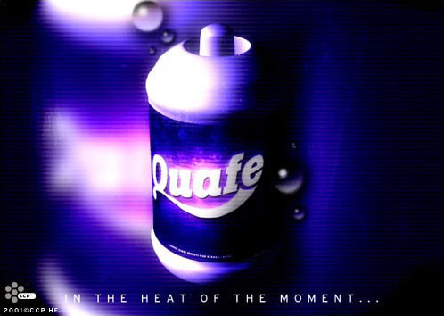

# Quafe

Quafe is the name of the most popular soft drink in the universe, manufactured
by a Gallentean company bearing the same name. It first appeared two centuries
ago and, like so many soft drinks, was initially intended as medicine for
indigestion and a tender stomach. The refreshing effects of the drink appealed
to everyone, however, and the drink fast became hugely popular.

Quafe is one of the most widely recognized brands in the whole universe and can
be found virtually everywhere. The marketing gurus at the Quafe Company have
often joked that the drink was the best Gallente ambassador there ever was, and
an incident between the Gallente Federation and the Amarr Empire ten years ago
showed these claims to be more than just amusing hype. At the time,
the Federation and the Empire clashed over ownership of the mineral rich system
Girani-Fa, located close to both their borders. After the Empire discontinued
negotiations with the Federation delegation, the dispute seemed to be headed
straight for all-out war.

But a few days later an extraordinary thing happened. The Amarrians declared
that while they were ready to continue negotiations, they would only conduct
them with representatives from the Quafe Company, claiming the latter were the
only group within the Gallente Federation with enough vested interest on both
sides of the border to be able to look at the matter from a neutral perspective.
The Gallente government, looking to avoid war, agreed to these requests and so a
delegation made up of top Quafe Company executives was sent to meet with the
Amarrian delegation. A few weeks later an agreement was reached: the system was
to come under Gallentean control, but a fixed amount of minerals was to be sold
to the Amarrians each year at cost price.

The Girani-Fa incident, as it has become known, clearly demonstrates the respect
consumers have for the Quafe name and how strongly the company has managed to
penetrate into every market. A further indication of this is the fact that the
Quafe Company is the only Gallentean company that’s been given corporation
status within the Caldari State.

This amazing success, which has mostly come about in the last three decades or
so, can be largely accredited to one man: Poire Viladillet, CEO of the Quafe
Company for the past 35 years. Under his leadership the company has ascended
from a position as one of several leading soft drink manufacturers into clear
and undisputed market supremacy.
