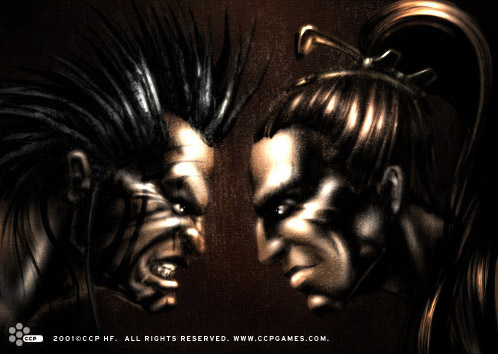

# War tattoos

For most of the Minmatar tribes the act of painting one’s face before going into
battle is an age-old tradition. In days past, some of the more warlike tribes
took this a step further by tattooing their faces in the same style, giving them
what effectively amounted to permanent war paint. The main disadvantage of these
facial war tattoos was obviously that they were a permanent feature. This made
their usage quite a bit less common -- after all, portraying as aggressive a
state to others as the war paints represented did not lend itself equally well
to all forms of interpersonal communication.

But high-tech developments have opened up a new way of expressing one's
aggressive intentions. The latest fad in tattooing is so-called nano-tattooing.
The nano-tattoos are very small microchips, surgically implanted between the
epidermal and dermal layers of the skin. These microchips are connected to the
nervous system via the hair and sweat glands' paravertebral ganglia, and are
activated when the host becomes emotionally upset or excited. When active, the
microchips emit dark or light color (depending on the person's skin color),
resulting in patterns appearing on the face.

These nano-technology war tattoos come in various versions. The most common ones
link the microchips' activation directly to the host's emotional state, making
it necessary for the host to control their own feelings if they want to
influence the appearance and disappearance of the war tattoos. Other versions
allow the person direct conscious control over activation, but Matari tend to
frown upon those, the general consensus being that these more user-friendly
chips suggest a lack of self-discipline in the host.

Since they first arrived on the open market a decade ago, the nano war tattoos
have taken Minmatar society by storm. They are especially popular among the
younger generation of aviation and space faring personnel. While the custom has
spread to other races, most notably the Gallenteans, it is still almost
exclusively confined to the Matari.
