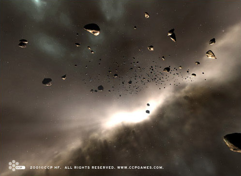

# Outer Ring Excavations

Nocxium is one of the most sought-after materials around, as it's one of the
vital ingredients for capsule production. Due to the fact that this strange
matter forms only during supernovas, it can only be found in a few exclusive
regions. As the nocxium breaks down when under intense heat and pressure, it
only exists in asteroid fields and not in larger stellar objects. A few years
ago numerous asteroids containing nocxium were discovered in the extensive
Miennue cloud ring just outside the jurisdiction of the Gallente Federation,
propelling the otherwise desolate cloud ring into the international political
limelight.

Thousands of prospectors have flocked to Miennue since nocxium was first
discovered there, but as always only a handful reap the rewards of their
efforts. Yani Sar Arteu was one of the few to hit the jackpot big time. He and
his small company named Outer Ring Excavations recently stumbled across an
asteroid reportedly containing the biggest nocxium deposit ever found in this
region. Although rumors abound nothing has been confirmed, as only Arteu and his
companions have seen this alleged super-asteroid and are not about to disclose
its location. In fact, they only spend the minority of their time actually
mining the asteroid, hunting it down on weekly excavation expeditions. This is
because they don't want to flood the market with nocxium, thus bringing down the
price. In between, they spend their energy playing elaborate games of
hide-and-seek with jealous competitors eager to get their hands on the asteroid.

The empires monitor the goings-on in Miennue closely and all of them have made
both overt and covert proposals to Outer Ring Excavations, offering security for
a stake in the company. Outer Ring Excavations have rejected all these offers,
but ever-increasing pressure from competitors is making it harder and harder for
them to keep their secret safe much longer. Sooner or later, one of the numerous
methods employed by those pursuing the asteroid -- bribes, threats, tracking
devices, bugs -- is bound to unveil the secret that Arteu has so meticulously
kept concealed. In the meantime, Arteu and Outer Ring Excavations are getting
richer -- fantastically so -- by the minute.
