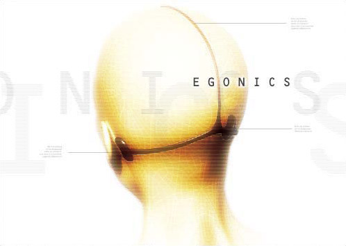

# Egonics Inc.

The Gallentean entertainment industry is highly competitive and show biz
companies are willing to do anything to gain an edge over their competitors. The
size of the entertainment industry means that a mere 1% shift in market share
means billions in extra revenue. This has led many companies to employ
questionable methods, such as espionage and sabotage, while others engage in a
constant technological race. An example of the latter is Egonics. Egonics
Incorporated is a fifty year old company that today specializes in making and
distributing music that fits each and everyone’s personal taste. There are a few
essential steps in this process.

First of all, Egonics runs and maintains a huge database, containing personal
profiles of billions of people. The Egonics database is arguably the largest
database of personal information owned by a non-governmental company. At first,
Egonics planned to use this database for numerous products, but only the musical
one became truly successful. Early on, conservatists within the Gallentean
government vehemently opposed the data gathering of Egonics, but the company
ingeniously used this opposition to their advantage by rallying the young people
to their cause, advocating personal freedom of all things. This was one of the
major factors in the subsequent growth of the company and the ‘Egone’ became a
symbol of liberty among young people everywhere.

The information in the Egonics database is extremely detailed, it lists both the
social status of a person: job, education, marital status and so on, but also
very thorough genealogical and biological data, including DNA samples. Egonics
uses every method possible to enlarge their database and keep it up to date.
Some of these methods are frowned upon by many, but others find it good how
dedicated the company is in making sure the customer gets exactly what he likes
and there are some that thrive on selling Egonics DNA samples from people not in
their vast database.

Secondly, Egonics employ thousands of sound engineers and musicians that are
constantly creating music according to the specs of a certain group of
customers. Egonics recognizes hundreds of distinct taste patterns in the
populace and they make sure that everybody can find music that caters to their
very special preferences, thus Egonics publish thousands of songs every single
day. Although the musicians employed by Egonics are total non-entities while in
its service, they gain invaluable experience during their stay and a number of
them have gone onto fame after their stint there.

And finally, Egonics use a unique method in distributing their music to their
customers. The Egone may look like a head ornament instead of a headphone. This
is because it doesn't broadcast sound to the ears as normal headphones do, but
instead it projects the music directly to the zones in the brain that govern
hearing, bypassing the ear altogether. This has many obvious advantages, both
for Egonics and the customer. Most importantly, there is no danger of illegal
copying and distribution, as there is no actual sound to record. Also, there is
no noise pollution and people can easily converse with each other as the ears
are clear.

Music is broadcasted to the Egone over wavelength, similar to radio, so in
effect every Egonics customer is listening to his own personal radio station,
playing only those songs he likes and has paid for. All in all, Egonics is
steadily increasing their popularity, although there are many that find the
ruthless data gathering and intrusive broadcasting methods to their disliking.
The Amarr Empire has for instance forbidden Egonics to operate within their
boundaries.
