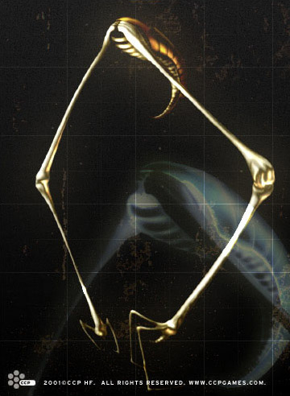

# The Hanging Long-limb.

In a mass manufacturing and marketing society like that in the world of EVE,
everything that is for one reason or another only found in short supply tends to
become more sought after because of the rarity factor alone. This is especially
true in the field of gourmet cooking, where the finest restaurants compete in
offering the most exotic food there is.

The eggs of the Hanging Long-limb are among the most sought after delicacies in
these fancy restaurants. This is because the Hanging Long-limb is only found on
one planet, Theruesse IV in the Theruesse system, located within the borders of
the Gallente Federation. The Hanging Long-limb belongs to the Long-limb family
of species, which are also only found there. The planet is almost entirely
covered with inhospitable marshy jungles and the methane filled atmosphere is
unbreathable by humans. The Hanging Long-limb gets its name from its habit of
hanging by its hooked tail from branches that slope over water. It then uses its
long claws to catch small fish and other amphibian animals.

The Hanging Long-limb lays its eggs in thousands at a time in a cluster, usually
attached beneath a branch. It is this egg-cluster, or roe, that humans so
eagerly seek. The main reason why the roe of the Hanging Long-limb is so rare is
because no one has succeeded in breeding the species outside their natural
habitat. Many individuals and companies have through the years attempted to
simulate the environment on the planet in order to mass breed the Hanging
Long-limb, but without success. Similarly, all attempts to artificially generate
or clone the eggs have only met with very limited success and such products are
regarded as vastly inferior to the real thing.

Most of the restaurants offering Hanging Long-limb roe are situated within the
Gallente Federation, as the demand for exotic food is highest there. These
restaurants are frequented by the upper strata of Gallentean society: industrial
tycoons, celebrities and the idle rich. Capsuleers, always rich though rarely
idle, are also apt to be seen at these places
