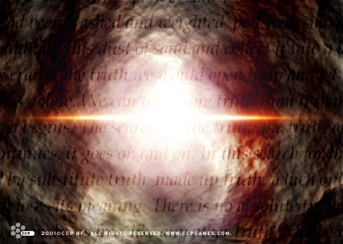

# The Truth Serum

_What if Truth was like a tiny speck of sand?  
A speck that has been washed and weighed, polished, smoothed and curbed into one
shiny point, the Universal Truth.  
What if we could take this grain of sand and collect it into a book? We would
treasure the book like our own life.  
We would lock it with the purpose of our mind.  
And when we craved the truth we would open it up and let the grains wash over
us. We would soak ourselves in its depth and bask in its radiance.  
But the book is flawed. We can take more truth from it than we have earned. And
soon we would be turning empty pages.  
Thus the search begins. The search for the truth; the truth we crave; the truth
that has the only meaningful value in an otherwise meaningless world.  
The search continues, it goes on and on. In this search for the ultimate truth
everything is allowed. We learn to lie and cheat in hope of progress. We see no
success, no breakthrough of any kind._

_We’re flooded by substitute truth, made up truth, whose only purpose is to
sooth us and lull us.  
Absolute truth loses its meaning. There is no absolute truth, only greater and
lesser truth. We’ve lost our standards, we’ve lost our talent to distinguish
what is real from what is deception. We no longer know the difference between
the right truth and the wrong truth. All we care for is truth in any form and
any guise; corrupted, filthy truth, we want it all, need it all.  
So this truth can make us free, like any other truth. Maybe this substitute
truth suffices? Maybe.  
But when we’ve become enslaved to this freedom, then it is freedom no longer.  
It is the worst kind of prison._

_A prison with no walls and no chains. We cannot break free for we cannot see
what binds us.  
We talk of freedom like it was something to hope for. I hope real freedom never
finds us, because we wouldn’t know what to do with it.  
Yet we continue the search, for the searching has become a way of life for us.
We know no other. It is what we’ve become.  
Let us only hope the search never ends, that the Absolute Truth stays hidden
forever. For if the search ends, we end.  
Then we become nothing more than dust, specks of sand on the shore of universal
lie.  
And maybe, just maybe, this has already happened._

The author of this prose is Gorda Hoje, a Jovian philanthropist that died more
than 300 years ago. Hoje was a novelty in his time and age, and his works, which
ranged from cryptic philosophical texts to meticulous science papers, were
generally regarded as too eccentric and absurd to have any real value. In his
lifetime, Hoje acted as a mentor to many of the greatest Jovian minds of the
younger generation, among them Ior Labron, the founder of the Society of
Conscious Thought. After Hoje’s death, his followers started to promote his
works in earnest and Hoje is today regarded as one of the most profound and
influential of Jovian intellectuals.
