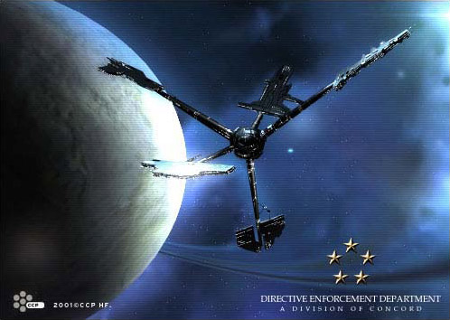

# Directive Enforcement Department.

Soon after the empires initiated contact with each other they recognized the
need for independent institutions, jointly run by all the empires, to handle the
numerous issues regarding the relationships between them, such as trade,
monetary policies, crime-fighting, and so on. The earliest forms of these
organizations were established decades ago and now there are a few dozen that
exist of various size. All of the organizations are controlled by a central
organization, called Consolidated Cooperation and Relations Command, or CONCORD.

One of the largest and most powerful branches of CONCORD is the Directive
Enforcement Department (DED). DED is the police force of CONCORD and is by far
the strongest armed force in the world of EVE that doesn’t pledge fealty to any
one empire. The main responsibility of the DED is to track high-profile
criminals. For this they often hire independent contractors (better known as
bounty hunters). The DED handles the licenses and legal issues of all bounty
hunters for the empires, although some of the empires have been known to bypass
the DED in special circumstances. Also, the most notorious criminals are marked
as free-for-all targets by the DED.

Among the other responsibilities of the DED is aiding customs officials in
patrolling areas where smuggling is rife. The DED ships are usually equipped
with the latest and greatest in surveillance technology, so their service is
always a great support for customs patrols, especially because they are
incorruptible. In addition, the DED takes care of all kinds of security issues
regarding meetings and conferences between the empires, they lend ships for
operations by the other branches of the CONCORD, and they often support local
law enforcement in dealing with large-scale crime activity or similar matters.
For this the DED often uses their special force unit, named Special Affairs for
Regulations &amp; Order, or SARO. The SARO is one of the toughest police units
around and are notorious for their brutal, but efficient, methods. They’re
mostly used in hostage situations, for the assault of heavily armed pirate
havens, and similar tasks.

The DED’s jurisdiction is limited to space and this has often put severe limits
on their operations. However, in recent years, the DED has increasingly been
authorized to operate in stations and on planets, and the result is a much more
effective fight against organized crime. But even if the DED is getting more and
more efficient in dealing with criminals within empire borders, they have yet to
gain any significant foothold in the outer regions where empire presence is
almost nonexistent. Also, the power of DED, and in fact the whole of CONCORD,
differs widely between the various empires, or even between different regions of
any one empire, as local governments or magnates often oppose strong DED
presence for one reason or another.
