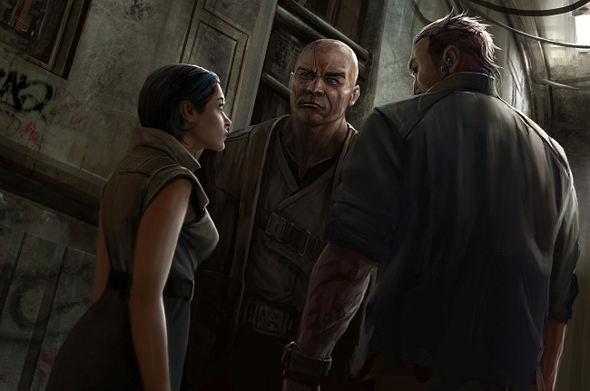

# Jita 4-4

## Part I

It's after 9 PM at the terminal when I arrive. Most shuttles are switching out
15-minute schedules for 30-minute ones now. People draw together and wait,
struggling to distract themselves in the seemingly endless space between. Bars,
vending machines and VR booths fill every corner large enough to house them,
offering up a quick, easy and overpriced escape from the intentionally gray
concrete walls, illuminated only in the cold monotone of fluorescent lights.
Pale and bloodless in this false glow, everyone looks like a vampire, something
I would describe as _convenient_.

Now begin the dead hours, when things start to calm down, if you could describe
anything here in those terms. Jita 4-4 may be one of the busiest hubs in the
universe, particularly for the capsuleers, but the eternal dominance of the
circadian rhythm makes itself known even here. Fewer shuttles leaving now?
That's the station slowing her breath. Really it's us, our collective breath,
but in _everything_ now is the human imprint – for better or worse.

One rule is that you can't sleep here. For me, tired of travelling through a
haphazard network from a station out deep on the frontiers, this particular
custom is unfortunate. You see, despite my much _younger_ exterior, today marks
a much older birthday, and without getting too technical about it, I haven't
slept in over three days. I've kind of forgotten how right now, and there's that
moment in the lull, that seductive daydream that creeps up on me when I least
want it.

Nevertheless, when in State space, I will do my best to _behave_. This is
because the massive roster of station attendants, security officers and
"information advisers" will actually wake you and _remind_ you, as they like to
say.

"Ma'am, I would like to remind you that there is no sleeping allowed in Terminal
1."

As if you'd actually forgotten. As if you intended to lie there asleep and
vulnerable, while anonymous passers-by sidestepped your defenseless, lifeless
body. As if you wanted to fall into that trap. As if you were, well…cattle.

They take a note, you see, and attach it to your Temporary Station ID. That's
your first and only warning. The second time you drift off they don't say
anything, they just start the clock. If you wake up before ten minutes is over,
that's two. Three is either ten minutes, or a third nod-off. You think I'm
kidding. You think _there's no way they'd bother with this shit_. Well,
everything has its protocol, its hard parameters, its bottom line. Well, where
are we again? _Exactly_.

Three times converts those little annotations into a vagrancy charge. Offenders
are removed roughly, quickly and without a word. Vagrants don't deserve to be
read their rights, because by definition they effectively have none.

Now, I remember a few decades earlier, everyone would fall into this trap. There
were the actual vagrant types; dreary-eyed Minmatar with the signature Sooth
Sayer drool, clearly homeless and reeking of their own shit, and then there was
the Caldari businessman, upper management type, rules don't apply they think.
Usually their first time here from some outer-regional post, Lonetrek or
something like that. Even those guys, dressed in suits worth more than the
yearly salary of the three men unceremoniously hauling their still-waking,
highly confused, designer-label-clad asses out of here: even the mighty could be
treated like the lowest. Nobody though, as far as I can see, has stumbled just
yet.

I've come here to remind myself of the Caldari. And that's also why I take the
stims.

There's the enjoyment factor, sure, but it has more to do with my aversion to
cold cement streets and the types of people who roam them until dawn. _There's
vampires out there, too_. Blame the circadian rhythm, or something.

As for what I'm doing here, well, let's just say for now that I don't want to
fall asleep. In actuality, this has little to do with what might await me out
there, and more to do with my lack of Temporary Station ID.

We're all supposed to have one, you see. Otro Gariushi's was 19, the first
civilian number available on the rotating register. Even he, _Otro Gariushi_.

My first stop is the food court. The primary one, that is. The one the size of
four Mind Clash arenas, that dominates the entrance to Terminal 1. You can't
miss it, in that the place simply _isn't designed that way_. It's a four by nine
kilometer sprawl of gastronomical consumerism like you've never seen before.

People come here just for this.

Everything you could ever want, from the fast and nasty (there is actually a
vendor, or two, that run by this name) Minmatar bread-soups, to the most
exquisite fine-dining on the mezzanine.

There's nothing quite as _fresh_ as Jita.

Jumpdrives brought about some amazing changes. They helped us reshape our world
with dramatic speed and efficiency. Here in Jita at ground level, though, I'm
reminded of the ways we've bent this technology towards more base means.

I say this because I can smell another human imprint, and it's something like
the salty tang of freshly caught fish. Maybe just a little over an hour old.
Back then, full of life, swimming upstream towards nothing under one of any
number of alien skies. I follow the scent and pretend to be able to discern
where: which planet, which continent, which settlement. Perhaps somewhere in
Urlen, I consider, near one of the polar settlements, where the magnetic fields
create these wondrously hypnotic purple skylines with clean, bright stars
shining through the thin atmosphere. Perfect low-cost real-estate for
entrepreneurial fisheries. Must be even cheaper now, I realize, given the
proximity of the planet to market hubs, and the latest CONCORD madness allowing
capsuleers to drop extractors wherever they damn please. Forgetting for a moment
what I am, in some ways, I´m back to imagining rivers of pure glacial water,
artificially rich with the most economically favorable species of the month.

Then I imagine that fish, driven only by blind instinct as it slides inexorably
down towards some dark fate. I imagine an inevitably murky and cold end; a net,
perhaps, but it's somehow not likely to be that romantic. These artificial
rivers tend to be quite literally purpose-built to the end, with the flow of
water eventually heading right towards the abbatoir. The Caldari have made it
efficient to the point where you have to question their use of the word
"fishing."

What's important though, is that from this stream it finds its way to a
warehouse, maybe 10 minutes or less, as these things tend to be built into the
actual rivers as well (at least if we're sticking to the Urlen fisheries).

Another 20 minutes and that fish is loaded onto the cargo bay of a freighter,
and then perhaps swims around for a few hours inside giant plastic-lined bags
filled with life-sustaining fluids, waiting for the launch. Then, most likely
our fish dies somewhere in orbit, if the acceleration out of the atmosphere is a
bit rocky. A space elevator is most likely just as inevitable here.

After at least another 10 minutes, it's at a station (and this can be pretty
much anywhere in the known cluster if you have a long enough cyno net [and the
best traders always do]).

After all that… all those hours spent dying, loading, launching, warping,
docking… after all that, our fish is in something with a jumpdrive.

Within _seconds_ it's here and in the hands of some of the Federation's finest
culinary experts, where those succulently smoked and sautéed and skewered atoms
permeate the domed terraces, filtering out downwards before they're slowly muted
by the dull mix of cheaper breads and spices. I try to imagine just how many
different atoms, from how many different planets, must be colliding around here
right now. Cosmologically speaking, Jita must be a meeting ground for them like
no other place ever before it, in all of human history. All because of isotopes,
cynosural fields and jumpdrives. Think about that the next time you're dropping
off for a bite.

Because it's important to realize how some things come about.

I've come here to remind myself of the Gallente. If you ever doubted the
capitalistic might of their corporate giants, you should make a visit here too
sometime. The entire area is dominated by their cuisine, which in a way makes
sense, since Gallente food accommodates everyone. It _has_ to. If you ever
thought politics or laws were the primary concern of an infinitely fractured
populace, think again. Think about tonight's dinner. I know I am.

One of the great accomplishments of the Federation's food services industry was
the way they managed to slowly absorb their competitors. They did this through
subtle and well-applied use of the nation's media influence, which extends
across all empires' borders. A predictable tactic, sure, but effective as
anything. They don't play the Caldari corporate game either, and that actually
gives them some advantages when operating in State space and abroad, even during
the "wars" when everything is supposedly turning to shit.

I suppose the most insidious thing about their commercial success isn't the
level of trickery employed on their own consumer base, but rather, the more
fundamentally repugnant _facelessness_ of it all. To survive economically in
your opponent's commercial nexus like this, you have to lose your face. You have
to become about something entirely impersonal. You have to become about a
_system_, about a _way of doing things_.

This is why people will talk about the diversity found in Gallente cuisine.
That's one of the darker sides to it. To most people this is perceived as
something slightly simpler. They say that the Gallente have copied every other
nation's cuisine, made _fusions_ and called it their own, branded it as their
own. This captures the essence of the issue, but doesn't identify the core.

These people say that we've arrived at the point where it's no longer even clear
who owned what anymore (hyperbole: trademarks keep that perfectly clear, if only
for the lawyers - most consumers don't even understand the most rudimentary
networks of corporate ownership). The favorite topic amongst economists is the
strange way (particularly strange to the Caldari) the Gallente economic model
worked on pushing everything into the public domain and then recycling it, again
and again, making it just different enough to justify the trademark. This is
part of what I mean when I say they don't play the Caldari game. But again,
people overlook how it was accomplished.

It's not all they overlook, either.

You see, for most people at Jita 4-4 and abroad in State space, it's enough that
the logo on the restaurant they're eating at is a Caldari one, and for the
Gallente business owners and entrepreneurs, it's enough that a little playing
pretend is all it takes to keep dishing out foods of every type as they attempt
to corner (or, most commonly, invent) another niche in this already
hypersaturated market. Everybody knows the game, but their apathy to such things
is well ingrained.

Take the Salted Amarrian Rockjaw.

Now this thing is a beast of a creature, quite familiar with the interiors of
Amarrian torture chambers, too. It has a rather sweet taste, with a fresh salty
aroma to the flesh. You can have that at _Dieurelli_ with a side of Achuran
Songbird wings in a sweet nut-and-berry sauce. This meal, to anyone there who
eats it, is unquestionably _Amarrian_. It is a tasteful, politically correct
marriage of Empire-State cuisine. Perfect for high-profile business lunches you
want to keep hiccup-free (depending on your clients, of course).

A little further down, off the high-rollers' mezzanine and into one of the many
corridors spinning a nebulous web below, you can get more adventurous with the
Rockjaw at every corner. At _Pmokka Caravan Delights_ you can have it seared
over a traditional Brutor _Khari_ oven, then watch as it's slowly de-skewered
and served alongside tender pieces of traditional Pator Steak, bloody and still
rich with life beside their impaled counterparts.

Some meals speak for themselves and many, do in fact, have something to say.
This one says "I am unquestionably Minmatar."

But in _every one_ of these restaurants, all you will ever see is pretty Civire
girls waiting tables, with the silvery circular logo of the State out front.
 Meanwhile, in the engine room, it is most often Gallente chefs who will be
driving things forward. Not just at _Pmokka_, but at _Diurelli_, and almost
anywhere else you care to look behind the curtain. The Caldari think they're
exploiting the labor of the Gallente, and the Gallente think they're influencing
Caldari culture, one mouthful at a time. The Amarr and Minmatar? Shit, they
aren't even really _here_. They're just ghosts; puppet apparitions dancing to
the tune of friends and foes up north.

And this… this hasn't ever really changed.

I'm opting for a low-profile bite-and-run here, though (and keeping my mind off
the steaks…) so I stop off at QuafeSnacks. The food here is, I suppose you could
say, the very bottom line. It's not like Quafe hides it either. They have
QuafeSnacks Premium and QuafeSnacks Premium Ultra vendor stands, and Quafe
Deluxe, Quafe Deluxe Premium, and Quafe Elite restaurants plastered all over the
courtyards as well. If you're at this particular franchise, you don't really
have any illusions as to why.

Personally, I find a sort of perverse, gimmicky joy in watching the families
order and endure. Most of the food here comes exceptionally cheap, you see, but
there are no tables and no seats. The consuming crowds have to disperse and eat
amongst the milling populace, at tables and ledges near elevators, escalators,
walkways, and – best of all – in waiting rooms packed with people killing time
on empty stomachs.

All designed, you see.

The bags that carry their food project subtle holograms above: a small news
ticker, the current air temperature, arrivals and departures, station
announcements. All to the side, all but consumed by the cool neon green of a
Quafe logo. Then there's the perfectly manufactured scent of it all, the look of
satisfaction and enjoyment.

It's the best way for me to blend in, you see, become _just another billboard_.

Yep, you can do pretty much anything here. Except sleep.

It's a non-starter for me anyways. If I fall asleep, then they'll see soon
enough. They'll notice the sockets at the base of the neck, telltale signs of
trouble. 

While pleasantly dreaming, I'd be giving them an excuse, a reason, a motivation
to look closely enough, and they'd realize quickly what I am. In these
situations where we are uncovered, alone and incognito, lurking amongst the
masses, they find it easier to just shoot us.

When capsuleers are involved, it's the only path with a predictable end.

If they woke me, and let me know that they know, well, _who knows_ what would
happen next? I could be loaded with nanite viruses, armed with invisible spy
drones, laced with biological contaminants. Who knows?

_Maybe…_

…I'm here to take a hit contract on some civilian in the crosshairs of a person
with too much money and some serious grudges. Just walk up to them as they amble
tiredly towards a shuttle and then boom, spray, bang, zap…who knows, but it's
lights out either way and I'm laughing all the way to the nearest clone bank.

I could be here to solve all kinds of problems. Or, I suppose, cause them.

Whatever it is, it's assured by default that whenever a capsuleer is trying to
_blend with the baseliners_ (b-lining, they say – rather repugnant if you
consider it) it's not because they're here to mingle.

Besides, the mechanics of it all are for them the same as mine. They have the
authority to act with lethal force at a moment's notice. Against us, that is.

Hidden, uncovered, that is enough. Beyond that they have impunity.

Me, us, we always had it – so they get to catch up. A dangerous game I don't
want to play. Some of you would just not believe the rumors I've heard. The
stories of opportunistic savagery unleashed upon our kind when nobody who gives
a damn is looking.

I hope a kind yet firm bluff will be all it takes. I know exactly what they
fear, even better than they do. This counts for a great deal. I understand their
countermeasures, and when you know their paths back to safety, you command
attention. They, sadly, only have one go at this. For me this is _practice_.
Something to keep my senses sharp after a long while doing nothing much, just
mixing it up. Blame the circadian rhythm.

As for what I'm doing here, now, deep inside a sub-basement level following two
Brutors who smell of alcohol (made from fermented Amarrian wheat, I establish,
but keep to myself)… well, I'm following the scent. I'm here to remind myself of
the Matari (always preferred that term).

But more specifically, I'm making a purchase.

More particularly, drugs, and to be explicit, we're talking some quite rare ones
that have, curiously, become far cheaper in recent times… ‘recent' meaning,
here, in the weeks, months and years following the wormhole openings.

Strange, right? Well, see anybody complaining, making a public scene out of the
fact? _Exactly_.

C3-FTM (C3-fullero-tris-methanodicarboxylic acid, in case you wondered) – I used
to have to go to the mezzanine for this, and I remember how awkward it would be
to order such tiny quantities in ushered tones, surrounded by an opulence that
outstripped the value of my purchase by an order of magnitude. Obviously, the
situation of demand and supply was _complicated_ back then.

Now all I have to do is hook up with the local Minmatar smugglers, follow these
two Brutor, and soon enough I'll have a whole fucking crate for the price of the
meals I used to have to order as a disguise.

Maybe you understand now that I am no cynic to be asking: _what's the catch?_

Following these two along this dimly lit artery towards some unknown
destination, I´m listening to a crisp, momentary tone as it's played out through
invisible loudspeakers embedded into the walls, perfectly audible even down here
in the bowels of the station. The two Brutor look over their shoulders at me for
an explanation; they understand the game, but they don't get the language. I
shrug a "nothing you need to worry about" and keep the pace down the darkened
corridor.

It's interesting that they grasp this much. Perhaps the operation here isn't so
reckless as I initially thought. My immediate suspicion is that I'm about to run
into one of my own kind. Or, at least, another capsuleer.

Close enough.

That's one of the games, you see. Or one of the ways they divide us, class us,
speak to us…look at it how you want. I see a game. In these momentary audio
blips there is another, secondary message, a heavily compressed meta-stream
lying obfuscated beneath expertly crafted static and white noise – all of it
neatly engineered into a fleeting, innocuous bleep. Inside each one there's
often quite a horde of information. Here, in this one: a neurovisual map marking
VIP elevator access points, secure comms lines, security posts, and of course,
advertisements for restaurants, accommodation and other venues that are all
kilometers above where we are now, and with price tags to match.

It's one part _Survival Guide to B-Lining_ and one part _Here's What You're
Missing Down There_.

Maybe now you understand, too, why I wasn't about to explain this one to my
Brutor guides.

"That? Oh, it was an advertisement for 4,600,000 ISK shoes, and a map showing
twenty-five of the quickest routes out of here."

These guys just stare ahead and continue briskly along a hard right into a
sharply twisting staircase that drops rapidly below what I just thought had to
be the bottom of the station. I'm beginning to wonder how close we are to the
surface, to the vacuum outside. Everything is quiet save for the low hum of
ventilation ducts, occasionally rattling a new breath of hot air through these
dimly lit catacombs. I imagine it all coming apart for a moment, and imagine
surviving. There is comfort in the thought. After some time we arrive at a door.
The two men stand beside it as it opens inwardly. I move to step inside and just
from the way they both turn towards me, I know that this is as far as I come.

Staring inwards from the outside, I'm met by what appears to be a plainly
dressed Vherokior seated behind a desk with wooden antiquated drawers that sound
like they're run on ball bearings. She's writing something out on paper.
Surrounding her are rows after rows of bookshelves, each filled with crates of
drugs – and, from what I can see, the odd weapon too.

I reel instinctively, before I can even restrain the impulse.

She notices this and smiles, lowering the pencil. She's dressed like a commoner,
it seems, but the way she carries herself and commands this strange scene
screams money and influence, and comfort in deception.

"Yes, we're a bit old-school here," she says, looking through the licks of her
perfectly straight hair, arranged traditional Vherokior style, no jewelry
(unless you count rubber bands).

"So much for not leaving a paper trail." With the copycat pretension of it all,
I can't help screwing with her a little bit. Tension is adrenaline and
adrenaline is good; it keeps you awake.

"C3-FTM?" she inquires, ignoring the jab. I nod.

"Of course, glad to help."

"The cost?" She can tell I'm not really asking, that I don't need to ask. She
can see the subtext.

She nods in turn. "Not much, these days." I hold her gaze. "You seem curious
about why, hmm?"

"I suppose you could say I am," I tell her.

She waves me inside. "Then we can probably help each other here. Come."

I step inside as she opens another door at the rear of the room, and follow her
into a narrow hallway lit by cold blue beams, all of them reflected in
meticulously designed angles across the cavernous metal spaces above us,
perfectly placed as though everything is ricocheting along the straight, rigid
lines of Caldari steel (perhaps I should say _Caldari Steel_, since it's their
product here). Something that looks like a turret is trained on me as I follow
her, swiveling from its mount in the ceiling as it slowly spreads a web of red
light over me.

Not sure what that just was.

"Is this still about C3?" I'm asking, raising my hands out of antiquated
instinct. The Vherokior is looking over her shoulder at me as she slides out of
the dirty robes around her, revealing a head-to-toe capsuleer's pod suit
beneath, black with white linings. Must by a YC111 style.

"Of course," she replies. "We can speak in confidence here, you do realize?"

I don't.

We reach the end of the hallway and stop at another door. She looks at me
strangely. I can see a sense of revelation slowly growing in her expression. I'm
supposed to be realizing something here too, but well, that could be any number
of things just yet.

"You're home, amongst company," she says quietly, sensing the reasons for my
hesita as she stares about this strange room before us, but there's something
practiced about the way she does it, and something definitely _wrong_ about the
way her eyes follow me wherever she looks. I think she recognizes me.

"No," I say. "I think you're mistaken."

"I'm not here because I'm," she begins, leaving the rest for me to fill in as
the door before us slides away. "I'm here because I know a _Sabik_ when I see
one," I hear her say, just barely.

The room ahead of me is supposed to be a lounge of some kind, but I recognize
its double use as someone's bedroom (not hers, a man). She stops at the edge of
a few small steps leading down to a sunken central area, furnished only by a
large, circular couch, overflowing with blue and purple cushions. I think she is
motioning for me to sit, perhaps, but she is leading me away down one side of
the room towards a ledge. Something else I recognize. Silver panels stretch
across the top, adorned with tiny glowing buttons of various colors.

Understated. I like it, but I keep this to myself (she probably noticed anyhow).
Each color is clustered in groups of four (that's Synth, Standard, Improved and
Strong variants) and arrayed in pleasantly cascading rows.

I want to keep the bloodstream legal as possible, so if she offers--

"Synth?" she asks, already at least one step ahead of me. She spins around to
face me, her left hand now resting on one of the panels; pastel sky colors
gradating to a dark, inky ocean-blue. That would be Blue Pill.

"Tried the NOH variant yet?" she asks. I shake my head. "On me," she motions.
Her fingers lift away from the blues and float towards a panel of warm, orange
lights. I'm reminded again of the first room I entered through. That would be
Mindflood, and all four of her fingers now resting on the smooth bumps in the
otherwise impeccably smooth surface. I suppose that's her way of saying I won't
be the only one about to let my guard down. I stare as she presses down, and
hear the pressurized shots of chemicals escaping from the tiny nodes.

"Slightly stronger, still legal," she says, inhaling gently as she rubs her
wrist and turns towards the couch. For a moment I regard the panel that houses
the release button. Sky blue like the other, but with a tiny little NOH logo on
top to differentiate. "Interesting," I say as I indulge.

She glides over the edge of the couch effortlessly and takes a seat at what
appears to be the head of it. I hadn't noticed this in the design until now. I
feel slightly dizzy as I climb over and seat myself at an acceptably
middle-ground distance, not too close, not too far. There's a stupid amount of
cushions here. I feel like I'm in a playpen. I kick a few away from my feet.

"Make yourself comfortable," she says.

"Strange setup you have here," I'm saying before really considering it. "Kind of
hard to."

In truth, I _am_ starting to sink a little into this thing and relax, but that's
more down to NOH's latest pharmaceutical sleight-of-hand than this overcrowded
cushiontopia. Cushionocracy. Yes, _definitely_ thanks to NOH.

"I'm curious about C3," the Vherokior says, almost absent-mindedly.

I'm curious about that Sabik remark, but I suppose we can get to that.

I turn to her. She doesn't seem interested in staring games anymore. "What, in
particular?" I ask.

"I just handle goods," she says. "I don't need to understand much beyond the
basics. C3 is interesting though."

_Is it?_ I don't even bother saying it. I can feel my expressions betraying me
enough to make the point.

She looks at me like it's some big secret. Some vast conspiracy. I'm not quite
sure what to say.

I ask her how long she's been a capsuleer. 3 years. That's a good amount of
time. Longer than I guessed.

I explain to her that C3 isn't really a drug. You don't get high off the shit.
It's a performance enhancer of sorts. You have to be able to know how to use it,
though, and what it offers isn't all that remarkable, in fact – only useful in
certain situations.

She asks what situations, naturally.

Imagine, I tell her, that you are outside of your capsule, and what you need to
do there isn't all that complex. Maybe you need to meet someone, or want to get
something to eat at a real restaurant, maybe sleep in a real bed.

Of course, this isn't hard to imagine, really. We're both unplugged right now.
She nods, a slight sense of impatience about her. I give a "bear with me" sort
of expression and shift up in my seat, kicking another cushion away. I can tell
she's getting progressively more high too, just by the way she watches it sail
away over the edge.

For a situation like this, or at least some of them, I tell her, you don't
really need your childhood memories, or your knowledge of how to pilot Jump
Freighters. And the more situational your needs are, the more you can narrow it
down, the less you need to bring along.

She's asking if I'm talking about selective memory, compartmentalizing different
parts of ourselves into different areas (her word, not mine). I'm nodding.

C3 helps with this, I explain.

She seems genuinely interested in the idea. Whether because of its potential or
historical application, I can't tell.

This outcome is altogether quite surprising, although not at all unanticipated.
Firstly, I'm still not convinced that these capsuleers (there are more here, and
5 exits, 2 unguarded) aren't just _posers_, and this overextension, this
trying-too-hard veneer isn't just the surface-deep summation of who and what
they really are.

I don't pick them for it. But she said _Sabik_, which is an interesting
differentiation to be making, even if I do have the unfortunate tendency of
reading far too much into these often thoughtless remarks. I'm following the
beams of blue light on their path around the room, wondering if she's even
meaning to screw with me.

Because part of this must be ego – my ego, that is, feeding into it, making this
more significant than it is. Of course. Part of it. _Part of_.

Then, of course, there was that half-decade stint a few decades ago with the
Blood Raiders, and then Sahtogas, and Mabnen, and _all that_. An irrelevant
association in the grander scheme of things, but with our actions come various
labels and categories, families and friendships, little tones on the
loudspeakers that you either hear or don't. I didn't drink _blood_, if that's
what you're thinking. I'm not a freaking Literal and Omir won't ever have the
pleasure of _seeing_ my ass, let alone _kissing it_.

"Sabik, you said earlier," I note with a stressed hesitation. "Meaning?"

Part of the reason it escapes my lips so perfectly neutral is because I don't
even have a clue anymore myself.

She's folding her arms again and pushing off the seat slightly, taking an
artificially long time to consider the answer. She can tell I'm after something
important in the reply. She leans over and reaches out. A man I hadn't noticed
until now (another egger) is handing her a small metal crate, the vials within
which I recognize, even though they're slightly _updated_ and… well, _enlarged_.

The tubes used to be millimeters thick at their very largest, usually much, much
smaller, microns typically (in the early days, first contact). She is holding
what appears to be over 7 liters. She eyes me all the way over, smiling in a
predatory way as she offers the canisters, her emaciated arm trembling slightly
with the weight.

This is a _whole lot of shit_, no matter what way you look at it.

"Meaning, happy birthday."

* * *

Perhaps I've been moving too fast. Perhaps I've not explained enough for you
yet. You don't really understand where we are, what made it possible, or even
what a capsuleer is. You certainly won't appreciate what happens next until you
grasp a few basics, and you're _far_ from that.

Well, that would be my intention, yes. But this is how I started out, you see.
I'm not about to give you any advantages. Take it from someone who actually
became a capsuleer, from someone who knows more than enough, that we all begin
here – drowning in the deep end, trying to make sense of these things. Jita 4-4
is a good place to start. It's designed to disorient you. If you can start to
make sense of it, though, you will start to understand a great deal.

But try to understand, also, that I won't make this easy on you, for the simple
reason that it wasn't easy on me.

## Part II

I'll take us back a little now, before Jita 4-4 even really existed, to the dawn
of the capsuleer era. Some associates of mine at the time discovered that I
wasn't just good with their cloning technology, I was capsule compatible too.
New arrangements were made. I was second cohort. Joining in the first rush would
have drawn a little too much attention, you see, so I waited a year and joined
in YC 106.

The first few hours of being a true, proper egger you don't really remember. Not
years later, not when everything you've accomplished leaves those early days as
embarrassing reminders of your own primitive imprint on this most advanced piece
of technology. Even for me, this was true.

Of course, not everyone feels that way about it. Some can recite their
graduation days with this clarity that borders between eerie and pathetic, most
often as part of some well-rehearsed yet banal anecdote about their "early
days." These are the sorts of people you see in the _Navy_.

My point is, you don't really remember because you don't really appreciate what
the hell it is that you're doing in that egg, or what you're capable of. Not
yet. You might remember getting pats on the head from some instructor agents,
and the rush of your first few warps and fights, but that shit is all
_peripheral_ to this larger picture. That needs time to grow in your mind, and
if you've got the right type of head for it, you'll start to realize important
things sooner or later.

The first thing to understand is that capsuleers can have the wealth of nations,
the influence of nations, and most importantly of all, the _sovereignty_ of
nations.

Many of us get to this first point. There are countless numbers of us now,
colonizing the outer worlds, building corporations and alliances that exist and
operate outside the purview of the empires. Of course, the four nations are not
exactly underrepresented up here. They have their own massive fleets, and there
are many of our own kind who have taken their loyalties with them to the stars,
whose patriotism has not been diminished by the drastic changes that fate has
afforded us. Some are just scared of that endless dark out there, where not even
CONCORD can protect capsuleers from their own kind. They have little to be
afraid of and yet, so often, people - my people - claim that there is absolutely
_nothing_ to fear.

This is nonsense.

Which brings us to the second thing that eventually dawns, and on an diminishing
scale now, down to the thousands. The second realization is that capsuleers
_can_ die. They are not immortal.

Many of my kind refuse to acknowledge this, but it is quite obvious. Standard
capsuleer re-cloning relies on the use of mind-state transfer technology, which
transfers consciousness from  one highly controlled environment to another; Body
A inside a capsule (an "egg") and Body B (for _Plan B_) in a cloning facility.

The important phrase here is _highly controlled environment_. You can't say it
is anything else. A scanner pores over your brain, capturing every last thought,
every memory, every personality defect, and it does this why? Because your
capsule was breached.

Because someone just proved how fragile that egg really is.

And that cloning facility you wake up in?

That cloning facility is surrounded by some of the most high-clearance people in
the field - these invisible caretakers who oversee the rebirth of the universe's
elite. They have a job with an importance like no other in our world, and with
it, surveillance and monitoring you won't see anywhere else either. They are the
real bodyguards. If a corporate CEO is waking up in one of these facilities, his
contingent on the ground have already failed, and this, the most sacred of
contingency plans, now depends on the people in the white suits. Obviously, not
everyone is comfortable with that, least of all us capsuleers who won't often
admit how tenuous our grip on everything really is.

Why? Because these people in white suits could make things go horribly wrong for
you and me.

I think the reason we've started installing cloning vats on our largest, most
powerful ships has less to do with logistics and more to do with trust issues.

Regardless, there are contingencies for such obvious threats, if you have the
resources to implement them. The point to take away from the idea is that if
your plan for immortality relies on you never having to ask questions like _what
happens when these become not-so-highly controlled environments_, then chances
are your plan isn't really worth shit. Most of us still trust in the system,
eating the crap served to us without ever really wondering who cooked it up, if
you catch my meaning.

As for the third thing, we need to return to that moment of capsule breach, when
your brain is scanned and transmitted via your capsule back to that facility.

The third thing to realize is that in this moment, the capsuleer has become
_data_. Maybe only for a second, half a second, even less in reality, but for
that moment we are nothing but 0 and 1 as we fly across light years of space in
between heartbeats. It's so short that almost nobody recognizes the importance
of this moment, and it's something only a few of us even _want_ to appreciate.

The idea of the informorph.

The question: _What if we just stayed out there and never returned to another
clone?_

_What if we could live out there, and build a bright and better world in that
space between?_
