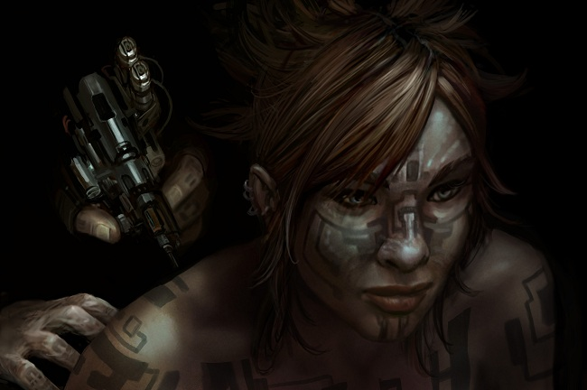

# Tattoos

While body markings and modifications appear across all cultures in New Eden, it
is t he Minmatar who have taken that most ancient method of body marking, the
tattoo, to a whole new level. To the Minmatar, the tattoo is not simply a form
of art, but rather an integral part of their culture and customs.

## The Tattoo in Minmatar History

When the Minmatar Empire was in its heyday, before a single Amarr ship ever
darkened its skies, the Minmatar had truly made the tattoo into a form of high
art. It was said the best artists could breathe life into the skin of an
individual with their work. Today’s works, although still beyond what other
races can achieve, are mere scribbling compared to the greatness of their
predecessors. The Minmatar tattoo artists of today are forever seeking to regain
the knowledge and skill that was lost to them when the Amarr, during their
occupation of the Minmatar, issued an edict banning the practice.

This was a savage blow to the Minmatar, for a Minmatar’s tattoos proclaim who he
is, where he came from, what he does, where he has been and what he has
experienced. They represent a Minmatar's identity as well as his story. A
Minmatar without his markings is not considered a Minmatar at all. Such a one
would be as alien to the Minmatar as a universe without God would be to the
Amarr. In this, as well as in myriad other ways, the Amarr began to erase the
Minmatar’s culture and identity, converting them into more pliable slave stock.

During the millennium of enslavement, the Amarr all but eradicated the tattoo
culture. Nevertheless, it managed to survive in various different bastardized
forms until the Great Rebellion, when the Minmatar finally threw off their
shackles. What followed was a long hard struggle for the Minmatar to regain all
that was lost to them during the occupation, and within the context of this
endeavor the culture of tattoos was given primacy. The Republic of today is
enjoying a renewed ascendancy of this ancient art form, with the tattoo once
again representing an integral part of Minmatar culture and being.

## The Tattoo Today

While the forms and styles of tattoo vary across tribes, the structure and
culture behind the art are surprisingly uniform, making it a strong source of
cultural bonding between the tribes. For the first few years of her life a
Minmatar infant has bare skin, and it is left symbolically so. When the infant
reaches a certain age she is given a temporary naming tattoo, which identifies
the child and tells which clan she comes from. This temporary marking is renewed
as the young Minmatar grows. It is the only tattoo a Minmatar child is permitted
to wear until the Voluval.

The Voluval is the sacred coming-of-age ceremony for the Minmatar. It is here
that the individual transforms from a child into a fully recognized member of
their tribe. At the height of the ceremony the presiding shaman will finalize
the ritual by invoking the Voluval mark, where the soul and destiny of a person
are said to be revealed through the emergence of a tattoo on the recipient, the
secrets of which are closely guarded by the Vherokior mystics who kept it alive
during the long centuries of subjugation.

The Voluval is considered the most sacred mark a Minmatar can carry, and in some
rare cases can change his life irrevocably. Although the significance attached
to the Voluval mark has waned considerably in today’s Republic, certain marks
can still see the recipient cast out from his clan and tribe, and conversely
certain marks can lend the bearer much acclaim. In nearly all cases, however,
the mark falls somewhere between these two extremes and the bearer moves on with
little effect.

After the Voluval ceremony the young Minmatar will receive her permanent naming
mark which will reside forever on her face. This mark will identify the name,
clan and tribe of that Minmatar, plain for all other Minmatar to see. In such a
way, two Minmatar meeting for the first time can immediately know these
fundamental specifics about each other.

After the Voluval, the markings the individual will carry can vary greatly
depending on the course of his life, where he travels, his occupation and what
great achievements, if any, he has made. Each will reside on a specific area of
his body – a person’s ranks within their occupation and their clan are usually
displayed on the shoulders, for example.

In modern society many such tattoos are covered during day-to-day affairs. For
example, Republic Navy personnel will wear uniforms with rank identifiers, but
their true mark of rank is considered to be their body mark, even though this is
not usually displayed. The culture of tattoo is truly ingrained into the
Minmatar mindset, pervading nearly every aspect of their society.

A Minmatar cannot bestow upon herself just any tattoo. In some cases she may be
able to influence styling and shape, but she cannot add a tattoo without having
first earned the right. Inking a tattoo upon yourself without permission is
considered a grave crime and offenders are subject to severe judicial
punishment. Because of this arrangement, a Minmatar who is heavily tattooed is
more respected by her peers, which will allow her greater opportunities to
advance. Her experience is there for all to see.

Through this near-constant long-term process of tattooing, it is sometimes
necessary for a tattoo to be removed or replaced with another tattoo. Since
Minmatar technology is very advanced in this area, removal of a tattoo is
extremely simple, with a pinpoint-precision surface laser wiping clear any
unwanted area. There are times in which a Minmatar will symbolically choose to
use the old method of skin removal, which carries the side effect of leaving
large, highly visible scars. This is particularly prevalent when changes of
allegiance or other actions of heavy emotional investment occur. (It is
especially common after certain judicial punishments, for example.)

The Gallente find the culture of tattoos somewhat barbaric and uncivilized, and
early on tried to persuade their Minmatar neighbors to drop this old custom and
embrace their future as a civilized nation. Their efforts to this end were
initially met with polite denials and later with derision, but interestingly the
Gallente youth now find the custom fascinating. Indeed, it is not uncommon to
see young Gallente teenagers sporting tribal and gang motifs lifted from their
Minmatar peers, symbols of whose true meaning they have little to no
knowledge. This can evoke anything between high derision and outright hostility
when those so inked encounter true Minmatar.
