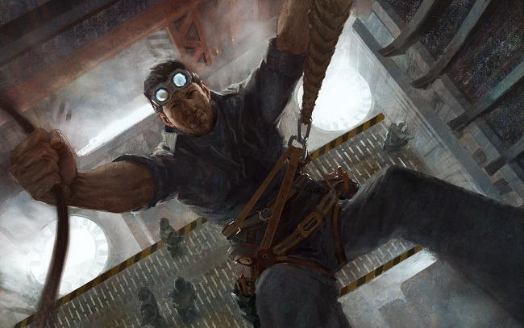

# Rust Creeps

I'd had a tiring and frustrating day, the kind you don't even want to mull over
once you've lain down in your bunk. There are too many days like that, these
days. You close your eyes and what you start seeing is too much for a tired old
man to take, so you keep them open instead, you look out the viewport at the
unblinking stars, and you listen to the silence.

That was what brought _him_ to mind: The silence, or rather, the impression of
it; that velvet cloth laid gently over the air. It never is truly silent on the
ship – the mind merely learns to block out all those little noises – but you
don't hear the other crew members much. The ship is built to muffle the sound of
other people going about their off-hour lives. This is good; it gives you a
little privacy, and keeps you from losing your mind if the person on the other
side of the bunk wall in your quarters has a sinus problem or likes to sing.

No, the only thing you hear in that near-dead quiet is the ship itself.
Adjusting to space. Gently balancing its mass distribution and heat. Stretching.

I hadn't listened to it for a long while, not consciously, but it felt soothing
after the long, rough day. This was not a tour I had wanted to sign up for. Our
dubious mission aside, the ship itself was not the best and certainly not the
most well-maintained in the cluster – even Eren would've had a hard time with it
– but we all have our dues to pay. We all have our dues to pay, and Eren, who
paid dearly, he knew how to listen.

* * *

Eren and I first met on a similar tour years and years ago. The technology at
the time was pretty advanced, obviously – I live on a goddamn spaceship – but
still not nearly so much as it is today. There was, in particular, a dearth of
reliable automated repair systems, which is a major problem for a type of
transport that involves shifting a highly complicated piece of technology
through an extremely simple and deadly medium.

On ships like that, good hands-on engineers are worth their weight in any
precious metal you care to name. The best ones tend to be more in tune with
their machines than they are with the crew, and they get plenty of leeway both
when it comes to proper procedure and working conditions. Some people have a
problem with that. I don't. My ship's purpose is to get me to wherever I'm
going, safe and sound, and forcing some guy to alphabetize his spare parts
instead of doing repairs isn't really going to help.

That ship was having a hard time of it. We'd managed to avoid taking damage – I
think we were transporting some bulky cargo, and we certainly weren't kitted out
for combat – but something, somewhere, kept breaking down and slowing our way.
Nobody on the crew could fix it, not even the people supposedly brought on as
specialized repairmen. Eventually our team leader announced that we'd be docking
a few systems away, a detour that would add considerable time to a schedule that
was already far delayeddue to all the breakdowns. I openly wondered why we were
going to all that trouble; if there was a special team for us to pick up on that
station, or special equipment that could detect the flaws in our machinery, or
what.

My boss at the time said there wasn't. There was just this one guy.

We hauled ourselves to the station and sat there for half a day. I was put on
assist, but I never even got a chance to talk to the man. They sent me
instructions on how to prep the repair area, which mostly involved me crawling
all the way into the bowels of the ship while lugging a bunch of heavy gear with
me. I deposited it in the manner I'd been ordered to and waited around in case
he'd need anything else, but when someone entered it turned out to be my own
boss, who told me to get the hell out. Eren couldn't be disturbed, he said.

I grunted, got up and left. For some reason the walkway lights had been dimmed,
to the point where I had to feel my way along the handrails even to see where I
was going. I took slow steps, muttering to myself in the darkness – not
something I usually do, but it had been a long shift and I was too tired to keep
my mouth shut. It wasn't until I'd made it to the exit that I realized what my
own stupid voice had nearly hidden from my ears. Someone had been whispering.
Someone had stood stock still in that dark corridor and whispered, either to
themselves or to me. I turned and glared down the walkway, and just as the door
closed on the engine room I saw that stranger – and I _knew_ it was that Eren
guy – walk through it, one hand trailing over the metal surface. The vision is
still burnt into my memory: A younger man silhouetted in the door, his face
looking up at the bulkhead opposite with that puzzled expression people have
when they're trying to work something out, his posture that of someone young
enough not to have to worry about it just yet.

Of course he fixed the problem. He stayed onboard for a few days before getting
off at our next port of call, and nobody spoke to him. We weren't ordered to
leave him be, but he gave off that kind of awkward loner vibe; and anyway,
someone who could just walk in and do what he did was not necessarily someone
you'd feel safe around. Geniuses – not just highly talented people, or the lucky
ones, but actual bona fide geniuses – tend to attract either attention or
trouble. At that period of my life I felt it would be best to avoid the chance
that either of those might splash on to me.

I didn't see him for years after that, nor did I think much about that time. I
was doing well. I'd had the good luck of signing on to safer vessels, which is
probably the reason Eren remained absent from my life. But everything breaks
down eventually, and after a long haul through dangerous areas with not a lot of
time to waste, we called on him to patch up our broken machines. As it turned
out, I was the only man who had ever worked with him before – if you can call it
work to lay out the instruments and scuttle out before the band starts to play –
so I was automatically assigned to do the same. This time I did get to meet the
man, and while he was very reticent to talk – and I certainly didn't push him –
we got along well in our own quiet way. He looked a lot more worn than I'd
imagined. I remember being amazed that I'd ever thought he could be younger than
me, for he clearly wasn't, but then my sighting hadn't been under the best of
conditions, and heaven knows we all fall short of God's glory in full daylight.
I enjoyed watching him work, and didn't wonder how he managed to find the exact
fault in the mess of steel and insulation he was fairly buried in. I think he
sensed this, for after the work was done and Eren long gone, I got a
commendation from the captain, and was given to understand that if ever they
called on the man's services again I would be expected to act as his assistant.

To my knowledge they never did request his help again, but then I didn't stay
with them long. I'd had enough of the weightless life - there is perfect gravity
on ships but in some sections they need to shift you a little to the side to
accommodate for their designs, and walking on walls _will_ get to you after a
while. Instead I signed on to a colony in safe space, working at a refinery that
enveloped well over half the asteroid it was located on.

Truth be told, it wasn't more than a few years before I was thoroughly sick of
that life, too. I guess if you make the jaunt into space, and take to it, you
cease being the kind of person that takes root anywhere at all. Nonetheless, no
decent tours were on offer, so I stayed on and patiently did my job.

The break came from the strangest of places. A ship docked, which was no great
news, but surprisingly it was without cargo and had no trade agreements with the
colony's ruling corporation. They did need repairs, they said, but we could
offer them no men or equipment that they did not already possess on their
vessel.

What they wanted was me.

They needed the services of a specialist, they said, and were on route to the
system where he was located. It was quite a few jumps from here, but the expense
was negligible when compared to the losses they would incur over the upcoming
weeks and months if they didn't stop having breakdowns right in the middle of
tightly scheduled deliveries. Supposedly this specialist was worth the trip, but
he would only sign up if an assistant were brought on as well. Someone who had
extensive mechanical experience, but more importantly, someone who had worked
with him before. Someone like me.

I grabbed the chance. Packed my things, signed the waivers, got to know the crew
and settled in for the long haul to see Eren.

When we met, I was rendered speechless. If I hadn't seen him a few years
earlier, I would have thought decades might have passed. His hair in particular
had noticeably thinned out and greyed, and there weren't so much wrinkles as
deep grooves in his skin, etched there by pressures I hoped I would never have
to experience. All his movements had taken on that slow, methodical pace one
sees in people who've gotten too old to have the energy for mistakes.

I decided right away not to mention it – you can't turn into that kind of wreck
and remain unaware of how it shapes you – but did my part in the ensuing repairs
by making sure his tools were always where he needed them and often just a
little closer than he really needed to reach. I didn't think he saved a lot of
effort from that arrangement, but I had the distinct feeling that having the
tools closer than usual would make him more mentally comfortable, as if they
created a small safe space with no room for outside influence. A protective
circle, really.

He seemed to like it. We didn't talk much at first, but as the days passed –
mostly spent waiting for replacement parts so we could get on with the actual
repairs – Eren opened up a little. Besides, we were in the deepest parts of the
engine rooms, the ones where everything is exposed, and you really don't spend
time with someone around machines that can potentially kill you without
developing at least a little camaraderie.

Actually, it's not entirely truthful to say he opened up – at least not to me.
He simply let his guard down. Two days in I noticed that a quiet murmur I'd
assumed to be part of the ship's own thrumming heartbeat was, in fact, coming
from Eren himself. I peered closer – all ship cores are gloomy and dark,
probably because if you don't know by heart where every single moving part is
now and is going to be in five seconds' time, you shouldn't be down there anyway
– and saw that he was talking to the metal itself. He was talking to the ship.

He must've heard my breath stop, because he fell quiet, leaned back and said,
without looking, "They say things."

"The ... parts?"

He shrugged. "Or the ones who touched them last."

"Ship parts come from all over the place, often from recycled ships," I said.
I'd meant to imply that he couldn't possibly know who these people were, let
alone that they were even alive anymore, when I realized what he was saying to
me. If there truly were voices, they weren't on our side of the veil.

I swallowed dry air and asked, "What do they tell you? How to fix the ship?"

He nodded.

It really was very dark in the engine room. "What do they ... want in return?"

He shrugged. "To talk. To be heard. For someone to remember the stories of the
dead, of this ship and all the others where their parts have been used. Or even
places where this ship has docked, places that no longer exist."

Those places would have been in space, unorbiting colonies, very possibly pirate
ones, and very definitely long since fallen prey to capsuleer fire. Deaths, and
more deaths; and once their graves had been picked clean by the attackers, the
only usable things left in the wreckage would have been those parts.

Capsuleers went through frightening amounts of ships and even colonies on a
regular basis. I wondered just how many ship parts had been salvaged from the
dead. How many voices wanted Eren to hear them, all moaning in the discordant
choir.

* * *

Late that same evening I was too restless to sleep. I ended up using the ship's
dataline and looked up a few things, which satiated my curiosity but eliminated
any small chance I would sleep that night. 

There were, amazingly, other people like him; but then, in this vast universe,
everything has to exist somewhere. Psychomancy, it was called. They could tell
things from machine sounds, working them like the entrails of a shaman. The
buzz, burr, shear and whine; the way the rust stretched its coarse surface over
them.

More than anything, the mention of rust unnerved me, and I couldn't stop
thinking about it. The next day I mentioned it to Eren.

He responded, "It's true. And I don't like rust. It creeps. It distorts."

"You mean it makes it hard to hear the, uh, voices?" I asked

"Oh no. It doesn't muffle them. They just ... come out distorted. As whines, or
these shrieky, tattered howls. Imagine the rust was on your vocal cords," he
said matter-of-factly. "Imagine it going into your lungs. It's a cancer."

I couldn't help it. "So Minmatar ships..."

"...can go right to hell," Eren replied with a grin. He added, almost
absent-mindedly, "All ships are haunted. It's like a sea we're on, this vast and
cold sea. Voices always drift to the warmth."

"You ever think about signing up for repairwork on a colony instead? I can't
imagine this kind of life is easy for you," I said.

He gave me a look, but in the gloom I couldn't see it clearly. "Don't like to
work colonies much. Too many buried there."

I got the distinct feeling there was more to that comment, and I really didn't
want to pry into the matter any longer. It's bad enough working in the gnashing
darkness without imagining things that aren't even there. We finished our work
for the day, and we didn't speak of the voices after.

The next day turned out to be the final one in our stint on the ship. A part
we'd been waiting for was finally shipped, and I installed it for Eren. I said
to him, "I honestly don't know how you're going to get this one going. The
team's replaced this part three times already, and it simply refuses to work."

He looked at me for a while, not unkindly – I couldn't tell if he was amused or
if he was listening – and then he leaned out, and he simply touched the damn
thing.

The breathless hammering we heard shortly after was one of the crew running into
the room to ask us what we'd done and how the hell we'd done it.

* * *

I lay there in my bunk, thinking of that time so long ago. It was the last and
only occasion we'd worked together. I had expected to be called out again, and
Eren certainly hadn't seemed averse to the idea, but the quality of repair
technology had caught up and the services of people like him were in less demand
– either that or they were being assigned tasks complicated enough to eliminate
the need for a simple machinist assistant like me.

I did see him once more, years later. On a colony somewhere, in a place I left
shortly after. I barely recognized him at first; it was like he'd been shunted
head-first into old age, his body matted, wrinkled and eaten up by time and
whatever other forces worked on that poor man. I didn't say a word, but he
acknowledged me with a nod.

"Tt's the rust," he said. He thought it over, nodded to himself and repeated,
"The rust. The rust creeps."

I couldn't help but ask. "Still the voices?"

His eyes were rheumy and blinked too often. The skin on his hands slid like oil
on water. "I haven't heard the voices for a long time."

I was still trying to understand this, and the implications of it, when he
added, "I hear what's beyond them now. There's something else. There is
something behind them and it never falls quiet."

His voice dissolved to a mutter. I didn't know whether it was directed at me or
the machine. Or at whatever lay beyond, which surely knew that he could hear it.

All his hair had fallen out except for the bushy growths over his eyes and in
his ears, and I could see the veins in his hands.

I lie here on my bunk and I think of him. That old soul in that rapidly dying
body, and the things he listened to. I think quite a lot of Eren, these days.

Because the ship creaks. The ship creaks, and we are going into empty space, and
there is a patch of rust in the corner, and I wonder if my old friend is calling
for me.
