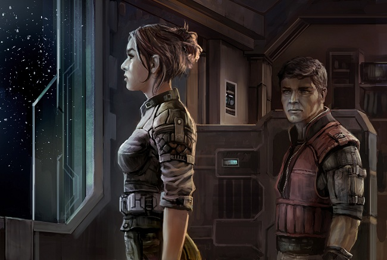

# Hona is Three

In the love of your life - any one of them,
for there are many, no matter what you might think - there are three people,
three human beings you fall for. There is the one at the start where everything
is fresh and new, which is when you see only what they want you to see; the one
some time after, when the gloves come off and they show you - or stop bothering
to hide, at least - whatever else they knew they contained; and the last, long
after, when you've begun to see so deep into them that you can tell what they
cannot. If you're lucky both of you will dovetail, fitting each other and
changing in each other's perceptions as you pass through time.

* * *

I was a Guristas operator, working out of a
minor, unaligned asteroid colony in a system of really no repute at all. After
years in my line of work - I was only twenty-eight but I'd started early,
having developed the necessary business acumen as a teenager and had the
required set of morals beaten pretty soundly into me as a child - I had come to
the conclusion that nondescript, monotonous but decently populated locales were
the best places to do my kind of business. Everyone here walked with their eyes
to the ground and their ears clogged up with asteroid dust. Most of what I did
involved oversight of nearby transactions, the kind where I linked up one
person to another through channels I made damn sure were safe from prying, and acted
as intermediary, facilitator or occasional pacifier, depending on the
situation. 'Nearby' is even a misnomer; the distance between me and my
customers was measurable in astronomical units, and I was very good at keeping
tabs on the locations and movements of everyone I did business with. On
occasion someone would dock at the station and request to see me in person, but
I was well enough in with the local station operators that I always received
plenty of warning and, if necessary, backup.

I was surprised one night when a call came
in over the local line to inform me that a team of allegedly Angel-affiliated operators
was to dock at the station and had requested my assistance. I was free to work
with anyone I liked, so long as the Guristas got their due, but people
explicitly affiliated with the rank and file of other pirate factions were
loath to seek out my business. When they did, it was usually out of desperate
need rather than convenience.

The call included verified contact details,
which was normal, but also single-use encryption keys for their positions
within the Angel hierarchy, which was rather out of the ordinary. I ran those
and they all checked out. The group captain, a woman called Hona, was member of
a special operations squad within a little-known branch of the rather extensive
Angel hierarchy. It was a vague enough title and rank that I couldn't make out
what her real job was, but since she was working here on the outskirts and
willing to meet with nonfaction black market personnel, it was bound to be
interesting. I agreed to the meeting, and as it was only Hona who wanted to see
me, requested that the rest of her team be given good accommodations well away
from the tumult of the mining grounds. I was always open to new business
relationships, and having the clients' first memories be of sleepless nights
and trembling furniture was not a good idea.

We met in a local bar whose owner had
considerately set up isolation booths, both aural and electrical. I arrived
first and took a seat with my back to the exit - I wanted to project a
comfortable, slightly trusting relaxation, and besides, if I was unsafe here of
all places, it wouldn't matter which way I faced when shots got fired. I did
discreetly place a small scrambler on the middle of the table; no lack of faith
in the bar's isolation tech, but I also wanted to project the feeling that I
knew what the hell I was doing.

The beating of a tattoo on the floor told
me that she had approached. From the muffled hush behind me a calm, crisp voice
said my name, and I nodded in acknowledgment without turning in my chair. She walked
around me and took at seat at the booth, directly facing me. There was a
dominant air about her - it's been so long I can barely remember what she
looked like, except that her face was set in determination as well as something
else, creeping towards exhaustion.

"Welcome," I said. "Drinks
or anything?"

"Just business," she told me. 

"I hope I can help."

She nodded and said, "So do I,"
in a tone that didn't quite imply a threat so much as an inclination not to
suffer idiots lightly.

Humor, even in the darkest of circumstances
- especially in those, really - was a major asset in any potential business
partner, so I decided to test the waters a little. I shrugged and with a
nonchalant air said, "If I can't, well. Shame."

She shrugged in turn, and seemed to accept
this. "If it's not your own fault, nothing to be done."

I agreed.

Then she added, "If you do mislead us,
of course, we'll send death squads after you," and I decided I liked her.

It took a while for her to explain the
particulars. The basic case was simple - undercover Angel recruitment agents
had been turning up dead - but the real details lay in what they'd done thus
far to find the culprit. Hona did not want me to waste time following the same
tracks. As she described the precise work she'd undertaken to find the
murderers, I was fascinated, first by the clear and definite purpose with which
she had followed up on this - the murders had been particularly vicious and
taken place in areas not safe for Angels to be in, so even recruiting people to
her squad had been an undertaking - and then by the meticulous way in
which she'd investigated what few leads she'd found. At some point I admitted
to her that I would have a hard time improving on her work, and she took my compliments
in good grace.

She was charming. Presentable, assertive, in control. We
got on well. As the evening wore on I found myself revealing to her a number of
options that I had not even considered mentioning for the fee her superiors
intended to pay me. I openly discussed, without breaking confidentiality, the
extent of my connections and the abilities they lent me. She told me about life
in the Angel Cartel, not only as an agent of theirs but as a regular person
living on colonies under their aegis.

We had drinks. We got on even better. She had signed up
for the Angel service because, she said, she wanted to control the world as
much as protect the people in it. Also, kick people in the teeth. I was here, I
found myself saying, because it was a safe place, netted with webs of
communication that I could - there was that word again - control, and yet
remain at a safe distance. She understood this. She was good at talking to
people, and at appearing tough enough to exercise an authority that she often
did not have. We agreed on the loneliness of space. Where our careers would
take us, we each admitted that we had no idea.

We did not end up sleeping together. We wanted to, and so
we didn't.

But at the end of a long evening and a long night, we
decided that she and her team would stay on station for a couple of days. We
had found in each other a capable, intelligent person, and we were convinced
that together we could develop a plan to root out the criminal Hona so badly
wanted to find.

It took a couple of days and a couple beyond that, and I
had to get in touch with more people than I had expected to, but finally we acquired
sufficient data to develop an extensive plan of action. It involved a series of
inquiries in neighbouring space, interviews and investigations using multiple
local contacts, heuristic searches through vast repositories of local data that
I had access to, and a definite possibility of bringing in added manpower and
weaponry in case Hona found herself outmatched by the criminals. We were going
to present it to her team that evening.

Then I got a note from her saying that they'd received an
unexpected lead: one of the recruiting agents in a nearby constellation had lost
his partner to yet another messy, horrible murder, but this time there was
evidence the culprit might still be in the area. She had to go. She was sorry,
but she had to go.

I never answered the note. She knew where I'd be if she
needed me.

* * *

The next time we met she stumbled through
my door covered in blood. My immediate shock was the sight of her, the poor
tattered thing; quickly followed, to my shame, by a shock that she had made it
all the way to my quarters without me receiving any advance warning.

I didn't bother to say anything, but helped
her as gently as I could to the bathroom. One of the compartments there held an
assortment of healing agents, coagulants and such, including a few expensive plexiglas
syringes that held different types of nanomaterial. Some of the items I had in
there were expensive and even bordering on illegal, but I hadn't bothered to
hide them. I'd figured that if I ever needed to access to this stuff, I
couldn't expect to be in any shape or condition to burrow into any kind of
secret compartments.

Hona was cut and burnt all over, but the
biggest immediate worry was a deep gash on her leg. It was  still bleeding, so
I reasoned  she must've had access to some kind of basic medical help along the
way - she would've bled out otherwise - and focused my attention on it. The
obvious conclusion of the focus she must've possessed to reach me in particular
didn't occur to me right at that moment. I sprayed her with local anaesthetic
and sprayed my own hands with a sealant that formed a second skin, lest I touch
the anaesthetic with my bare hands; then smeared a disinfecting coagulant into
the wound. It stopped bleeding after a while, to my immense relief, and I got
out the clamps. Her head was turned to one side, but I shifted a little to
block the leg from view just in case. Once I'd stretched the clamps to match
the wound and fixed them to the skin, they gave off a burning smell and started
retracting, pulling it together and sealing it with immense local heat. It was not
the most pleasant of sights - the skin blistered and dripped at the mouth of
the wound - but it was a million times better than watching Hona bleed out on
my bathroom floor. Once the clamps had properly sealed the skin they dissolved
into the leg, where they would, at a much slower pace, continue to seal up and
heal the wound underneath.

I glanced up at Hona, only to find her
staring right at me with unblinking eyes. Her mouth was slightly open and she
was taking shallow breaths. She'd gone into shock. I gave her a little smile
and stroked her cheek, then took hold of her hand and slowly stroked that as
well. Whether she noticed the small patch I affixed to the inside of her wrist,
I don't know, but in a few moments her breath slowed, and not too long after
she drifted into sleep.

She stayed with me for several weeks. Try
as I might, I could not get her to tell me what had happened, other than that
it had involved the murderer she'd been after. That person, she said, had been
brought to justice. I sensed there was quite a bit more to it than that. She,
in turn, got frustrated and then annoyed at my curiosity, and didn't hesitate to
let loose when she thought I'd done enough prying.

It wasn't a good time. She recovered from
the initial, physical shock - her wounds healed remarkably fast given how
serious they'd seemed at first and how little proper medical care she received
both before and after coming to me - but there was a deeper-set trauma that
neither one of us were ever able to properly deal with. It wasn't just shock;
it was a nervous breakdown, something I realized the first time Hona woke up
screaming and then had brought home to me when she sullenly refused, then and
later, to discuss anything in her past. Not just the incident, but anything
else prior: Her career with the Angels. Her past team and what had become of
them. Us.

She was not a woman who would allow herself
to be helped. She needed it - she'd come to me, I reasoned, because I could
give her a balance of safety and trust on one hand and anonymity and distance
on the other - but she hated it, and I bore the brunt of her frustrations. All
the sides I'd seen of her in our initial meeting came out reverted, turned in
on themselves. She continually attempted to dominate our relationship, or
whatever it was; in words, and in actions as well, using her secret past as
excuse to go into shrieking arguments over issues of no importance whatsoever.  At
times she'd treat me like an underling, someone to order around. Other times
she'd obsess about our safety, continually asking me about the security
mechanisms in my quarters and on the station, then freaking out when she
thought she perceived gaps in them. She was good at using words, and when she
put up a front there was nothing I could say to pierce it, good or bad.

We slept together, sometimes. We didn't
always want to, but we did.

Despite her intermittent worries over
security, there were times when she was amazingly nonchalant about her arrival
on the station. My own questions about potential repercussions or chase went
unanswered outside of brief, slightly condescending comments from her that
there was no risk hanging over us. When I finally did look into the records of
her arrival - it took me more than two weeks to even get to that point, caught
up as I was with her arrival and the change in her personality - I was astounded
to find that there was no registration, no check or mark, nothing whatsoever
denoting that she had even arrived in this area of space, much less crawled
bleeding up to my doorstep.

The anger I took in good grace. I'm sure I
yelled back just as much, though that's not the point. She was changing. I
could tell, easily, even though in truth I barely knew her, so I was sure she
could tell, too. Sometimes, in peaceful moments, I'd see her stare out my
window, at the colony outside and at the protective atmospheric shielding and
the stars beyond it; and I'd see something in her face, either shifting about
or, possibly, slowly settling. She was on her way to somewhere. She was
shrieking because she was moving too fast, but she definitely had some manner
of destination. Even with the arguments, and the petty games, and all the rest
that we could never have borne for a long period of time anyway, it hurt a
little that this destination couldn't be here.

_Why_ I took it,
well … I knew that I was getting to know another side of her, one she'd not
have shown to many other people. Even in all the tumult, I still respected her;
I saw a woman trying her hardest to deal with events that had clearly stretched
her mind beyond its breaking limits. I wasn't unfamiliar with screaming
arguments and fights - I'd ended up at this colony, in this job, for a reason,
and even though I'd progressed far since those ugly childhood times, I still
had coping mechanisms ready for use. I did get upset, as anyone would, and I
did feel hurt and let down, but I retained my perspective.

Besides, I knew this situation would
eventually change, one way or another - for her, or for me. If I had been
entirely happy with my life on the station I would likely have been more
protective of it and less inclined to let Hona in. In reality, I had been growing
so dissatisfied with it - especially since that initial meeting with Hona, when
I'd had it hammered home just how lonely and meaningless this existence was - that
I knew my own time on the colony was increasingly limited. So I kept my anger in
check, allowing it to slowly rise and strengthen. I wanted to leave, sometimes,
just pull up stakes and disappear, but I knew that if I dared, I would leave
behind in Hona a guilt that would never be extinguished. She would think that
she drove me off, and I couldn't allow that, because now matter how badly we
got along - and how much I wanted her, all at the same time - I knew that this
was not about me, or about us: It was, in the end, solely about her. That face,
growing increasingly peaceful between the rages it was forced to express. That stare,
seeing other planets. And that strange body, healed too soon from terrible
damage, hidden too easily from electronic eyes. Something else, more than
human.

One day we woke up together. She turned to
me and whispered "sorry." Then she kissed me with warm lips, open
eyes, calm breathing. It tingled, and afterwards I lay in bed, stunned, more
peaceful than I'd been for a very long time, far beyond her arrival in my life.

I didn't hear her when she left, but I
knew. I left soon after, myself, on some road of my own.

* * *

When I awoke, I was in a cave, surrounded
by lit torches, and there were people standing around me. I grinned at them.

In the preceding months I'd been drifting
about through various regions of space, trying my hand at different jobs and
different lives. I'd had enough money saved up that I could leave any place
whenever I liked without fear of starvation, but my natural ability to develop
and make use of connections came to the fore, and I found that I was able to settle
in nicely wherever I decided to stop. Eventually, though, I'd grow unhappy with
whatever life I'd set up, and disconcerted at seeing old patterns arise again.
I would isolate myself, no matter how big or welcoming the crowds around me. I saw
all people eventually as collections of usable traits and potential benefits. I
sought a general control over life that the universe wasn't much inclined to
let me have, so I ended up applying it only to myself, and in the process disengaging
from other people before they could start poking through the shields I'd put
up.a

During the drifting it did on occasion occur
to me, yes, that the one person in recent memory I'd had a different
relationship with had been Hona, first because we connected through an
understanding of our own loneliness, and then later when her raw, exposed,
confused self was too taken up by its demons to bother with faking it from me
and my own. I never reached out to her, nor made any attempt to find out what
had become of her. I figured that in time, if I was meant to, I'd find out; and
besides, the way the woman had covered her tracks when coming to me, there
wasn't a chance I'd find her unless she wanted to leave tracks.

It finally happened when I was headed
through Angel space. I received an anonymous request for a meeting that ended
up bringing me to a large asteroid in the middle of nowhere. Just as I was
about to turn the shuttle back, it malfunctioned. First engines, then
pathfinding. Then life support. The oxygen lasted amazingly long, really; I
breathed easy the whole time. I knew it was her.

They brought me into a city of stone,
encased somewhere in the asteroid. Stalactites like cathedrals hung suspended
from the ceiling. Past the center, on the outskirts, in an area where people
spoke in hushed voices, there was a building - a hollowed-out stalagmite -
where they led me and left me to wait alone.

Hona was there.

We talked for a while.  She sounded
distant; not for lack of commitment to our conversation, but as someone who now
lived somewhere very far off from the rest of us. She explained to me how she
had come to be there, how she'd come to terms with what she'd become and, once
having reached that level of honesty with herself, had begun to be honest with
the world at large. She had accumulated fellow thinkers - she did not have to
call them followers; I understood what they were - and they had found
themselves drawn here, to this living rock. I asked them how they got food and
oxygen here, and she said the rock provided. I enquired whether they were as
safe from prying eyes here as she had been after her accident, and she said the
rock gave them all the protection they needed. I told her she was being
maddeningly vague and she said me she didn't know what in the world I was
talking about. Torches burned on every wall, casting their arcane lights on her.

The people in this place, she explained, did
not worship gods, but powers and universal forces, and looked to her as the
conduit. She did not attempt to explain these forces and I did not ask. When I said,
only partly in jest, that this made her a demigod, she looked at me for some
time with the strangest smile on her face. I met her gaze and smiled back, and
it took me a while to realize that whenever I blinked, I still saw her there. Somewhere
in the dark of my head, where my eyes couldn't go. She asked me to turn around,
and I did. She was still there. When I asked her if this was magic, she
laughed, a beautiful laugh, and shook her head.

I told her I was glad that she'd found the
place meant for her. When she tried to shrug it off by saying it could've been
anyone, I interrupted.

"It's perfect for you. You're in
control, you get to plan and think and care for other people, and you belong to
a system greater than yourself; greater than anyone, really, given the way you've
described it. I don't think I know anyone who'd fit this role so perfectly, let
alone get through the initiation ritual the way you did."

"You think what happened to me was a
ritual?" she asked.

"Not in a preordained sense," I
said. "I don't believe bad things happen for a reason. But I think it
brought you to a place you might not have reached otherwise. And I think you're
proud of it, and of yourself. That's why you invited me here."

"You think I brought you here to _brag_?"
she said, looking immensely amused.

"No, dear heart. You've no interest in
acknowledgment nor compliments. You brought me here to show me you were all right,"
I said. "And I think you are. I think you found the end."

She nodded her thanks. I stayed a little
longer, but we didn't say much more. I enjoyed being with her, and she with me,
and we exchanged thoughts that went beyond language. When I finally did leave,
I did not need the acolytes to show me the way out.

* * *

I'm still headed somewhere. Haven't quite
found my way there yet. It's alright. She'll be there, however long I have to
take.

I still see her when I close my eyes.
