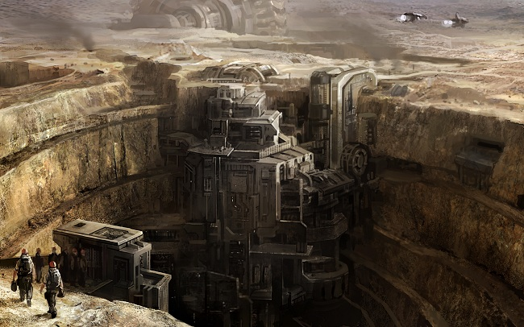

# The Desert Fathers

Well, uh. Okay. My name is Kartanen Sedia. I am the overseer on Outpost 4972,
where in the past three years we have been extracting minerals used in the
production of various hybrid polymers that in turn are used to create advanced
components for the capsuleer industry.

In fact, in those three years we have sustained a consistent output in the top
forty-eight percentile while simultaneously maintaining a perfect safety record
extending not only to security but to employee safety, and-... I'm sorry?

Oh. Of course. Yes.

First off, I am sorry about what happened. I assure you that once we are done
here, I intend to launch my own investigation and get to the bottom of this.
Szekel is not getting away with what he took.

It's not easy, living in the desert. If they hadn't discovered those mineral
deposits I don't imagine anyone would ever make their home here, at least not on
this continent. That goes double for the scientists. You can always find hard
workers for the excavation, people with calluses and no savings, but it's harder
pulling in those who consider air conditioning a basic human right, no matter
what kind of interesting rock we've suddenly pulled out of our back yard.

Yes, I hired them all. Yes, even him. As I said, I regret what happened. His
resume was-... my own? What do you mean?

All right. I've been an overseer on various outposts for most of my life,
really. I was born on an asteroid colony and spent a good part of my life
working those, but eventually the lack of solid footing got to me and I
transferred to planetside work instead. I maintained exemplary security during
my tenure on those colonies, with a near-perfect record in my thirty-year
career.

Yes, including Outpost 3478, out in the dark near Stain.

Yes, where the Sansha came. What's that to do with anything? It was ages ago, I
did what was right, I was investigated afterwards and exonerated, and nothing's
ever been prov-...

Ah, hell. God damn it, god damn it and god damn you.

Nothing's ever been quite the same since. Happy now? Everything changed. Yes,
I've been working thirty years in the same damn business at the same damn level
of lower management, and all because the cyborgs came in and ate up my people
all those years ago. Nobody trusts me anymore.

Well, I suppose, yes, but I wouldn't call it a sliding slope. It's just hard to
pull up from that kind of career slump. I drifted through jobs on other colonies
and finally got a contract at this one, where I had intended to spend my
remaining years until retirement.

No, not that well funded. I'll have some money to live on, but ... wait, why are
you even asking me this? We're trying to find a thief here!

No, I don't have a lot of money. Not after the Sansha debacle.

Why are you asking me this?

* * *

Certainly. My name is Jania Betodt. I am working on my post-doctorate studies in
astrobiology. The atmospheric properties on this planet make it a haven for
acquiring large intact samples, though I must say I've never quite grown
accustomed to the living conditions. I am married to Phaedan Betodt, and we have
a wonderful daughter, Adara.

No, they're not with me, but those are the costs of an interstellar life, right?
They visit me on a regular basis. Anyway, I have had some noteworthy articles
published in peer-reviewed journals, including at the University of-... well,
yes, I suppose it has been a while since they last were here. I do communicate
with them on a fairly regular basis, you know. When the relays work, yes. We're
a very close-knit family.

Well, because there was important work to be done here. I didn't _want_ to leave
them behind, of course. It simply didn't suit us to break up our careers. Look,
is this about Szekel or my family?

What do you mean, 'Both'?

Yes, I did work with him. Yes, closely. He's a talented scientist and a
hard-working man, whatever else he may be. We pulled a lot of long, hard shifts
working on-site whenever a new batch of data came in. There's only so long you
have to study the new samples before the life they harbor is extinguished, no
matter how well you may try to prolong it.

When that asteroid landed a few months ago, we were in heaven. It contained
sealed pockets that our scans indicated might harbor brand new life. Only
microscopic archaea, of course, but the way they seemed to be reacting with the
metals in the asteroid was astounding. I don't think we've even begun to scratch
the surface, though of course Szekel's disappearance, and the data I ... guess
he took, all of that is going to be rather a setback.

My daughter? She is with her father, and before you ask, I do miss her. I miss
her a lot.

Him too, of course.

Yes, they were long shifts.

* * *

Rakan Dep.

I'm a security guy on this outpost.

Nothing else.

Hey, I'm cooperating. Even if I don't know who the hell you people are.

Disgruntled? Hah! Listen. Listen. We are on a _desert_ planet. There is nothing
here but _sand_. If you end up living in a place like this with no hope of
anything better, disgruntled is the least of your worries.

Well, okay. There's a few towns and settlements in the area, but you'd be an
idiot if you thought you could walk there by yourself. You're isolated here,
pretty much. You make it to the outpost, fine, but you're not making it out on
foot again.

I suppoze Szekel must've gotten help, yeah. Assuming you haven't found him yet.
Scorched and dead and picked at by the jackals, by now, if he went out by
himself.

Of course I've been to the settlements. That's why I'm not _disgruntled_, isn't
it, my pretties? Besides, there's no fun to be had elsewhere.

Fun, yes.

Reading scripture, group hugs, and watching the sky. What do you _think_ I'm
talking about? Goddamn old fashioned fun-for-money. It's mostly gambling,
actually. I'd stick my dick in the noontime sand before putting it to some of
the women you get down there. I'm sure it'd burn about the same in the end.

Hah! Thanks. I am available for children's parties, you know.

Money, yeah ... I don't have enough, truth be told. Never quite manage to hit
that mark. Always seem to spend too much. Hey, I'm not ashamed. I pull long
shifts. You'll find idiots anywhere who say they work hard and play hard, in
that order, as if the first causes the second. I can't say the desert life is my
first choice, but I'll live it the way I would anywhere else, and that means I
need to bust my back earning for it. Doesn't make it right or wrong, and
certainly doesn't mean I deserve any sympathy. It's just how it is.

Yeah, the scientists got plenty. Especially after that damn meteor hit and the
grants started coming in again. They're decent people, most of them. Humans like
the rest of us.

No ... I just mean they do human things. I'm not gonna gossip. But let me tell
you, it gets cold at night, here in the desert.

Sure, I'm human too. What, you're calling me out on my track record? Go ahead. I
know it's grubby. You try working security all your life, live in the desert,
too; see how clean you come out. Never taken money from people I shouldn't,
though. Nope. No, I don't care how you put it - I'm clean when it comes to that.
I _may_ have taken some from people who shouldn't have been dumb enough to bet
it, and I _may_ have been an intermediary for some people who had money and pale
skin and fear of a little sand. But I haven't gone dirty. You know Kartanen, the
overseer? He gave me a shot at this. I'm here because of him.

No, he's not a client. He's saving up, thinking of buying a little house on a
small planet a couple jumps from here, somewhere in ... 32-GI9, I believe. He
doesn't think anyone knows about it, but I do. I watch the money. He's never
made bets or anything. He's a decent man. And besides, you don't touch someone's
life savings, not in this business. You know who people are.

Szekel? I don't know him. I don't know him at all. I have no idea how he
breached security like he did.

I suppose it's my responsibility, yeah. What are you getting at?

* * *

Look, it's been three days. I'm getting tired of sitting in this room all the
time. I'm the overseer on this colony and I don't care who you people are, you
can't just come in here, shut everything down, and pull people into a-…

Yes! I hired Szekel, I let the man in and I gave him a job here, being fully
aware that we were working with highly sensitive data, that we'd had an
important rain and we were due to have another, and that he would be overseeing
the research teams along with Jania. What else do you _want_?

What do you mean, everything?

* * *

What's that you're bringing in? I'm well familiar with all the equipment on this
colony and this is not a part of our stocks. Look, if you have brought in your
own scientific equipment, I need to be told. I am the sole remaining head
researcher on this colony and I am to be included in all communications-...

Uh. Yes, I'm sitting comfortably. Why do you ask?

* * *

The fuck you doing with that thing in here?

* * *

I think, I think, I think we got off entirely on the wrong foot here. I did vet
Szekel, I did give him a job, yes, certainly. But I haven't done anything
_wrong_. Surely you see that.

Of _course_ I know how valuable the asteroid was. Of course I did. I am used to
handling serious responsibility, I will have you know.

That was a cheap shot. We had no idea the Sansha were coming.

Look, there's really no need to activate that thing. I am cooperating fully. I
don't know where you think you have your authority from, but-…

Oh. Really?

Ah.

All right.

Well, can you please tell them that I would never work for anyone else? I mean,
while I was overseer here. Certainly not our competitors. I wouldn't be feeding
anything to them, data or whatever else.

I really don't think you need to turn on that thing.

* * *

We did work together. I told you that. I worked with him, and yes, we got along
fine. Can someone _please_ tell me what this is all about? I don't-… why did you
just put that there? Why is that there? I consented to the monitors because I
wanted you to know I was telling the truth, but I don't think I want that there
at _all_.

We just worked together. I didn't know he was pulling data, or that he intended
to do whatever he did with it. He was a good man and I trusted him. There was
nothing going on. Can you please take that thing off me? Look, I am going to
tell you whatever you want. I mean, I'm not going to hold back. I'll be honest.
I am not covering up for Szekel. I know full well how important our research was
here, for me and this colony and for our employers. That's who you're working
for, right?

I am going to ask you one last time to take that thing off, to-... What are you
doing? No, come over here and take it off!

* * *

Look, I knew the dude from a little betting. The worker's pool, mostly. Maybe a
few extras, too. He wasn't a bad guy, I'm sure, but he did make some bad bets.
Had a few people upset at him over in the townships, but he was working to fix
that. And I believe him. I did believe him.

Maybe he was doing something else, and maybe I'll tell you all about it, but you
better wheel that goddamn thing back out right this minute before I'll say
another word. I've worked in nullsec before. I've worked on colonies that
rebelled, I've been there when the black suits come in, and I know what that
hellish thing is for.

So maybe Szekel needed money and was looking for a way to make some, or maybe he
just didn't like the perks of being in the desert. That's all I'm saying. That
is all I am goddamn saying.

* * *

Look, look, look, look, look, look, I know there's a guard. There is a guard on
this colony who has money problems and access to security logs and probably a
guilty conscience over something, hell if I know what other people think. I've
seen them talking together, and I know they were in cahoots. It was him. If you
want to find someone guilty of working with Szekel, it was him. Talk to him and
you'll see. Make him talk and you'll see. Please take that thing off me. It was
the guard.

* * *

I'm sorry about my earlier outburst. It was unprofessional of me. Unbecoming.
Just let me take a breath, clear my head.

Alright. We can resolve this like human beings, I'm sure.

So. Of course you hear things, working on this station.

Yes, of course I will tell you. I am a respected scientist. We are having a
reasonable discussion, you all and I. We are professionals. Yes. I have rights,
and I know they apply even when there's a communications blackout. Even in the
private sector, on a colony in the middle of a desert, I have rights.

Of course. If you'll just take that thing off me I can tell you all you want in
detail, if you'll just take _no don't activate it again please I beg you-…_

* * *

You know they had an affair.

That's all I'm saying. You can stop it now.

She mentored him when he came in, taught him to use the equipment, and spent all
her time with him. Long hours in the lab, she'll tell you. I know better. Lab,
my ass. I know what the access logs would say. You can start up a job in those
labs, let it idle for hours, and do whatever you want in the meantime.

Doesn't take long to figure out how he might've got what he wanted, does it?

I want you to stop it now. I want you to unplug that damn thing and take these
straps off me, because I am a patient man but I don't need to be pushed and
prodded to tell you anything.

Don't you touch that dial. Don't you touch it.

I'm going to throw up again, you bastards. I'm going to throw up. I'm gonna
throw up!

* * *

Okay. I took the money, too. A share of it. It's on my special account. No, it
wasn't for 32-GI9. It was to betray the colony, to let Szekel take the data to
our competitors, or sell it on the open market, or whatever. Not 32-GI9. Just
... make it stop. That's all I know. Make it stop.

I did take the money, I don't care if you can't see it. I took it, all of it.
What? No, no, a share, that's what I meant, a share.

Thank you. Thanks for stopping it. I'll just ... I'll just catch a breath.

You people are pretty brave, aren't you? Coming in with your tools and your
unquestionable authority.

Well. Let me tell you something.

You've gone over the limit and I intend to report you, I am going to stop you, I
AM GOING TO TAKE YOU DOWN, I WILL TAKE ACT-

* * *

Don't make me do this. Please. I don't want to drag him into this, we haven't
spoken forever and the last time we talked I had to tell him that I ... that I
...

Don't make me do this. If I talk to Phaedan then I'll have to talk to Adara as
well, and I don't want her involved.

No. No, you're wrong, I do have a choice. In fact, I want you to bring in my
overseer. I don't care what authority you people have, I want you to prove to me
that he sanctioned the things you've been doing to me.

What do you mean, he-...

Oh no. No, you didn't. Not Kartanen. No. I-... no.

No, don't show me pictures.

I will make the call. I will contact Phaedan, I will talk to him and get him to
come here if that's what you really want, but please, not Adara. Oh gods.
Kartanen was a good man. Please, not Adara.

You promise?

* * *

You can't break me. Go to hell. You can't break me.

You know the truth anyway. Oh yeah, she asked me to delete it from the logs.

When I get out of here, I will find you and I will hurt you.

Go to hell. You can't break me.

* * *

...

* * *

You promise?

You promise?

You promise?
