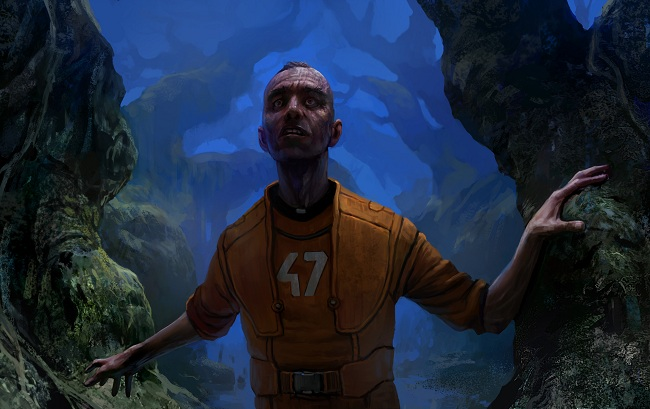

# King Slaver

The Bertha, a prisoner cargo vehicle, slowed to a crawl
without so much as a squeal of tires. The skies were clear and burning blue,
and a heat haze wavered up off the scorching bone-white sand.

Bertha's doors opened and a large man with a gun stepped
out. He didn't look around but immediately walked on a few paces away from the
vehicle, then turned and looked at it silently, standing at ease.

A group of red-clad, head-shaven men shuffled out, single
file. Most of them did not look around, either, though whether out of fear of
what they might see or a dread that it might be exactly what they expected was
hard to tell. The last man to exit the vehicle did glance to either side,
taking in the desert fields all around him, buffeted by ugly swamps full of
gnarled trees and animals and a musky stench he could smell all the way to
where he stood, and, closer by, a huddle of wood and stone buildings that stood
on top of black-sanded stalagmite hills, surrounded by deep trenches from which
came ugly, grinding sounds. His designation was number 47; a low number, but
he'd been informed that they were re-used when their past owners no longer
needed them.

Another ugly sound, short and sharp, rang out much
closer. Prisoner 47 looked back to the group and found that the man with the
gun had shot one of the others, for whatever reason.  The dead man lay sprawled
in the sand and his blood ran out slowly, absorbed and blackened by the earth.
What unsettled the prisoner - he was not shocked, nor aghast, because by now he
had exhausted the wells of those emotions - was the silence: not just of the
others in the group, which was understandable, but of the guard himself. The
shooting obviously hadn't been out of any kind of justifiable motive, any more
than the rest of the events that had landed them all in this place, but the
calm look on the guard's face showed it hadn't been because of anger, either.
It was, simply, the way things were here.

The prisoners, Amarrian all, were marched into the camp
that was to be their home for the foreseeable future. They were somewhere in
the Minmatar Republic, they had been secretly tried in Minmatar military
courts, and they were considered a collective threat to the interests and the
freedom of the Minmatar people. Freedom was an important concept, apparently.
The Minmatar found it so important, the prisoner thought, they wanted to keep
it all to themselves.

* * *

It was several weeks before 47 first heard of the King,
and by that time he was to all intents and purposes dead himself.

Faith had been a notable part of life in the Amarr
Empire. No more, and no less. It was there, always there, in speech and the
back of minds, but it was not an _important_ part unless cut off, much
like breathing. The citizens of the Amarr Empire were not, whatever outsiders
might like to believe, fanatics. They simply accepted faith, and had a tacit
agreement among themselves not to violate its major tenets. Civilization, to
them, worked much the same way. One did not impinge on another's sphere of
being - their liberty, their freedom or their joy - just as one did not,
metaphorically speaking, walk into church, lower one's pants and leave a
steaming gift to the almighty. Things worked, and people understood what they
needed to do and not do in order to to make them work.

The Minmatar understood this, too.

After the murder at their arrival, the group had suffered
no more direct attacks, deadly or otherwise, from the guards. None were
necessary. The entire colony had been constructed not for the output of its manual
labor but to break the spirits of its inmates. Work started under dark blue
skies and ended the same, and whatever little sleep there was to be had remained
unsettled and light, punctuated by the groans and muffled wails of fellow
inmates. They slept in large barracks with little privacy, three per bunk. The
guards who walked through would swing their batons against the bunk beds' metal
railings, startling the inmates out of tired revelries; and once awake, the
prisoners would lie still with open eyes and hear the mournful, hungry howling
wails of the slaver hounds drifting over from the swamp. During the day, the
sun would beat down on them as they worked, either digging or mining or, in a
very few trusted cases, running services for the camp. Noise blared throughout
the work areas, echoing off the rocks that surrounded them, vibrating in their
tools and in their heads. Food was scarce and revolting, and clothes were
rarely washed. The routine wore them out. It kept them numb, too, but only on
the surface, leaving them completely susceptible to deeper influences.

The guards played games. One day per week was a holiday,
during which inmates were free to rest, roam about or even leave the area
altogether. No one wandered; the sun-drenched desert and the swampy woods
beyond were formidable repellants. Instead, the guards would hide things - anything
from colored pebbles to little skeins or wooden plaques with pictures of
Amarrian idols - in the possessions of some random, unknown prisoner, then call
out a hunt. If the items were found before sundown, and the right person given
up, that individual would usually have their rations withdrawn for the next two
days. If the items were not found, everyone lost their rations. That was the
basic version of the game, but some guards were more inventive than others, and
occasionally offered an alternative to the rations - especially if the target
looked like they wouldn't last two days without food. 

One liked people to eat sand, or wads of someone else's
hair.  The prisoner saw a friend ingest so much dirt that his exhalations left
little muddy spatters on the ground; and later, overnight, he sat up with the
man and held him still as his agonized, bleeding body rid itself of what it had
been forced to ingest.

One liked public sex, choosing at random another inmate
to accompany the victim. The rest of them had to stand around in a wide circle
and maintain absolute silence, hearing only the hoarse, bleating grunts from
the center.

One was partial to violence, and breakage.

The prisoner 47, after somehow bearing to watch several
of these events, began to notice that certain people had an aura over them. They
were safe. They stood where they wanted, instead of hiding among the
assemblage. They lost their rations like everyone else if the item hunt turned
out empty, but when special rules came into play they stood at ease, solitary
and sheltered. All of them had apparently been in the camp for a while.

The prisoner saw them mill about, unobtrusive but
entirely unconcerned, as he watched friends and compatriots tortured, molested
and beaten. He saw them look at the sky not because they wanted to avoid the
sights on the ground, but because they genuinely found nothing else of interest
around them. Unconcerned, and unaffected.

It shook him. When he tacitly inquired about these people,
every question went unanswered.  It wasn't as if they were aiding the guards,
or in some manner actively participating in the degradation. Amazingly, 47 felt
no real animosity towards the guards themselves: They were the catalysts of
pain and suffering, but what they inflicted was so terrible as to render them
inhuman in his mind. There was no more point in hating them than there was in
despising the weather. But those fellow inmates carrying a secret that in any
way related to or amplified the suffering of everyone else around them, those
men were nothing but traitors. Worse than that, in 47's opinion, they were
evil. They were evil men. Not grey like the guards and the sand at night, but
black just through and through.

And he was continually forced to watch the games, week
after week after week, until one day something in him simply gave way. While
two inmates were fighting in the middle of the circle, seeing who could break
the other's right arm first, 47 shuffled over to an ignored little corner of
the plaza and picked up a wooden plate on which was painted in gold a picture
of an Amarrian saint. It had been the day's bounty and was now being ignored by
the other prisoners, who all stood slack and gazed at the fight in the
distance. Number 47 held it casually to his side as he walked up to one of the
safe men, some older guy inspecting a cloud far above, and swung it back and
beat him in the face with all the power he had.

The man crumpled to the ground, blood spurting from a
gash on his cheek. Number 47 descended on him. He got in a handful of blows
before the guards yanked him onto the ground and adminstered a beating of their
own. As he lay on the ground, shortly before he lost consciousness, he caught a
glimpse of the other man, lying there not far from him, apparently at ease with
himself and the world. The man was smiling. He said something but it was
muffled by the blood in his mouth, and all 47 could read from his lips was
"hail to the king."

It took him several days to recover, during which he was exempt
from labor but given only half portions. No major bones had broken but several
were badly bruised, tendons were overstretched, and his skin looked like a relief
map. He had a lot of time to think while everything healed. Being yanked from his
daily routine, first by the upset that had led to the beating, then by being
forced to stay in the sick ward - he hated the routine but it really was all he
had - turned him more and more tense, and all he could think about was his
growing obsession with inequality.

It was like faith, and in his convalescence he realized
that even in this place, where he truly expected to remain until he died, he
had clung to his beliefs. Not the great, grand vision of God and Emperor, but
the deeper, unspoken truths that lay behind them. Everyone could suffer,
everyone did suffer, and 47 had grown up implicitly accepting that life, for
all its joys, had plenty of suffering to heap onto its people - but only so
long as everyone was equal. Not in the experience of suffering itself, for that,
along with life's pleasures and darkness, belonged to you and nobody else; but
in open judgment, in evaluation, before the renownedly loving but - secretly,
suspected, known in the heart of hearts of all their subjects - uncaring and
disinterested authorities.

Each time he shifted, it hurt like blazes. He was aware
of every breath. His body had lost so much weight that his bones clicked
against one another. He was willing to die in this place, if that was his
secular fate; in this cot or out in the mines. There was little, at this point,
he could do about that. But he wanted so badly, with such horrible need, to go
to his eventual death as a man of values, not a slack-jawed ghost who hadn't known
the meaning of the life slowly leaving him. He needed to know the meaning of things
here. He knew it existed; it _had_ to exist, or life no longer made sense
and he was a ghost among ghosts. A god, or a guard, or, as it seemed, a king. A
ruler of the earth. The perfect authority for this terrible place. The devil.

It had to be, the more he thought of it. The source, not
of suffering, which was God's work, but of inequality. The chaos of
counterbalance to God's own order.

And he had to meet this king. To understand why the world
was the way it was. Not to comprehend it in its entirety - that was given only
to God and the most wicked of men - but to understand the balance. To know how
this inequality worked, of the camp and the people in it, and through that
understanding, to incorporate it as a blip, a sensible aberration that was
merely a stray chaotic fluke in a much greater scheme of order.

He understood that he might have a fever, too. Certainly
the things he saw crawling on the inside walls of the infirmary could not
possibly be there. Not even the ones that sometimes crawled up into the cot
with him, with chitters and wet little clicks.

When 47 finally got out of the infirmary, he was a
different man. He got into more fights, seeking to beat out the knowledge he
needed. Other inmates shunned him. There were more beatings, too, though none
so vicious as the first had been.

He got pulled into a game, once. He sobbed into his
straw-filled pillow that night and several nights after, and in the days that
followed merely fought even harder. If this was chaos, he would be part of it
until recognized as its own.

And at last someone gave it away. One of the men with the
holy auras, caught unawares behind a supply shed. Once he recognized 47,
beneath the flurry of blows, he started to say something, but it was not until
47 had exhausted himself and fallen gasping to his knees that the victim
managed to speak. Even then, it was hard; the man's face was swollen up and
distended, as if made from lumps of clay. Prisoner 47 crawled over to him and
bent over his face, looking down at the mess of blood and flesh he'd brought
into creation. Still, the man tried to talk, his tongue pushing away blood that
47 noticed was being watered out and then realized it was from the tears
dropping from his own eyes.

"Jungle. The King is in the jungle," the victim
told him. "Go there. He will see you now."

That same evening, not for cover but the cool of dusk, 47
ran off, through the desert for either minutes or hours, until the musky scent
enveloped him.

He waded through for hours or days. The chittering was
loud here, and the things clicked wetly when he held them, but they had protein
and liquids and that sustained him. Occasionally there was growling in the
distance, which 47 suspected came from wild slaver hounds, but never anything
more. It did not worry him that the beaten man had refrained from giving
directions. Whoever or whatever this King was - and 47 was just as ready for it
being a desiccated tree or some other dead altar where he would lay down and
die - he would be found if he wanted it.

When at last he stopped, he did not sleep. Instead, he
dropped into some place dark and still. Once he came back to himself he found
the night felt different, not brighter but perhaps more still.

Before his eyes, a mix of broken, felled trees and
rotting foliage resolved itself into a shack, standing on crooked feet a little
above the marsh. He waded over to it, clambered up onto the gap that seemed to
be an entrance, and made his way in.

There was almost total darkness inside, though his eyes
adjusted remarkably fast. A corner held an empty spread of straw - dry, to 47's
amazement - and in the murky gloom of another, a silhouette of deeper darkness
gave the impression of a man.

"Sit," the voice said. He obeyed. The straw
crackled under his weight. He couldn't help but touch it, languidly running his
hands over it in a combination of nerves and obsession. It seemed entirely too
pure to be here.

A thought struck him. "We are-" he started,
then stopped to cough his voice into action. He couldn't remember when he had
last spoken. 

"We are in a desert," he tried again. His voice
was deep but without much volume. He could feel it echo in his faded body. "How
do we even get food, let alone the straw in our bedding?"

He could hear the King's breathing. It turned shallow for
a moment, as if he were amused. "Hot-dropped from outside, like all your
supplies. Selected prisoners bring the crates into camp under cover of
darkness."

"Who selects them?"

The unseen figure, he knew, grinned at him for a moment.
Then he said, not unkindly, "Is this why you came here? To ask about the
straw in your bedding?"

Prisoner 47 thought it over. It was hard to hang on to
thoughts for very long, and he didn't feel certain he could articulate them too
well. He slid a hand over the straw and felt how the clamminess of his palms
left a slick trail over the surface. It wasn't just that the straw was dry; he
was wet. He was soaked.

He had a fever again, he realized.

Something shifted, and something small and inert was
suddenly lying in front of him. "Eat this," the voice said.

He did. It tasted greater than anything he'd had for a
long time, certainly in the colony itself, though a part of him missed the
crunch and chitter of the jungle outside.

He tried to collect his thoughts again. "I think I
went mad."

The King replied, "Yes. I think you've gone
mad," and waited for 47 to speak again.

The prisoner thought it over. At last he said, "How
did you become King?"

There was a hesitation. Then, "I was like you, worn
out and broken. But I kept glimpsing something else, as if behind a veil. At
last, something in me gave way and let me see the darkness proper, only to find
out I'd known it all along. "

The prisoner thought this over, too. "Is that true?"

There was a short laugh. "Maybe. Or maybe I was just
good at making connections and reading other people's minds, until the point
came where even the guards didn't know what to do with me."

"So you left."

"So I left. I get what I need here. They bring me
straw, held over their heads to keep it dry, and they bring food and drink and
whatever else I require. If the guards have it, so do I."

"Why?"

"What else is there, in this place?" the King
said to him. "Except eventual death, and all your suffering until then.
And me, giving you the faith you need."

"Does everyone follow you?"

"No. And they die either way, but the ones who came
to know me can live in a little comfort, which is briefly important, and die
with understanding, which means so much more." 

The King continued, "I decide who is safe. My people
do not get chosen for games. If you get hurt, you will be allowed to mend
before going on. You will never lose a meal. It's not for everyone."

"I made it here," 47 said. Even with the meal
in his stomach, it was hard to think.

"You made it here. You went into the darkness. You
can be one of our own, if you wish."

In the darkness, 47 nodded. "What do I need to do
now?" he said.

"The same thing you did that let you be led here. Embrace
it. Accept it. Know that you belong to it."

"The chaos."

"Oh yes," the King said, as if receiving the
right answer to an unasked question. "Exactly that."

The voice grew closer, as if the King had leaned in.
"Every man who comes here is a man of faith, a creature of thought come to
understand that there is something greater than you. But until you come here
you have nothing like the true faith, only carefully selected pieces of it.
Here is where you fill in the rest. Here is where you become, at last, a
believer of a dark and utter truth. Did you feel it missing, before you came
here?"

"Yes," 47 whispered.

"Was it a life that seems now not only distant, but
fake as well? False, and incomplete?"

"Yes," 47 said.

"Yes," the King echoed. "Here is all the
truth a man of faith, a true man of faith, could ever have sought."

The prisoner knew he was right. Here it was, all of it. In
a prisoner's camp where people were broken; in an emptiness full of beasts and
starvation. The balance, found at last.

"Thank you," 47 said. It came out choked. He
cleared his throat. "Thank you," he said again, loud and clear.

"I'm glad you found the faith," the King told
him.

The prisoner 47 left the cabin and began making his way
back to camp.

On his way through the marshy wilderness, he heard the
growl again, much closer this time. He turned and found himself looking at a slaver
hound, realizing in that moment what a terrible joke, what a perfect fulfilment
of this life it was to have these beasts here to guard the faithful, diverted
from their original purpose of guarding and attacking Minmatar slaves back in
the Empire. He could hear the hound's hoarse, deep breathing. Puffs of air
wafted from its hungry face.

He stood still, calmly looking back at it. And in that
animal face, with its sharp teeth dripping saliva, and the eyes red-rimmed and
unblinking, he saw no longer a hunger, but a fellowship.
