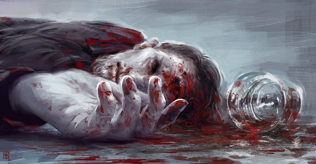

# The Plague Years

Fermar looked at the sun for the last time. His home had one of the most scenic
spots on the asteroid mining colony, and if he stood at this living room window
at the eve of the day he could see all the ships coming and going.

One had docked just now. Fermar inhaled deeply, holding his breath before slowly
letting it out again. His hair was all grey and his hands were rough and
creased, as befitted a man who'd worked on the colonies all his life. He noticed
his own reflection in the window, superimposed on the starry blackness. It
seemed to be smiling.

There was a knock and the sound of someone opening the outside door. A man's
voice said, "He's in here, sir," and another voice said, "Thank you. I'll see
myself in." That second voice was much huskier than the first, worn but not
imposing. There was the sound of a door closing.

A man walked into the living room. He was dressed in black, stylish in a fairly
classical way and covered with a mop of dark, curly hair; noticeable, all in
all, but not memorable. He was younger than Fermar by at least thirty years, but
didn't carry himself with the same bullish assurance. Fermar moved like a man
used to high gravity; this one sidled like someone expecting the sky to pick him
up at any time.

"Terden," Fermar said.

"Hi, Fermar," Terden said.

"Get out."

"It's not what you think."

"Get out."

"I have a deal for you."

"_I_ have a gun in working order. Get out."

Terden walked over to a settee and sat down, unbuttoning his coat and pulling
off his gloves. "I … want to help you," he said. 

"You want to do a lot of things, but help won't be high on the list."

"I … wanted to see you on the sly, too, but I was nabbed as soon as I came in."
His whispery voice was oddly modulated; it would start off slow, get its
bearings, then rush to the end of the sentence as if trying to race past the
meaning of its words. "Security's tight here," he added.

"Of course it is."

Terden ran a hand through his thick hair. "So you know why I'm here."

"Your creatures are coming," Fermar said. "I've heard reports. They're settling
in the area, kidnapping people. Same as they always do."

"Which is why I'm here," Terden said. "Hear me out, but take a seat first,
please."

Fermar looked at him for a moment, then walked over to a chair opposite the
settee and sat down.

"You're right. The people I work for … they're coming, they're reaching out and
they need new recruits, but nobody needs to get hurt. You yourself could walk
away completely untouched."

"Everybody gets hurt when the Sansha come in," Fermar said.

"We don't want a fight, and we don't want people to die," Terden said, ignoring
the comment. "You and I, we know each other. You remember what happened last
time and I don't want that to happen again. I want you to give up this colony
and convince its people to surrender so we can move in quietly and without
bloodshed."

"You know what happened in the Plague Years," Fermar said. "Why did you even
bother coming to me?"

"Because I do remember the Plague Years and the time before them, too. I
remember being taken in for a long while when I didn't have anywhere to go and I
remember a family that showed me a lot of kindness when I didn't always deserve
it."

"Damn straight, you didn't," Fermar said.

"And I remember Carla," Terden said.

Fermar jumped to his feet as if he'd been stung, glowered at Terden and seemed
about to say something, hesitated, then merely stood there in silence. Finally
it was as if the air went out of him, and he sat down heavily again.

The two men sat there, unmoving. After a while Fermar said, "Drinks in wood
cabinet, lounge, other room. No ice."

Terden got up and walked out of the room. There was a clink of glasses and he
returned, handing a drink to Fermar and holding one himself. "There was only one
bottle," he said.

"I don't much go in for alcohol," Fermar said. "Serve guests, that's it."

"Always happy to be a guest here," Terden said and took a sip, then grimaced.
"Strong stuff."

Fermar held the glass at arm's length, as if he'd forgotten about it. He had a
faraway look in his eyes. "Why did you bring her up?" he said.

"When we come in, who do you think will be in the lead?"

Fermar put down his glass and stared at Terden.

"You all did me a lot of good during hard times," Terden said. "But that's over
now. These are new times. Remember Melvue."

"You will not mention that name again," Fermar said calmly.

"It's the … height of the Plague Years, and I won't pretend that the term
doesn't apply to the Sansha, too, because they came right when everything was
bad enough already. So what happens? The leader of the mining colony is
approached one night at his house by a scout like me, and he gets an offer, same
as you do now, and he _takes_ the offer. We … move in, not intending any
violence, but then some people get it into their heads they want to fight. So
they fight, and they get hurt, and some of them manage to run away and some of
them don't, all because the colony leader tried to make a sensible deal with us,
and some people made a bad decision." Terden leaned forward. "It doesn't have to
happen again."

"To hear you of all people saying this."

"They're coming, Fermar," Terden said. "And you're the leader now. But I know
that you can keep your people in check, so I offer you the same deal as they did
back then." He leaned back, waiting for an answer. When none was forthcoming, he
said, "You know, they don't always do this. Sometimes they … just move in,
especially when they're hungry for people, and  believe me, with the capsuleers
thinning out their numbers they're real hungry now. But I know you, and I asked
to come here, smooth things out."

Fermar said, "We might fight back this time, too. I have contacts and I heard of
the Sansha coming. I made sure we had weapons."

"That's stupid," Terden said. "Stupid and suicidal."

"They have my daughter. You know this," Fermar said. "You people are on the
other side of everything."

They fell silent. Terden looked around. "Yeah, I know. Thanks for the reminder.
It's not like I'm here trying to _help_ you, you ungrateful old fossil." He
looked back at Fermar. "I wasn't going to bring up family, but since we're on
the subject, how's your wife?"

"She's dead," Fermar said.

"That a fact? Is that why there are no pictures of her?" Terden said. He waved
his hand at the walls. "I see pictures of your daughter here but not your wife.
That's surprising, isn't it?"

Fermar sat silent. Terden said, "I think she's dead to you. Which is usually a
little different, though right now it comes out to about the same. When did you
lose her? After we came? Long after?"

"Why the hell are you asking this?" Fermar said.

"Because the … only one who matters to you now is Carla and I don't believe for
a second that you're being a colony leader because you want to. It's because
you're a sensible man with a good head on his shoulders who's taken so many
losses that now he only wants to wait until life catches up with him and eats up
that one last breath he has."

Terden took another sip of his drink and quietly added, "You could see Carla."

Fermar's breath caught. His own drink was untouched; he reached for it,
hesitated, then reached again but didn't pick it up, only held on to it as if
for ballast. "What did you say?"

"I can't guarantee that you will spend much time together, but at least you will
meet again. She's close enough in the area that she could be brought over, and
I've told the Sansha of her connection to you. But that's not going to happen if
you bring a fight."

"They won't send Carla if I fight?"

"Oh, they will definitely send Carla if you fight. With a gun in her hand. And
this is the first house she'll go to. They'll dock, and they'll swarm in, and
they won't enter a single house until they've entered yours, dragged you out and
put a bullet in your brain. They will make an example out of you."

Fermar studied Terden for a while, then said, "I believe you. Speaking of which,
that rotten cheat of a colony leader whose name you mentioned earlier. How's he
doing?"

Terden's tone changed subtly from confrontation to elucidation. "Melvue made the
right choice, so he's doing fine, enjoying his life."

"That so?"

"Absolutely," Terden said without hesitation.

Fermar said, "See, that's interesting. Because the last time I saw him, he was
tied to a chair in a noiseproof room, and there was little all life left in
him."

Terden, sipping from the glass, froze up.

"You're right," Fermar said. "He did make the right choice, back when he was
colony leader. It was right for him and nobody else. And we never forgot it."

Fermar, glass in hand, slowly rose to his feet and walked over to Terden,
towering over him. "I lost Carla, who your people took, and I lost my wife, who
couldn't stand the loss and the aftermath. The Sansha took everything from me,
and that miserable excuse for a human being we had as colony leader, he paved
their way."

He poured the content of his wine glass on the floor beside Terden, who
momentarily looked down at his own glass before looking up again with a puzzled
expression.

Fermar said, "For years I couldn't even think straight. Carla had been taken and
I wanted to get her back at any cost. I made contacts, I moved around, and I
started to learn about the people you serve, but there was no way to get to her,
or even discover where she was." He leaned in close. "Until, at long last, I
tracked down my old colony leader. He was a spy by that point, working for you
people in another colony, reporting on its setup and getting in with its
leaders."

In a cold tone, Terden said, "And you ratted him out. To be tortured and
killed."

"During which I discovered that life among the True Slaves really isn't that
pleasant. In fact, it's downright rotten. You're taken in and made into a
mindless drone, subject to the whims of a single person who certainly doesn't
bear your interests at heart, and it eventually drives you insane. Doesn't
matter what level your implants are; there's a threshold beyond which you start
to rebel against the lack of free will, and your subconscious realizes that it's
been trapped. It's extremely painful in the long run, though the symptoms break
out in unusual ways. You've never thought about how willing these people are to
die for their master? You would think that even his machinery couldn't erase the
survival instinct. But once you've been his slave for long enough, apparently
all you want to do is die."

Terden took a long, slow sip. "I'm perfectly … fine," he said.

"You scouts get more autonomy than the rest," Fermar said. "All they need is to
keep tabs on you, not control you. They'll have vetted you and found that you're
one of that rare breed who'll willingly join the Sansha. You're _safe_," he
spat.

Terden stared at him, his jaw clenched. "Was there something wrong with the
wine?" he said at last, nodding his head towards the puddle of alcohol on the
floor, and lifting his own glass to his mouth.

"Oh, it's poisoned," Fermar said.

Terden stopped, wine in his mouth. He slowly swallowed, then said, "I've
finished half a glass, Fermar."

Fermar looked at the spreading stain on the floor. Terden followed his gaze,
dropping his own glass in the process. When Terden looked back up at Fermar, the
old man had a gun in his hand.

Terden's eyes widened and he started to rise, but Fermar shot him, first through
a knee, then through each shoulder. Terden dropped to the floor, screaming, and
Fermar knelt down beside him, saying, "Before you go into shock, I want to tell
you something. I know this won't get to the Sansha, because they don't use
direct feeds on their scouts.

"First off, the wine wasn't poisoned. I wanted to slow you down a bit, make you
comfortable, and distract you at the end. Which is funny, because it's pretty
much what your type does when you're about to pounce on innocent people.

"Second, I know Carla is in this region. She's been here for a while. It was a
long time before I realized that I couldn't possibly go after her, and if I
tried they'd either kill me or move her somewhere that I'd never find her.

"So I'm bringing her to me."

Terden was quiet, gasping for breath.

Fermar arose, grunting with the effort. "Once everyo-" He hesitated, then fired
a shot into Terden's arm. Terden screamed, and his hand, which had been reaching
into his clothes, dropped back into view, a small pellet rolling out of its
grip.

"Leave the suicide dose alone, thanks. I want you to hear this." Fermar ambled
over to his seat, keeping his gaze on Terden. "This entire colony is wired with
explosives."

Terden's grimace turned to surprise, and he stared at Fermar in shock. "You're
insane," he said.

"Everyone has left, just about. I knew you people were coming even before you
did. I still have my contacts, and I watch the solar winds. When they made me
leader I told them of my Sansha experience, and one of the first things I did
was implement an escape plan in case your employers decided to move into the
area. Which they did, after a good long while, and I had my people start
practicing." He had the gun trained on Terden, and his eyes narrowed. "When I
found out that you of all people had been posted to this part of space, I knew
it wasn't long to wait, and that you'd be the one they'd send. When I heard you
were finally on your way, I fired up the plan, and everyone left quietly and
efficiently. The only people still here are a skeleton crew, and after you and I
are finished they will leave, too. Nobody here will get caught by the zombies.
Nobody."

"Your daughter … will come here, "Terden said. "She will come to your house, gun
in hand, and if I don't return you'll never get her back." A puddle of blood was
spreading around Terden's body, and his voice quavered with exhaustion.

"Oh, I will. But not the way you think I want," Fermar said. He got up again and
walked over to Terden, this time kneeling on his damaged hand. Terden hissed in
pain, but kept his eyes open and staring straight into Fermar's.

Fermar said, "Once someone has been taken in by the Sansha, modified to Carla's
level and kept for as long as she has, there's no turning back. The only thing I
can do for her now is ease her misery, and my own, and that of anyone else you
people send to this miserable rock. And if I can't do it, for whatever reason,
then the explosives will."

"Murderer," Terden croaked.

"Yes," Fermar replied calmly. Terden's expression showed that this hadn't been
the expected reaction. "After my team has gone, everyone left here will die,"
Fermar said.

"Including me," Terden said, clearing his throat and taking deep, hissing
breaths.

"Including you."

"You really are a bitter, vengeful old fossil, aren't you?" Terden said, trying
to shift so that he could glare at Fermar. "And you've lost it. You tried
rebelling once when you had a perfectly good chance of saving everyone you cared
about, and you failed, so now you want to finish the job and make sure they're
all _dead_!" He had lifted his head with the effort, his shoulders giving him no
support, and now he slumped back to the ground, breathing heavily, his one good
hand making a fist.

Fermar thought about this, then said, "I'm finishing what needs to be finished.
And confronting something no one else would, which is a lesson you and a lot of
other people should have learned a long time ago. If it wasn't for people like
you, you and that old colony leader, we never would've had those situations at
all, and I wouldn't have lost my daughter."

There was no response.

Fermar sighed, aimed his gun and shot Terden in the head. Terden twitched with
the impact, then lay still in his puddle of blood.

Fermar set the gun down on his chair, then walked over to the comms console and
activated it. "It's done," he said.

Very shortly after, several men came into the room. "You do all right, sir?"
they asked him.

"Yeah, it's all confirmed," he said. "Thanks for waiting. You were close?"

"Outside the door, practically," one of them said, and grinned. "No worries, we
didn't listen in. After we heard the shot and his scream, we knew you had him."

"Alright. Clear out the body, please, then get in your ships as fast as you can.
You have a little time, but not much."

The men nodded, and carried Terden's body out of the room. Fermar had turned and
was about to put away the drink glasses when he heard them all come back in.
They walked up to him in silence, and every one of them shook his hand. Then
they left.

Fermar sat down to wait. If he had failed with Terden, these people would have
taken over, after which they'd have primed automated triggers that would set off
the explosives as soon as the Sansha had gotten into the colony.

Now that his suspicions had all been confirmed, the only thing remaining was to
sit it out. If something were to happen to him now, the triggers would still
work, but he hoped he'd see it through. He hoped he would hear a knock at the
door and see another familiar face, if only for a second, before the end.
