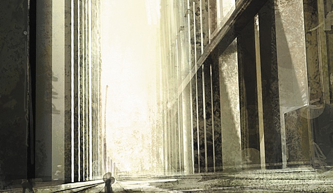

# Welcome Party

"Where the hell _is_ everyone, Bouteil?"

"Good question, sir."

"I swear, it's like some people have no respect for … what is it? What am I
looking for here?" He snapped his fingers. "Conundrum. Concord."

"Decorum, sir?"

"There we go. It's infuriating."

"It is certainly a discouraging set of circumstances, sir."

The two men were walking around in the arrivals area of a Customs Office. Upon
approach their ship had been automatically towed close to the Office and locked
in place beside it, and a boarding ramp had been extended, attached and
pressurized, all with the same automation. The sole voice they'd heard had been
the recorded message welcoming them to the Office and asking that they present
their business to the local authorities at their earliest convenience.

Gister had been the first to enter, holding a datapad in one hand like a trophy.
He was a tall, brisk man who carried with him a sense of purpose so potent it
seemed barely containable by his personality. He gave the impression that he
cheerfully walked his own path and would continue to do so even if it led him
through a brick wall.

Bouteil had come in after him, at a respectable distance. He was Gister's
personal assistant, tall as well, and dressed in dark clothes that could have
been styled in any of the four empires. He gave the impression that he would
cheerfully, if rather quietly, have a word with the brick wall beforehand and
successfully change its mind about certain minor but important details
pertaining to rigidity and cooperation.

No one else had followed; the ship's crew had orders to wait until such point as
Gister considered his tour of the facilities concluded, after which he intended
to return to his vessel and fly away again.

"Really," Gister said, looking around as he walked. "You would've thought that
when it came to officiating our agreement, the old guard would at least stick
around to hand things over. Not just leave everything and run."

"It does seem they made rather a hazardous departure," Bouteil ventured.

The two men made it to the exit of the lounge, and entrance into the Customs
Office proper.

"Well, times are changing, Bouteil," Gister said. "If people are not willing to
change with them, or even, indeed, welcome them with open arms and perhaps-" he
gave the empty lounge a disapproving look, and sniffed, "even an open bottle of
something, then yes, I suppose it _is_ best they say their quiet farewells and
damn well be gone before the future moves in."

"A good extended metaphor, sir. Very true to life."

"Yes, thank you, I do rather think so." Gister walked down the hallway that
connected egress points to the central arrival hub, followed by Bouteil a few
steps after. The hall widened into a larger one with windows on one side,
showing the dark stars beyond.

Gister slowed his step, looked out one of the windows and gave a contented sigh.
"We made it here, Bouteil. InterBus, that is. And about damn time, too."

"It could indeed be said, sir, that your moment had arrived _in situ_."

"Precisely, Bouteil! One must be situated to move, to rush headlong into new
dangers. Just as interBus has done through the years, when we haven't been
hampered by capsuleers." He slowed to a full stop, knitted his hands behind his
back, and glared out the window, as if taking a stand against the stars.
"Honestly, Bouteil. Honestly!"

"Indeed, sir."

"We're formed by the four great empires. We're given a charter, asked to risk
our lives transporting people and goods. We brave pirates, natural phenomena,
other transport companies, and the endless convolutions of interstellar
politics. And then … nothing. Stagnation. Regression. Capsuleers."

The stars stared back.

"Capsuleers," Gister repeated to himself. "Good gods, how _did_ those beasts
ever enter the picture?"

"Hard to say, sir."

"We were supposed to be the future, Bouteil. An integral part of inter-empire
communication and conveyance. Anything more substantial than a message, than a
bundle of electrons dancing in the ether, was to be ours to hold and convey.
When I thought of the future, every potential route the known world could take,
I could not picture it without us at the forefront. I really couldn't."

"I recall, sir."

"I don't know where it went so wrong." Gister said, looking for a moment
positively downcast. He stepped forth and raised his hand to the cold glass. "We
did the work that  was requested of us. We honored every single political
contract we were given, and practically every one of the personal ones we
acquired. It took time, but we really were poised to take over the couriering of
every single package between every point in outer space."

"So we were, sir. Until the capsuleers came."

"Yes." Gister lowered his hand, so that it hung limply by his side. "Why bother
signing five layers of security contracts, and undertaking any number of extra
costs for insurance, damages and all the other risks of doing business in dark,
empty space, when you can just toss your package in the lap of an agent and have
her hail an immortal pilot to transfer it, or put it up for open transfer
auction with the very same people? They made a mockery of us, Bouteil. They
managed to associate our name, which was known throughout New Eden, with the
perennial image of _has-beens_." The last part came out as a hissed whisper.

Bouteil said nothing. After a moment or two, he cleared his throat.

The noise shook Gister out of his reverie. He took a deep breath, and smiled at
the stars. "Well! And here we are now. A wonderful, wonderful deal has been
struck, and interBus is finally going to get back on the map." He hefted his
datapad and stroked its silver lining, then turned and began walking down the
hall again. "I have to say, I do admire how perfectly auto-operated these
facilities appear to be. Tell you what, before we head over to Administration,
let's take a ramble through their storage areas, see how everything ticks over.
I'm dying to know how they're handling all those types of cargo they get sent up
from planetside."

"As you wish, sir."

"I do hope there'll at least be someone waiting in Administration. I had a
speech prepared and everything."

"Yes, I know, sir."

The two men walked down the corridor.

* * *

"So what's the word, Bouteil?"

"Well, sir, storage E was neat and well-cleaned just as the others."

"And everything fully operational?"

"Yes, sir. All machinery is in perfect operation and has clearly been
well-maintained. I do have to note, though, that while they have clearly taken
meticulous care with their hazardous materials, which have apparently been
stored here for some time, there are signs that other, more recent arrivals have
been treated rather more haphazardly."

"What, slacking in standards just because there's new management incoming?
Surely not!"

"No, sir. Everything was perfectly stowed, and all the machinery in place for
maintaining fragile or organic storage material is working just as intended."

Gister furrowed his brow. "So what's the problem, Bouteil?"

"The problem, sir, is that machinery onboard a small establishment such as this
can only go so far in balancing the precarious state of certain materials before
a human touch becomes a necessity. I'm saying that not too long ago, the people
here left their food to rot."

"What a completely odd situation," Gister said. "You'd think we were pirates or
somesuch."

"I don't like it one bit, sir. I took the liberty of hailing our vessel, and
they have not heard a word from any of the registered staff on this office, no
matter where they may now be located. Moreover, I would say that the Customs
authorities are purposefully ignoring our own crew's requests to track down any
past member of staff."

"Really, Bouteil? Just handed over the keys and ran?"

"It does appear so, sir."

Gister sighed. "I believe I understand the situation."

"Do you, sir?" Bouteil said, in a tone which did not entirely hold complete
conviction.

"Come, take a look." Gister walked off to storage area A, the sole one that he
himself had inspected.

When they arrived, Gister immediately headed down a metal walkway that was
suspended some distance over the storage area itself. He walked for some time,
with his assistant easily keeping pace, until at last he slowed, and waved a
hand over the entire collection. Cargo blocks, of uniform size, stretched out
both ways to some distance.

"Solidification," Gister said. "That's what they ran away from."

"They did, sir?"

"See all those blocks down below? You know what they remind me of?"

"I couldn't fathom, sir."

"Fuel."

"Sir?"

"You know interBus keeps a close eye, or at least I personally keep a close eye,
on scientific developments that might pertain in any way, shape or form to
interstellar transport. You know what's the most recent technological
breakthrough of New Eden?"

Bouteil gave this a moment of thought. "Would that be the recent advances in
what they call hybrid weapons technology, whereby the overall improvements in
vessel types, actual weapons, and even the ammunition itself are believed to
give ships for the Gallente Federation a notable up in the stakes of
interstellar dominance?"

"What? No!"

"Ah, then I believe sir may be referring to the new types of weaponry available
to capsuleers of all empires, including but not limited to power cores, drone
tracking devices, siege and triage modules, and even an improvement on the
unobtrusive but important tractor beam."

Gister stood agape, but rallied quickly. "Well, there is that, yes. Though
really, Bouteil, I have to say, even for you that's a little short-sighted. All
that's been done is the capsuleers are being powered up so they can destroy each
other better. Which is _perfect_, I should say, because it only helps take their
attention away from the proper business of running the world."

"Would that be the one we are involved in, sir?"

"Well, of course. Haven't you paid any attention to the rise of interBus?"

"Oh, I have, sir. In miniscule detail."

Gister looked back to the crates. "At any rate. _Fuel_. For capsuleer-run
starbases, because those grubby little maniacs apparently have to have their
hands in every operational part of space. You're familiar with those?"

"Yes, sir."

"And you know the sheer amount of fuel these starbases have to use?"

"Yes, sir."

"Coolant, oxygen, robotic parts, various mechanical pieces," Gister said,
entirely undaunted, "even crazy things like isotopes, liquid ozone, and enriched
uranium. _Uranium_. Can you imagine? I'd have thought those were the stations
where the crew couldn't wait to up and leave."

"I'm sure people are getting impatient everywhere, sir."

Gister wagged a finger in front of Bouteil. "But not anymore. They simplified
things, in a beautiful move. Now it's just blocks. That's it. A single source of
matter, though of course I'm sure the empires will find some way of putting
their stamp on things, and that single source of matter comes in single, perfect
blocks. Just like all the ones down here. Stackable, storable, perfectly cubed
blocks. Ripe for the right mind to strike a deal over. They couldn't hack it,
the customs people. Everyone knew it. CONCORD knew it. That's why we were
offered a takeover deal of all these offices outside highsec, with no notice.
They knew we'd have the stomach for it, when no one else would."

He gazed over the landscape of squares down below, holding his datapad close,
and gave a contented sigh. "Portable blocks. That's the kind of advances in
science we like. Not all this tech-two rubbish, kowtowing to the madmen of the
skies."

"You think they really are mad, sir?" Bouteil said, in a carefully neutral tone
that indicated his own opinion might go either way.

"They're insane, man. I mean, seriously. They have to be. How can you be blown
up that often and not just be disjointed from the world?"

"An excellent question, sir. Though not one that I'd venture to openly ask."

"Why not? What do we possibly have to fear from these people?"

"Well, sir, they are wealthy enough to have my entire family tree eliminated
from existence, up to and including some very distant cousins that I barely even
get a letter from these days."

* * *

"It's all about war versus business, keeping the two separate," Gister said, as
they walked away from the storage areas. He'd gotten tired of inspecting the
station and wanted to make one last pass through the previous administration's
offices before launching the official interBus office occupation and getting
back to his ship.

"Indeed, sir?"

"You don't sound very convinced," Gister said to him.

"Well, sir," Bouteil ventured, as they passed into an elevator that would take
them up to the administrative floors, "it's more that I always believed the two
were rather tightly knit together. A military-industrial complex, as it were,
with capsuleers at its very crux."

Gister turned to him with eyes wide open. "Good heavens, man! The capsuleers
can't even keep their own alliances intact for longer than a fortnight."

The elevator doors opened onto an area with much brighter lighting than the one
below, and the two men stepped into an area shorn of iron and bare steel, all
replaced with plastics and glass.

Gister continued, "And speaking of alliances, I've heard that those ragtag
things will now be allowed to join the empire wars _en masse_. Which is
wonderful! That's all they're good for, fighting and war. Best to put their
focus on something like that, and not have them getting in the way of people
trying to do proper business."

"People like you, sir?"

"Precisely. That's what I mean with war versus business. You let those people
have at it, shooting one another, but you keep their activities couched well
within the box of war. Meanwhile, business takes care of its own self,
uninterrupted. No capsuleers jumping in to fulfill contracts, courier items
around, destroy caravans that happen to carry our cargo, or otherwise bother us
with their presence in the world. And the world is catching up."

"Is it, sir?" Bouteil enquired. A control panel nearby attracted his attention,
and he took a few steps toward it.

Gister, who was too preoccupied with inner visions to notice, stared skywards
and said, "It is! The sad things can't even blow themselves up anymore. You
hadn't heard? CONCORD finally had enough of them, and cut short their
insurance."

"Only when they intentionally self-destruct, surely," Bouteil said without
looking. He reached the panel and, with his back intentionally to his superior,
performed a few deft moves involving an illicit signage key he procured from his
pocket. The panel came to life, and lists of recent communiques began scrolling
in front of him.

"Yes, yes, but the point stands," Gister said, waving the silver datapad in his
direction. "The business world is slowly having its fill of capsuleers, and of
the endless, unyielding, _messy_ wars they always seem to be engaged in. The
business world doesn't like that. No sir. We prefer things crisp, clean, and,
er…"

"Block-shaped, sir?" Bouteil said absent-mindedly, as he browsed through the
communiques.

"Precisely! Even now, Bouteil, you and I, we've travelled deep into what they
call a low-security sector of New Eden, all so we can observe a proper
ceremonial handover of responsibility. Leaving aside the fact that nobody on the
other end had the good grace to uphold their part of the bargain, it _was_,
nonetheless, a bargain, with clear lines of conduct. Just think of how the
Minmatar are finally sorting themselves out, concluding all that government
nonsense at long last." He poked at the datapad, as if illuminating its
brilliance. "Organization, you see. Once people get organized, we have
civilization. Business moves on, and interBus finally has a chance to move with
it."

He glared at Bouteil, who was standing absolutely immobile by the communications
panel. "Are you listening, man?" Gister barked at him.

"I have been, sir, without reprieve," Bouteil said, and straightened up. "And I
have discovered some minor niggles in the contract between interBus and CONCORD
that I believe deeply concern us at this very moment. If you could just bear
with me, sir, and withhold from activating the interBus occupation of this and
other stations."

"Bouteil, I will not have you spoil this moment, not when I've waited so long
for it. What in the world is going on?"

"Just a second, sir."

"Hesitation. There is _no_ room for it in the business world, Bouteil. As my
personal assistant, I thought you were aware of that." He held the datapad in
front of him. "Well," he continued, "I might as well prove it by example."

Bouteil rose and faced him. "No, sir, don't-"

With swift movement, Gister entered his personal key, activated the datapad, and
signed the digital handover document. "There! See? Nothing to fear, everything
to gain."

Immediately, every monitor on every work station in the office blinked, then
rendered the black and orange interBus logo.

"Transfer complete," Gister said proudly. "It's all ours now."

Bouteil walked swiftly toward his boss. "If you would follow me at once, please,
sir."

"Bouteil, I will not have you rush me, either. Explain yourself."

Bouteil barely paused to grasp Gister by the arm with a very strong grip, and as
he led the startled man toward the elevator he said, "There was a loophole in
the contract and now that you've signed it there are some people coming to take
advantage of our situation."

"What? What are you talking about?" Gister demanded.

"I believe business and war may be rather more intertwined than you believed,
sir. The upkeep of these stations is our responsibility as of now, but it, and
everything else, may still be claimed by force."

"The empires wouldn't dare-"

"It is not the empires I'm concerned with. We are going to take the elevator
directly down to the arrivals area, sir, and I've called up two escape pods in
case we don't make it all the way to our ship."

Gister was herded into the elevator, where he leaned up against one of its walls
and said, "Explain yourself!"

As they whooshed down, Bouteil looked him in the eyes and said, "The capsuleers
are coming, sir, and I believe it is not interBus's day at all. In fact, sir,
once these elevator doors open, I advise you to run."
