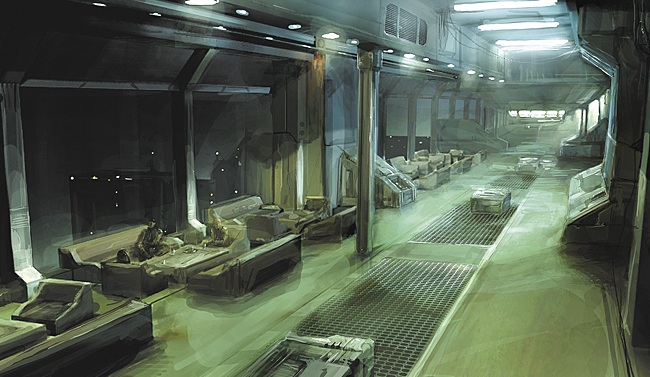

# Breathing Space

Chief Secretary Ramini Vos sat in silent contemplation before the communications
panel. Thousands of lights and buttons sparkled before him as they tracked a
complex flow of information; the conversations of a hundred people all tracked
in a digital language he understood more intuitively than his native Vherokior.

The Arek'Jaalan project had become a 24-hour operation in recent months.
Initially, only a handful of capsuleers used the Eifyr & Co. networks that he
oversaw, maybe a dozen in the first few weeks. Nowadays, the capsuleer channel
hovered around fifty at all times, peaking to double that during the big
meetings. Information requests from the public had increased even more
aggressively, with Eifyr staff - lead in part by Vos - now handling upwards of
1,000 unique inquiries a day.

The most common requests were for the basics; what the Arek'Jaalan project was
about, and what its goals were. These were easily enough explained by the
project mission statement, a document Vos had relied heavily upon as the
requests began to pile up.

The Arek'Jaalan Project was founded to act as a cross-organizational research
body and common ground for capsuleers to share information about the Sleeper
civilization and related matters. Our goals are to research these matters,
document our findings, and then educate the wider capsuleer populace on our
work.

Of course, while those few words were enough to sate the fleeting and shallow
hunger of small time reporters (who comprised the vast majority of the requests
Vos handled) they left out a few important details, to his mind. Unsavory
things, perhaps, but as true as anything in the document he'd sent out over 800
times already this week.

The whole "apolitical" approach was the most obvious omission, Vos mused.
Arek'Jaalan had struggled to keep the politics out of the science so far. Most
likely, the intent behind the mission statement was to help this flagging cause,
by defining the project in purely scientific terms. Not a bad strategy, Vos
reasoned, and yet one that left questions open about Arek'Jaalan's political
stance. Answering them required a little more work on his part.

Amongst his many responsibilities, the Chief Secretary had the unenviable job of
being the primary contact for countless backwater planetary governments, both
local and foreign. With little in the way of success, Vos would have to explain
to Amarr officials how a capsuleer project backed by Minmatar Republic assets
was "entirely apolitical in nature". In another meeting, often scheduled only
hours apart, Vos would be assuring local Minmatar governors that despite
Arek'Jaalan's refusal to make a political stand, no Republic interests (or
citizens) would come to any harm through their work. After many long months of
futile diplomacy, Vos had become increasingly bored with the politics of the
empires and their unending feuds.

The Chief Secretary was at hour fifteen of a day riddled with such meetings, and
as his eyes began to close, and his mind began to drift, he would imagine that
all these tiny points of light in the comms panel before him were actually stars
in a universe that he alone was tasked to rule over. In these slow moments, he
would drift away from Eram, and instead, oversee this universe from an
uncomfortable metal chair, positioned near the one window looking out of his
cramped and overheated office.

On this evening, Vos was having a particularly vivid dream in which he, as
master of the universe, was contending with a troublesome supernova that
threatened to dwarf a little cluster of stars he'd grown quite fond of, having
spent considerable time already optimizing their orbits. After many unsuccessful
attempts at draining the nuclear fuel, he'd been toying with the idea of a
well-placed black hole.

The light from the dying star continued to grow, however, and as the tension of
his fantasies began to mount, Vos (as he would so often do) retreated back the
other way towards reality, just in time to notice a little supernova of his own.

A rapidly growing light on the comms panel told him that someone was taking over
an entire network hub, which meant either they were about to host a very large
meeting, or wanted a whole section of the network to themselves. If that wasn't
enough to irk Vos, a man who had flown off the handle for much less, these same
people were requesting the "immediate presence" of his superior, Hilen Tukoss,
the leader of this little research movement Vos had become swept up in.

The Chief Secretary took a moment to rub what he imagined was an exhausted
expression from his face, and opened a private channel to the man in question.
By the officially posted schedule, Tukoss had only been asleep for around three
hours. This was easily the worst part of the job.

Tukoss answered the call promptly – perhaps instinctively, Vos suspected, as the
good leader's head was inclined horizontally across what looked like some very
comfortable pillows, and his eyes were firmly shut.

Vos hesitated. "Are you with us, Tukoss?" he offered, after careful
consideration.

"What could you possibly want?" came a voice from the other side. Tukoss seemed
to be sinking deeper into the pillows with every breath.

"Someone's taken the main comms hub all to themselves. Obviously it's one of
those people you gave a clearance key to," Vos started, expertly (in his mind)
laying the blame for this disruption at Tukoss's feet.

"It's just two people in there right now. They've placed a lockout on the whole
hub, scheduled a meeting in ten minutes, and made strong requests for your
attendance."

Against his better judgment, Vos continued.

"I really must protest the audacity, sir, of these people coming on to our own
networks and making demands like this. Eifyr is not a round-the-clock
information service, nor are we a conference call center. This is really getting
quite far from how we normally do things."

Taking a moment to gather his thoughts on some new communications protocols, Vos
came to realize that Tukoss was now staring at him with a haggard gaze that said
"not now." Putting aside ideas about meeting request forms, he instead set his
mind to wondering how long Tukoss had been staring.

"Thank you, Chief Secretary. Give me five minutes."

Vos nodded a silent reply.

"And try to give the capsuleers a break, too."

"Oh, I doubt these ones are capsuleers, Tukoss," he replied, expertly (in his
mind) dodging the issue of granting the capsuleers any kind of lenience. "They
had capsuleer IDs, of course, but not freelance. Their subnet is masked, which
means they're most likely operating outside corporate bounds by being here."

Tukoss sprang upright in his bed and leaned into the screen.

"Why didn't you tell me this immediately?"

Vos smiled. "Well, with the company we keep these days, how am I supposed to
tell one visitor from another? Perhaps if we instituted those minor tweaks I
proposed last week, we could better—"

"Set that hub to limited access, and put the archivists and moderators on
standby. I have a feeling our guests will want them out of the way."

Vos stifled a sigh, and with much greater effort, thoughts of all-consuming
black holes.

"As you wish, sir."

* * *

"Greetings Mister Tukoss. Thank you for coming at such short notice."

"No problem, although my Chief Secretary wants your head, of course."

"Well, you can tell Mister Vos that he did his job superbly, and just as
expected. We weren't kept waiting long."

"We?"

"Yes, of course. Let me introduce my little team, as best I can anyhow. Our
anonymity is still required, I'm afraid."

"I understand."

"Good. You are speaking with a Senator of the Federation. Also present in this
channel is the operative who acquired the information I'm about to share with
you, but I will do the speaking for both of us."

"I see."

"In addition to the two of us, later on I would like to invite a member of the
Krusual tribe to this channel. He will be asked to validate the data we provide,
so that you can be sure it is genuine, and we are who we claim to be."

"That shouldn't be a problem."

"The Krusual is associated with your project; your Chief Electronics Officer, in
fact. Our assumption, which we'd like assurance on, is that if he deems the data
trustworthy, then you will share his judgment."

"Yes. Very well."

"Good. Let's talk about things in simple terms then, before we start the
transfer. Firstly, we've come to understand that sometime in the future you want
to build research libraries in deadspace pockets. These will be used to house
research undertaken by your capsuleer team. Your plan will be to start in with
the Minmatar Republic in Eram, and branch out to the other empires' space from
there. Is this information correct?"

"It's more or less correct, and I don't really mind that you have this
information. It's no great secret. I'd ask, though, that you don't go spreading
it around before we're ready. This is a sensitive issue and the timing is
important."

"We couldn't agree more, Mister Tukoss. We came to offer some help with that, as
a matter of fact. We have news that might inspire you to act sooner, rather than
later."

"What did you have in mind?"

"We have also acquired information on some of the research projects being
undertaken by the capsuleers in your project. I am sure you realize that some of
it will draw the kind of attention you truly do not want, and we are not talking
about mere bad press here, I hope you realize. We're talking about powerful
enemies capable of invisibly undermining your every effort."

"You mentioned offering some help?"

"Yes, well, the final piece of information we acquired is that sometime soon,
the empires will be making a great deal more ripples in the pond than your
comparatively tiny group could ever hope to in its current state. This is an
opportunity to make some bold movements on your outpost building projects,
without drawing the sort of attention I mentioned earlier."

"What sort of ripples are they going to make?"

"I hope we can trust you with these specifics, Mister Tukoss. This information
was so well protected that for all we know there are less than ten people in the
entire cluster who are aware of it. We're telling you in the hopes that you'll
act on it in a specific way, and not in any other form. One could get obscenely
rich from this information, for example."

"With respect, Senator, I'd trade my life earnings to know the things you do."

"Flattery and deflection is it? I suppose this is your way of agreeing?"

"I'm more interested in gaining knowledge than profiting from it. I would think
that was clear by now?"

"Yes, that is certainly the reputation you cultivate. Anyhow, the specifics are
this: Acting under the pretense of an arms race, the empires are about to
release a number of new Tech II modules and capsule upgrades. The technology
behind these developments is Sleeper in origin, and most of it was developed
from material identified during the Vitrauze Agreement as practically worthless.
If the origin of these modules and improvements were ever to become public
knowledge, this agreement would need to be rewritten, something everyone would
rather avoid."

"Most interesting, Senator. Thank you for sharing this. I think I see how we can
factor in here, too. Perhaps though, before going any further, now would be a
good time to exchange the data and verify everything. If you can do that, and
everything checks out, then I can promise you we will start pushing on the first
site immediately."

"Excellent. We'll pass it along shortly."

"Was there anything else you can tell me, then? I had some more questions."

"We're sure you do, Mister Tukoss. Sadly, we've already offered as much as we
can, and risked a great deal in doing so."

"I'll draw my own conclusions, then."

"We expect you will. Best of luck with the project, Mister Tukoss, and do keep
in mind that once this matter is settled, you'll likely be drawing your own
share of attention too. We suggest you prepare well in the meantime."
