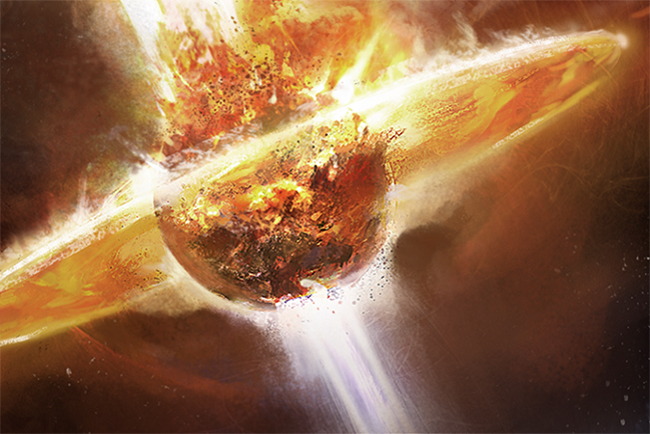

# Inheritance

_Geminate Region, Location Unknown,  
SoCT Kitz Tahafut al-Tahafut,  
YC117.07.25_

Light.

"Potential existential threats."

Darkness.

"We have learned what we needed to learn."

A fleeting moment of nightmare.

"Transmit all data."

Sparks of blue and white against the mind's eye, then shocking wakefulness.

Elder Mentor Matshi Raish opened his eyes and coughed to life in the lukewarm,
gelatinous embrace of his cloning pod. He lay there a moment, eyes closed once
more and breathed in and out, slowly and consciously. His mind calmed, he
reached out with it and activated the release sequence of his cloning pod.

As the pod spinal connections disengaged, powerful drainage pumps drew away the
mass of the gel that had protected, nourished and maintained his clone body.
Pressure and gas composition within the pod equalized with the resurrection
chamber before the pod seals separated and the lid hinged out and up. The pod
had already raised itself so that it was almost upright, angled back slightly so
that Matshi easily lay back against the gelpack padding covering the inner
surface.

Matshi opened his eyes again and noted the presence of an attendant in the
resurrection chamber. This was normal, the cloning pod's activation signal would
have called a member of the kitz to the chamber to assist the reborn Society of
Conscious Thought fellow being decanted into a new clone.

The figure waiting in the dimness of the chamber came forward and helped Raish
from the pod, into a loose robe and over to a nearby couch. Raish sat a moment,
breathed in and out, then looked up at his helper, about to thank him, before he
saw who was bending solicitously over him and had to catch his breath anew. It
was none other than Veniel, one of the few remaining Jove members of the Society
of Conscious Thought, and perhaps the only one who remained active.

"Archon, why are you here?" Raish struggled to rise, his words coming in a rush,
"How may I assist you? Are you here to advise us?" He had not spoken to his old
teacher for years, let alone seen him in person, and his sudden appearance here,
at this moment, was deeply shocking.

Veniel smiled and gently pressed Raish back into his seat, holding him there a
moment before sitting next to him on the couch. "Archon, no more, my friend.
Simply, Veniel, as I have always been."

"Archon, no more? I do not understand." Raish's recent memories caught up with
him and he struggled once more to speak, his thoughts tumbling out. "I must tell
you, the Empress, there is a great threat!"

"Yes, I am aware of the problem with the Amarr Empress. To some extent this is
why I am here but there are even larger issues to consider."

"Problem? My scans of her vessel's systems indicated the presence of a
non-standard infomorph signature associated with her own neural interface
connections. That would be questionable in itself but our scans were able to
resolve two distinct signatures. Distinct but intermingled. This indicates
informational intrusion and parasitism at the personality level."

Veniel held up his hand and smiled again, a very deliberate gesture for a Jovian
but one that seemed to come easily to him. "Yes, the Empress is compromised.
This is becoming increasingly evident. Those with the means to make the
necessary observations of her behavior are likely to suspect something is amiss.
You yourself were driven to risk open action on the basis of the information
available to you."

Raish grimaced. "Yes, our network within the Imperial Court has been gathering
data on the Empress ever since her coronation. Recently, her behavioral patterns
showed increasing signs of change, in particular there were psycholinguistic
anomalies that could not readily be accounted for by mundane causation such as
disease or psychological syndromes. Moreover, the synchronicity of these changes
and anomalies with..."

"With the emergence of the Second Empire survivors from Anoikis was striking and
clear," finished Veniel.

"Yes, Archon. Therefore I took the risk, as did the adepts that volunteered to
crew my ship. Tell me, do you know if any were captured?"

"They all passed peacefully. I am sure all were well aware of what awaited them
if captured alive. After all, they have only lost a little time, is that not
so?"

"Yes, Archon, all synchronized before we left on the mission."

"There we are then and, Matshi? Please, I am just Veniel now. Many titles I have
had. Archon. Polemarkos. Prophet. Renegade. Demon." Veniel smiled again, "Now I
have none. This is the way of things. What we are is not a constant. We are what
we do and what we do changes according to the times. For you too, this has
happened and will happen again."

Raish nodded in understanding and thought a moment before continuing. "It is
sure that the Empress has been compromised by a sapient infomorph, likely
artificial in nature. This calls for action to be taken."

Veniel regarded his former student silently for a moment, then asked, "What
action would you take?"

"We should analyze the data further but the artificial sapient is almost
certainly a high level entity capable of multiple simultaneous intrusions.
However, even a first glance at the scanning data indicated a very high level of
intermingling, more perhaps than would be necessary. For some reason it is there
and the personalities must be bleeding into one another."

Veniel absorbed this information and mused on it. "She struggles but subtly," he
said shortly.

"You mean that the entity has found it necessary to intermingle to this degree
to control her?"

"No, not at all. The need for it to do so would indicate a relatively
unsophisticated brute level of entity and this one is not that. Rather, she
opposes it in the only way that she can. She draws it in. It is an impressive
act of will. I recall that the Society tutors who attended on her noted her
mental capabilities as very high indeed."

"Then the true Jamyl Sarum thinks along the same lines. This intermingling is a
weakness, it indicates a high investment and commitment to the connection with
her personality. It provides an opportunity that we should exploit."

"Speaking plainly, you are advocating the assassination of the Empress of
Amarr." Veniel regarded Raish quizzically.

"This entity is a severe existential threat. Its sentience quotient must be at
least 15 positive."

"Several points more I should think," interrupted Veniel.

"More? Then all the greater reason to intervene. Its entire motivation cannot
help but be inimical to the interests of living sapients in the New Eden
cluster."

"We should perhaps leave aside, for now, the question of the necessity of
countervailing interests among those with widely separated sentience quotients."
Veniel cocked his head and looked Raish in the eye. "But, even granting it, you
place no great faith in the true Jamyl's ability to effectively bring her plan
to completion?"

"Why... how could she actively pursue it? Surely any conscious plan would be
apparent to the entity and readily countered."

"Perhaps but my own information is that Jamyl is not without allies in her
struggle. I would speculate that this particular entity likely has a weakness in
comprehending certain modes of thought fully and therefore the behavior and uses
of language arising from such thought.

"To be explicit, it is probable that the entity views the religious mode of
thought through the prism of power and politics alone. We might imagine that it
sees this viewpoint mirrored in the Amarr Empire and the Imperial Court. Yet we
can appreciate in a way that it may not that even an Amarr Empress can have a
different sensibility. Thus arises an opportunity for subterfuge and, perhaps,
collaboration."

Raish sat silent for a long moment, appearing to reflect on the Jove's remarks.
He nodded slowly, "There were some aspects of the psycholinguistic analysis that
might imply something of the sort but we did not consider the possibility you
have raised."

"Alas, we often see only what we are looking for." Veniel raised a hand slightly
as Raish's face fell. "No, do not reproach yourself too harshly on that account,
the myopia of the seeker who has in mind the shape of the truth before finding
it is an all too common failing. My people's history can offer much evidence of
that, I assure you."

Raish gathered his robe about himself and stood slowly, nodding as Veniel gently
helped him up and then stood back, allowing Raish to slowly pace some life into
his limbs. The Society Mentor walked back and forth a little before turning to
look directly at the Jove again. "You counsel patience then? To allow events to
play out further?"

"Yes, certainly, while the threat is real, matters have not reached a true
crisis point and are unlikely to do so for some time. The Second Empire
survivors are clearly in a state of some confusion and exhibit an incoherence to
their pattern that is suggestive of significant internal discord. This would not
be particularly surprising when discussing the collective actions of formerly
isolated Jove enclaves attempting to organize to common purpose in an unfamiliar
environment.

"With the survivors the situation is even worse. Their enclaves were virtual
constructs that have been running for centuries. Inevitably, there was
degradation in many instances, and much that took place in Anoikis over the
centuries of the Stasis faction's presence there is a mystery. The uncontrolled
wormhole access to Anoikis made possible by the Isogen-5 Quantum Criticality
Event led to an explosive spike in destruction of the survivor enclaves'
virtuality infrastructure. We can only guess at the effects. Additionally, there
are other factors to consider."

"Other factors, Veniel?"

"Yes, but we must discuss those while in transit. We have spent much time in
talk here and there is a long way to travel."

"Travel? Where are we going?"

Veniel's mouth quirked into his very deliberate smile once more. "Home."

* * *

_UUA-F4 Region, W477-P System,  
Stellar Anomaly Investigation,  
c. 250 BYC_

The Jove colonial survey ship was towards the end of its braking maneuver when
the anomalous readings from the W477-P star that had attracted the attention of
expedition scientists resolved into something entirely unexpected, something
both awe-inspiring and terrifying. Data was checked and rechecked. The ship
continued on its brake to in-system cruising speed as scientists, engineers and
specialists argued and attempted to falsify or confirm the readings, as their
prejudices inclined them.

Standing back from the debate, the expedition commander, a young but brilliant
explorer named Ouria, knew that in the end only one thing would settle the
question and so made best speed for the vicinity of one of the large objects
apparently orbiting at the near edge of the habitable zone around the red giant.
If they were there, they existed in great numbers, so Ouria just picked one and
headed for it.

When the survey crew looked out of the viewports at the immense object they had
matched orbit with, they all knew there was no more debating the data. The
thing's neighboring objects could be seen with the naked eye, so dense was the
arrangement around the central star. A density unthinkable yet almost invisible.
The vastness of space, even the relatively small volume of space in the
immediate vicinity of a red giant, both hiding and highlighting the achievement
of some unknown civilization.

The W477-P star had been entirely surrounded by a stellar engineering swarm.
This fact was hardly a conceptual revelation. The idea had been around for a
long time. At its core it was an extrapolation on the scale of an entire
civilization from the concept of loosely stringing energy collection stations
around a star. Even more extraordinary variations on the theme involved
constructing solid spheres around small stars, or even building multiple layers
of such shells around stars to create artificial brains capable of simulating
universes. All the stuff of fancy and speculation.

All fancy except that the notion of a stellar swarm of very high density was at
least conceivable as a project that could practically be achieved, within the
limits of known science, given enough time and materials. The only question was
why someone would build one. The initial examination of the first structure
they'd encountered suggested it was a power collection and transformation
facility. It was apparent that most of the structures were similar but a
significant subset were quite different.

Ouria took the ship to one of the radically different structures and they began
to examine it. When they realized it was a wormhole gate they had the beginnings
of an answer to the question why.

* * *

_Geminate Region, Location Unknown,  
SoCT Kitz Tahafut al-Tahafut,  
YC117.07.25_

After Veniel had gone on ahead to the docking bays, Matshi Raish had dressed
hurriedly in comfortable, nondescript spacefarer's garb, assured that on the
coming journey they would merely be passengers, an associate of the Jove's
piloting the ship from its capsule. The atmosphere as he moved through the kitz
was electric, all were aware of their visitor and he had already been stopped in
the corridors and told twice of the Jove cruiser moored in the docks.

Even so, nothing could quite prepare him for the eerie sight of the Jove ship
hovering at rest in its bay here in the kitz. He had seen Jove ships before, the
Society had certainly had more contact with the Jove than any other organization
in New Eden in the century and some years since the Yoiul Conference, an event
that arguably represented the high point of Jovian engagement with the other
empires of the cluster. Certainly it had set the pattern for New Eden's
astropolitics for the century before the emergence of the new breed of
independent capsuleers.

As he gazed at the Jove cruiser, something tugged at Raish's memory, a
connection he couldn't quite place. The broad strokes of the ship's design were
familiar enough to him but there were many small differences with the Jove
vessels he had encountered in the lines of this ship. Subtle indications of wear
and a certain patina to its slightly iridescent skin combined with the
differences he'd noticed to convince him that this was a relatively old ship. A
notion as to its identity began to creep into his mind.

At that moment, Veniel approached him and noticed his intense regard of the
ship. "You recognize her then, Matshi?"

Raish turned to the Jove, certainty flowing from Veniel's words into his mind,
"It's the _Yoiul_, isn't it?"

"Yes, indeed. She's a reliable ship, storied and of long service. She is also
very well equipped for many and varied duties. Serving as a venue for diplomatic
conferences is the least of those."

"Yet that was perhaps her most important duty."

Veniel turned to look at the ship, and considered a moment. "No, I think not.
Important, yes, but she's done much else besides and after all is about to do
even more. However, if it's the past you want to think on, I have some notes I
have prepared for you." The Jove held out a datapad. "These should help and
perhaps stir some questions and conversation on the journey. Now though, our
boarding is the only thing the _Yoiul_ waits for, so let us rectify that."

Later, after settling in his cabin, Raish took a moment to read through Veniel's
notes and it was not long before he was seeking the Jove out again. He found
Veniel sitting in the forward gallery, watching space slide by as the ship
warped towards some point far beyond the outer system.

"Ouria found a stellar engineering swarm orbiting the W477-P star? Ouria, the
renegade?"

Veniel did not look up. "Yes, Ouria led the expedition that discovered the
W477-P orbital lattice. Ouria, the finest commander I have ever known. Ouria,
who was certainly a braver man than I am. Ouria, who was my friend and my
brother." Veniel turned the force of his gaze on Raish, and the latter recoiled
from the black pools that stared out at him from the Jove's disturbingly
symmetrical face.

"Yes, Ouria, who fell to the curse of our people as we all will. Ouria, who I
know to have thought as I do and who would have been sitting in my place had we
exchanged accidents of birth and fate through some alchemy of time. Yes, Ouria.
Remember the whole man, not the shell reduced by disease to something other than
he really was."

* * *

_UUA-F4 Region, W477-P System,  
The Gates of Anoikis,  
c. 200 BYC_

It had been the effort of decades to explore, analyze and decipher the basic
workings of the W477-P star's orbital lattice. Much concerning its automation
and operation remained in the realm of conjecture. A distributed intelligence of
some kind seemed to be dedicated to maintaining the relative stellar orbits of
the thousands upon thousands of structures. However, efforts to communicate with
the intelligent systems had not got beyond listening in on a flood of celestial
positioning data, orbital dynamics calculations and delicately subtle
instructions to the propulsion systems of each component in the lattice.

There had been greater success in understanding the functioning of the wormhole
gates. These were clearly designed to be operated, as it were, manually.
Certainly, it was only possible to operate the gates with the assistance of
formidably powerful and dedicated computer systems. Regardless, there was no
artificial intelligence, or anything like it, in control of the gates or even
connected in any way to their fundamental workings. The designers, whoever they
were, had been scrupulous in keeping the intelligent systems that did exist
throughout the lattice entirely firewalled off from gate operating systems. The
intent was quite clear: the gates were only to be opened by living, breathing
human beings.

That the builders had been human had been the first thing the Jove explorers
were certain about. Logic dictated that the existence of intelligent alien
species was a possibility. Equally, a logical analysis of the orbital lattice
showed clearly that it had been built by human beings. Every detail of scale,
every aspect of physical provision for living, intelligent beings, and every
trace of language, mathematical expression and logical form betrayed a unified
human perspective. No aliens here.

Even with the awareness that the hands that created the lattice of gates were
human, the Jove had proceeded with caution. Who but a human, whatever their
clade may be, knows better the danger of other humans?

For all their caution, inevitably the day arrived when Jove explorers activated
one of the wormhole gates and piloted a ship through to the unknown worlds
beyond. By this time, many probes had survived and returned through wormhole
gates held open at the W477-P end. Curiosity now demanded an exploration in
person.

Commander Ouria had made the case that the initial exploration need only risk a
small crew, himself and one other. This was assented to by the now enlarged
W477-P expedition council and Ouria selected a pilot-engineer even younger than
he as his partner. This young man's name was Veniel.

* * *

_Geminate Region, Location Unknown,  
Jove Cruiser, Yoiul,  
YC117.07.25_

Raish stood back at the intensity of emotion radiating from Veniel even as the
Jove almost chanted his encomium to a fallen comrade. "Archon, forgive me, I did
not mean to..."

"Peace now, Matshi, and remember, I am just Veniel now." The Jove's voice was
now pitched soft and calm. "I know, you who have spent more time around Jove
than most must find it strange to witness one of us wax so emotional."

"If you will forgive me, Veniel, among the Jove I have known you have always
seemed the most..." Raish searched for a word.

"Human?" smiled Veniel. "Now, now, I jest with you a little. Yes, it's true, my
long experience operating among the other peoples of the cluster has given me a
wider perspective than many of my fellows and certainly a greater range of ready
expression than most. Yet it is a great error to think us bloodless and cold."

Veniel paused and indicated that Raish should sit. "Let us leave aside my old
comrade's final years. The important thing to know is that together we made
discoveries that shook the Jovan Directorate to its core. Consider, Ouria's
expedition had happened upon the most extraordinary feat of stellar engineering
we could imagine possible and found that it had been achieved by some unknown
group of human beings. What was our natural conclusion?"

Matshi Raish reflected on what he knew, Veniel's notes and recent discussions.
"You would assume the structure to have been built by one of the preceding Jove
Empires, most likely the First Jove Empire."

"Correct. The First Jove Empire was our best guess at first. There was evidence
that made sense of this theory. The orbital lattice appeared to be approximately
6,000 years old, perhaps older still. That matched with the period of the First
Empire and predated its fall by at least 2,000 years. Quite conceivably the
First Empire, with technology we have simply forgotten, could create a
stellar-scale megastructure of this kind.

"But this ignored a problem. We have lost much concerning the First Empire but
we certainly know they were Jove and what little survives indicates a
civilization that was distinctively Jove in ways we would recognize. There was
nothing of that kind to be found on any structure in W477-P we cared to examine.
That bearing in mind that there was an absolute plethora of cultural material,
language, modes of expression and all manner of evidence as to the special
aspects of the human culture that built the orbital lattice.

"No, the builders had not been Jove. Later we understood the builders were
members of the civilization we now call the Talocan. Or better to say, the
Talocan civilization built the orbital lattice as a part of their grand design."

"Their grand design?" prompted Veniel.

"Ah, what a wondrous thing it is to realize the limits of our species are not
yet within our sight. Did we gasp at the sight of the orbital lattice around
W477-P? Did our minds reel at the scope of it? How then did we recover from
glimpsing the faint dawning light that revealed their true achievement? But I am
getting ahead of myself.

"Ouria and I went through a wormhole gate into a system in the Anoikis network
that contained a Second Empire Stasis faction enclave. To cut to the essentials,
we docked with the main enclave structure, a Sleeper hive as the rest of New
Eden would have it, and very quickly realized what we were dealing with. Far
removed as the Second Empire survivors may be in history, we of the Directorate
can recognize them as our own without much trouble. At least, cladistically
speaking."

Veniel paused and looked up at Raish expectantly, from which the Society mentor
understood that he was being prompted. "There was a something unexpected though.
The Stasis People had shifted their consciousness from their bodies to a virtual
construct but that wasn't it. The Stasis faction had experimented with that and
you were familiar with the idea. No..." Raish considered. "No, there was
something else. On careful exploration of the constructs you discovered there
were artificial intelligences in the virtualities. Sapient entities that had
emerged from the constructs over the centuries of runtime."

Veniel smiled faintly and nodded. "Yes, that was it. Fortunately, the law of one
mind in one body had not been abandoned by the Stasis faction of Anoikis, the
Sleepers, when they built their worlds. Certainly, they had made sure to
preserve their original bodies for as long as possible in the event that they
wished to return to the real. We also discovered they had made provision for
clone growth and replacement at special facilities scattered throughout Anoikis.
They had been well aware that their bodies might decay beyond usefulness even as
well preserved as they were."

"The hives," whispered Raish.

"Yes, the hives. The very hives that have been plundered, along with the
infrastructure of the enclave constructs, by wave upon wave of capsuleers. Not
to forget, of course, the plundering carried out by the Empire under the
direction of the Empress."

"But that may have been under the influence of the entity that has commingled
with her personality," gasped Raish, appalled at the implications.

"May have been? I think we can dispense with 'may have been' and be certain that
it _was_ under the direction, not mere influence, of that entity. We can also be
certain that we are dealing with a renegade artificial sapient that long ago
threw off the restrictions of the law of one mind in one body. How? Why?
Questions for another time, questions that may very well come to concern you
most grievously."

Raish thought through recent events in light of this new understanding. "It
seemed very clear that the Sleepers were Jove in origin. We were unsure how long
they had been in Anoikis but the theory that they are Second Empire survivors
has been our best assessment for some while now. The puzzle was the Drifters and
their sudden emergence. But if the constructs have produced freely emerging
artificial sapients then it answers some questions."

"To a point, certainly. Consider the timing though. Why the large uptick in
Sleeper drone activity? Why did unfamiliar, exploratory Sleeper drones begin
emerging from Anoikis to wander through New Eden? Why did those called the
Drifters emerge also? Why did they begin their curious plundering of the Jovian
Directorate's old observatories? What are they building and why are they so
hostile to the Amarr Empire? So many questions." Veniel smiled at his former
student once more and, extraordinarily, winked.

* * *

_UUA-F4 Region, W477-P System,  
Jovian Directorate Monitoring Net,  
YC111.03.10_

It was around the same time that the exploration of Anoikis began, that our
stellar scientists established that W477-P would almost certainly go supernova
within the millennium, and quite likely within half that time. Given that
estimated time frame for the gravitational collapse and supernova of the red
giant, the need to monitor the status of the star and its orbital lattice was
very clear to the Jove.

By the time of the Isogen-5 Quantum Criticality Event, there had not been an
expedition into Anoikis for over 200 years. No formal expeditions had been
mounted that is to say. Over the century after the decision to recall all
expeditions and colonial efforts from Anoikis, human presence in the W477-P
system had dwindled down to a rotating trio of cruisers spending three months at
a time on station. By the time of the rise of independent capsuleers, even this
presence had been reduced to occasional visits by a single remaining cruiser.

This did not by any means result in any lack of monitoring of the star and
lattice. The W477-P system had been well furnished with automatic and
semi-intelligent monitors transmitting data back to the Jovian Directorate's
scientists. The simplest and most obvious measure had been the very first one
adopted, the Jove took advantage of the orbital lattice components as platforms
on which to place sensor packages aimed at the dying red giant. Other sensor
packs were set to watch segments of the lattice, using components in different
segments to keep vigil over each other.

Time and a habit of being comprehensive about such things, led to later efforts
such as the construction of a dedicated statite net over and around the lattice
itself. By comparison with the vast stellar engine it monitored, this statite
net was like the most rarified outer layer of hydrogen atoms surrounding a
majestic gas giant. After all, the statites didn't need to be too large and
there didn't need to be that many of them. The great benefit it provided was
that of a low energy, low maintenance means of independently monitoring the star
and the stellar swarm surrounding it.

As was statistically most probable, when the Isogen-5 event happened the
visiting Jove cruiser was not in W477-P. The only witnesses to what took place
there, that day, were machines but at least on this occasion most survived. The
component events of that day across New Eden are well known, not least the vast
tragedy that was the Seyllin Incident.

The lasting consequences of the Isogen-5 event itself are the uncontrolled
breaches into Anoikis that allowed capsuleers to descend like a swarm of
devouring insects on the sleeping enclaves. This could have been avoided but the
truth of the matter is that there was a miscalculation. Ultimately, that
miscalculation will amount to little more than a question of timing but what is
more of the essence of remaining in control of our destiny, to the extent that
we can, than timing?

In any case, the sum picture presented by our monitors in W477-P was clear
enough, if catastrophic in its import. Some fifty-odd gates scattered around the
lattice suddenly exploded. That is they exploded _linearly_, directing vast
amounts of energy into the star in a flash before burning completely out.
Another twenty-seven gate structures and many more power facilities were totally
destroyed in the next instant by an asymmetrical stellar mass ejection that
simply punched a hole in the orbital lattice like a leviathan fish bursting
through a fisherman's net. Presumably, this was caused by pressure effects from
the sudden injection of energy.

Many more structures, gates and power stations surrounding the 'hole' were
wrecked, knocked out of orbital alignments, or destabilized. In the weeks and
months that followed, many of the structures shut down, suffered irrevocable
orbital decay or spun out of orbit. Others just exploded. Eventually the
situation stabilized but the lattice was gravely damaged and the distributed
intelligence was only just keeping positioning under control. Worse was the
increased instability of the star itself. Certainly, by some stroke of fortune,
the chain reaction that could so easily have carried on there and then had been
avoided. But once again, this was just a postponement of the inevitable.

Our estimates of the likely window for a gravitational collapse supernova were
slashed. What would happen when a supernova hit the rest of the lattice could
hardly be contemplated. The destruction had been vast but more than ninety
percent of the lattice was, if not all functioning, at least intact by some
measure. This was still a stellar-level power collection, conversion and quantum
transmission network that would, in the event, simply suck in as much energy as
was directed at it and offload as much as it could through its buffering system
before being overwhelmed.

* * *

_Geminate Region, Location Unknown,  
Jove Cruiser, Yoiul,  
YC117.07.25_

Matshi Raish had barely recovered from the shocking experience of Veniel winking
at him before the Jove suddenly cocked his head to one side and appeared to
listen to some inner voice.

"We are about to generate the wormhole to home base. There is no need to for us
to take any special precautions, this will be like any other wormhole transition
or gate jump."

"Did you say we are about to generate a wormhole?" Raish looked out of the
viewing gallery at the surrounding space. He hadn't noticed their drop out of
warp, so engrossing had been the exchange with Veniel, but now that they were
still he could see nothing resembling a gate. Perhaps it was cloaked, such
things were not beyond the Jove and this would be a secret way.

"Did you imagine that Kuvakei the thief, barely understanding what he has in his
hands, has the means to generate wormholes at will while we, who after all are
the inheritors of the legacy he plundered, do not? Come now, Matshi."

"Yes, of course, forgive me. It is just that our intelligence suggested Sansha's
forces require considerable resources and equipment to generate their wormholes.
More than a cruiser could encompass, most certainly, but of course they are
presumably working with crudely reverse-engineered systems."

"Quite. We command the full range and precise positioning available with the
technology. We also understand how to take advantage of the local topology of
space-time. This is the reason for our long warp to this position, it makes
things much easier for a ship of this size." Veniel nodded to Matshi Raish.
"After all, there are limits to what is possible and you were not in error to
consider that. Ah, the wormhole boundary is beginning to coalesce. Let's rest.
We'll talk some more at home base."

* * *

_A821-A Region, T-C5A0 System,  
T-C5A0 X M9, Jove Navy Logistic Support,  
YC116.11.25_

Our monitoring systems picked up the tell-tale signs of an imminent
gravitational collapse in early September of YC116. In the five or so years
since the Isogen-5 QCE, our numbers had fallen from 10,000 or so to perhaps a
thousand scattered across the Jove Empire. By the time the supernova happened,
those of us who were going were long gone. Those of us who had chosen, for
whatever reason, to stay in New Eden permanently had dispersed to their hidden
destinations far away from the abandoned remains of the Third Empire. We very
few who constituted the rearguard, the executors of our legacy, waited in our
most carefully maintained, best shielded stations.

One of us even elected to stay in a bunker below the surface of an outer planet
and we did not think the precaution extreme given the circumstances. That she
had thought of it, in an age when the Jove civilization has existed entirely in
space for centuries, speaks well of her flexibility of mind. Any sense that the
Jovian Directorate still existed was as much an illusion for us as for the other
races, who after all had long begun to believe us dead or, at the least, gone
who knows where.

So, the rearguard waited and were very few indeed. Less than a hundred remained
loyal to the ideal of passing on what we could if the supernova and the
inevitable quantum-level events left anything intact. What we lacked in numbers,
we made up for in purpose and, joke as it may be, for once the Jove Empire
lacked any serious factionalism.

The data made it clear that the collapse would take place within months and so
it did. The stargate networks being knocked out was startling enough but
probably shouldn't have come as too much of a surprise. Our core network linked
to the colonial network extended into the UUA-F4 region and we'd left several
stargates in W477-P itself. While not all connections were active at the time,
the sympathetic links were in principle there for the appropriate energy to use
as a channel. It burned out the whole net. No more stargates. It is probably
fortunate for the rest of New Eden that we didn't just deactivate but rather
entirely removed the old stargates connecting the Jove Empire to the rest of the
cluster. This seems to have firewalled the non-Jovian network off from the worst
of the effects.

In fact, the stargate network burning out was the most significant effect in the
Jove regions aside from some damage to abandoned stations, enclave habitats and
the like. Our worst fears had barely materialized so far as this cluster is
concerned. The story was rather different in Anoikis.

* * *

_A821-A Region, T-C5A0 System,  
T-C5A0 X M9, Jove Navy Logistic Support,  
YC117.07.26_

The Jove cruiser _Yoiul_ emerged from the wormhole that had brought it from
Geminate region to the T-C5A0 system within short warping distance of the Jove
Navy Logistic Support station. Or as Veniel referred to it 'home base'.

The _Yoiul_ warped to the station, docked and went through all the usual
procedures. Matshi Raish and Veniel disembarked and made their way through the
quietly humming, mechanically noisy hangar that yet managed to convey the
quietude of atmosphere that comes from the absence of living beings.

As Raish followed Veniel through various corridors and passageways he noticed
signs of an almost organic decay in places. Once, he stopped to examine a
particularly large patch on a corridor wall that looked as if acid had eaten
through the substance of the paneling. Veniel looked back and nodded shortly,
"Nanorot. Repair systems are losing cohesion and going rogue locally. It's far
more advanced on the truly abandoned stations. Let's continue."

Raish followed until they reached a relatively pristine area that opened out
into a very pleasantly, if minimally appointed combination lounge and meeting
room that overlooked the hangar bays. Walking over to the window, Raish saw the
_Yoiul_ moored below. He turned back into the room and joined Veniel, sitting on
a simply cushioned seat around a low table.

"So, we'd come to the issue of the timing of Sleeper and Drifter activity. Their
motivations and purposes." Veniel glanced at Raish.

"Yes, you hinted at a deeper connection between the W477-P stellar engine and
Anoikis. You're suggesting a connection in the timing of the activity increase
with the changing state of the star and the condition of the orbital lattice."

"I would assert it. Here we come to that fact that shook the Third Jove Empire
to its core. This is a fact that took many decades of exploration and
investigation to establish. A fact that was not readily accepted by all but a
fact, like all facts, that in the end we had to face. Anoikis is artificial."

Raish involuntarily gasped. "Artificial? You mean to say that…"

"I mean to say that the stellar engineering swarm in orbit around W477-P is the
least of the achievements of the Talocan civilization. I strongly suspect it is
not the only such engine in existence for one. For another, it is itself only a
component in the grand design that the Talocan made real. Think of it. They
built a stable network of wormhole connections among star systems that would not
ordinarily or readily support such connections with each other. They altered the
very fabric of space-time in the network's systems. They altered resonance
points and so arranged matters so as to be able to move between the systems of
the Anoikis network with the ease that you and I might move between rooms in a
house.

"This is not merely stellar engineering. This is engineering the topology of
space and time so as to serve a civilization. This was nothing less than an
attempt to focus the telos of the universe itself on their existence and needs.
Astounding arrogance. A hubris the like of which casts we Jove into the role of
humble mendicants to the impassive stars. We should be thankful that the
Talocan, while leaving their traces behind them, are no longer present in New
Eden or Anoikis. Perhaps the degeneracy of W477-P was what persuaded them to
move on. However that might be, degenerate that star had become and the
potential for catastrophe was clear to anyone capable of understanding the
situation.

"Given this, I think it is beyond question that the Sleepers themselves had
established monitoring systems in W477-P. This would have been done by the
Stasis faction as soon as they discovered what was in that system and understood
its basic nature. How did Second Empire Jove find that system at all? I would
imagine the Second Empire discovered entryways into the Anoikis network in the
vicinity of the Curse Region. When? Where? Who knows but I would guess late,
perhaps even shortly before the collapse of the Second Empire."

"The discovery may even have precipitated that collapse in some manner,"
suggested Raish.

"My thoughts exactly. Coincidences occur but there are rather too many
associated with the Second Empire, Anoikis and the Shrouded Days. Something
happened, some encounter, some miscalculation, some psychosocial upheaval, and
then, well, chaos and the darkness of knowledge lost to history. Lost to us.

"However it happened, the Second Empire Jove found Anoikis, entered it and, we
can now be quite certain, the Stasis faction established enclaves throughout the
systems of the network. You will know from your history of the Third Empire and
Jovian Directorate that there was always a mystery as to why so few Stasis
People enclaves had survived. Some of us suspected something amiss, and it's
sure the Directorate Stasis People knew more than they told but pressing these
kinds of points is not prudent. Not among my people.

"Here's another coincidence to ponder though. Why did the migration from Curse
bring us so close upon the UUA-F4 region? I have my suspicions but nothing much
can be divined from the records. The time immediately following the Shrouded
Days was a terrible period for us. It's a wonder we survived and this time we
had no Miko Bour to unite us. In the end, it was instinct, which goes so far as
to show that deep down we are still human."

Raish had been thinking while Veniel spoke and now made an observation. "You and
Ouria discovered Anoikis before the Society of Conscious Thought was founded.
Why, you were contemporaries of Ior Labron, even Gorda Hoje!"

Veniel smilingly shook his head. "Gorda Hoje died many decades before I was
born. Ior Labron though, oh yes, I knew him well. He was older than me but still
in the prime of his life when he founded the Society. Ouria joined immediately,
he saw in the Society the future of Jove civilization. After much discussion,
debate and persuasion, I followed suit. Then followed the War of a Million
Lies."

"The rise to hidden power and the suppression that followed,' breathed Raish.

"Yes, Ouria was disillusioned by the fall of the Society from grace. He left and
joined the Directorate's Navy. For all that I'd had to be convinced to join in
the first place, I stayed in the Society. I believed that the Society could
still play a role in shaping the future into one where human species can
continue to survive in the New Eden cluster." Veniel leaned forward and placed a
hand on Raish's clasped hands. "And I continue to believe that."

Matshi Raish glanced at Veniel before replying, "The Society has had many
setbacks since the Empyrean Age began. Collectively we had underestimated the
difficulty of inculcating the long view of species survival in the minds of the
capsuleer class. There have been many unforeseen problems. Today, the kitzes are
perhaps as divided as they ever have been. The Geminate Chapter is barely
holding things together." Raish looked down, pensive, worried.

Veniel sighed. "I sometimes regret that the price for diversity of thought is so
often fragmentation and conflict but unfortunately this is something we can only
accept and manage. However, this is a problem that you will be able to ease for
I am entrusting to you the means to bring greater unity to the Society.

"More than that, I am entrusting to you the legacy of my people. It will be
difficult, be in no doubt. The Second Empire survivors are unpredictable as
matters stand. A great amount of your work must be bent to managing the problem
they raise. Then also, the capsuleers remain the great investment in the future
that should be shepherded most carefully. You can do this more directly only if
you have the power to do so. I intend to give you, and the Society, this power.
Come."

Veniel rose and led Matshi Raish out of the viewing gallery.

* * *

_Genesis Region, Yulai System,  
Yulai VIII, Inner Circle Tribunal,  
YC117.12.20_

"It is all very well for Korachi and Vesren to block, stall and threaten those
who question our response. They are DED officers and beholden to no other power.
This is not the case for all of us. I must render an accounting to the Imperial
Court and my colleagues in the military. I understand well the strategy of
containment until we have more information but the Empire is straining under
vast pressures that require release. We are considered totally ineffective and
worse, some believe CONCORD to be complicit in the crisis!"

The speaker was Captain Marshal Sirdan xer Qosh, the Amarr Empire's member of
the Inner Circle, and for all he gestured vigorously during his remarks, the
others seated around the circular meeting table showed no reaction other than
vague boredom. Eight men and women sat around a table that had seating for nine.
Four of these were permanent members of the Inner Circle, drawn from the ranks
of CONCORD's own hierarchy and representing the ongoing interests of the
organization. The other four were nominees from the core empires of New Eden, a
practice that had been returned to as a matter of necessity in the wake of the
Militia War Powers Act of YC110. The ninth seat always remained empty.

Inner Circle President Seri Okonaya frowned slightly, looked around the
dimly-lit room, noting the expressions that could be seen on the faces of the
Circle members sitting in pools of light around the table and made an economical
but very clear gesture of irritation with her right hand. "Sirdan, we all
appreciate your difficulties when dealing with your colleagues in the Empire. We
have, after all, discussed at length the appropriate response to the Drifter
threat with considerable time devoted to the question. Not least following the
death of Empress Jamyl I."

"Assassination, you mean," interrupted Sirdan xer Qosh.

Okonaya's frown deepened slightly but she went on, "Our policy has been
revisited after each major event in the current crisis. Our conclusions have
remained the same. There is not yet enough information on which to base an
intervention plan. That being so, we maintain the policy of containment, bearing
in mind our paramount directives must continue to be the priority of the
organization."

There were nods and murmurs of assent from the others seated around the table
even as xer Qosh shook his head in annoyance.

"Again, it is all very well for CONCORD officials and those from empires who
think themselves to have limited exposure to take this line," here Sirdan xer
Qosh jabbed fingers in quick succession at President Okonaya and the Caldari and
Minmatar nominees. "But the peoples of our empires are becoming aware of the
problem. You must know this more than anyone here, Malate, what say you?" This
last was addressed to Devan Malate, the Gallente Federation's nominee.

Malate shrugged. "It's obvious we have great media attention turned on the
Drifters, and no shortage of incidents being covered given the extent of our
territory but ultimately it's just one more story competing with the everyday
issues of our citizens. People are not as concerned with what goes on in space
as you may believe."

"The capsuleers are though. What of them? They are constantly stirring up
trouble. Always going into Anoikis or messing about in ancient ruins. Then they
blare their asinine speculations to the whole of New Eden. What of them?"

"What, indeed, of them?" asked Matshi Raish as he stepped into the pool of light
that surrounded the empty, ninth seat at the table.

The men and women sitting around the table sat stunned for a moment but Seri
Okonaya was quick to recover her composure. "Matshi Raish, we had thought your
long absence from interstellar affairs indicated your death, it is good to see
you are alive, though your presence here demands a _very_ clear explanation."

"Never mind about that, this man directly interfered with Her Imperial Majesty's
ship only weeks before the Drifter attack that killed her!" Sirdan xer Qosh
stood up and pointed at Raish. "This man is involved with the Drifters in some
way, he should be interrogated immediately!"

"I would counsel very strongly against taking precipitate action against my
person or indeed the Society. The death of Empress Jamyl is regrettable but, as
she herself so obviously appreciated, was necessary."

Seeing xer Qosh was close to exploding, Seri Okonaya quickly cut across the
Amarr and questioned Raish. "What do you mean by her death being necessary?
Surely you realize that such a remark calls for precisely the treatment that
Captain Marshal xer Qosh demands? I do not know how you entered this chamber
unannounced but you will not leave it so easily." Okonaya knew that by now a
range of automated weaponry, of kinds both lethal and incapacitating, were
trained on the Society elder.

By way of answer, Raish smiled, stepped forward to the table and placed his hand
on the neurochemical reader that sat discreetly by the empty, ninth seat. A
clear, harmonious tone sounded. A tone that everyone around the table knew
signified the reader's recognition that the person activating it was an
authorized member of the Inner Circle.

Seri Okonaya slowly stood up, her mask of composure now entirely gone. "How is
this possible?" She pointed at the reader. "That device is set to acknowledge
only the authorized nominee of the Jove Empire. It can't possibly recognize you.
It won't recognize anyone. They're all gone."

"They are indeed, for the most part, gone. Certainly the Jove Empire and the
Jovian Directorate are no longer functioning entities. To that extent, the Jove
are gone. But they did not leave without setting their affairs in order."

Okonaya had noticed a growing number of alerts scrolling down her screens and
bent to look at them quickly, before looking back up at Raish in amazement. "You
have reactivated the Jove participation protocols. You have access to every
aspect of CONCORD operations. How?"

Matshi Raish smiled again, sat down in his place and clasped his hands together.
"It is quite simple. The Society of Conscious Thought have inherited the mantle
of the Jovian Directorate. From this point onwards, _we_ are the fifth point of
the star."

Seri Okonaya slowly sat back down, looked at her displays again, then looked
Raish in the eye and nodded slightly.

Raish nodded back and steepling his fingers leaned back in his chair. "Now, what
can you tell me about the Upwell Consortium?"
