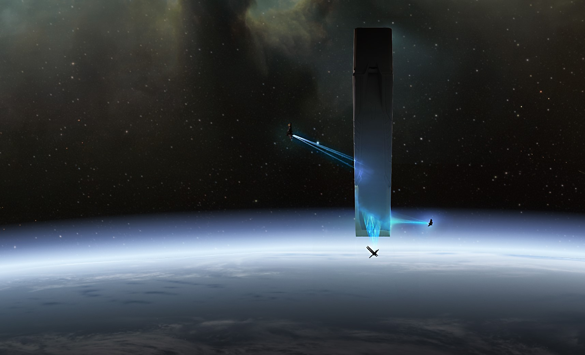

# Sine Wave: Omega

++Some Personal Recollections++

_Heimatar System, Matar, Great Caravanserai, Council Quarter, YC118.09.06_

I have never been fond of the Great Caravanserai, for a center of politics and considerable intrigue, it's far too open and busy. Not to mention that the ventilation in the Council Quarter is atrocious, far too hot in the summer and shockingly cold in winter. A consequence of bad adaptation. The old architecture, built to take account of the climate, is fine but rather too much clutter has been added inside. Of course, the outside can't be changed for heritage reasons.

Fortunately, I don't find myself visiting the heart of Minmatar politics that often these days. Unfortunately, I had to make a visit to see old Shakor in connection with the upcoming diplomatic visit to Amarr Prime. I wouldn't have bothered with insinuating myself into the affair but it afforded an opportunity to deal with several matters that had been variously delayed or, in one case, were quite urgent.

Unsurprisingly, Keitan Yun awaited me in the anteroom to the Sanmatar's office. I'd known Keitan for a long time, what with the Elder Fleet matter and certain other aspects of Thukker Tribe operations in conjunction with the rest of the Minmatar. I'd always found him pleasant enough company but he'd become quite dangerous in some respects. A shrewd man but intense and driven. The events of the Elder Fleet conflict and subsequent border war had altered him somewhat. Shakor valued him as a personal envoy willing to get things done without scruple, so long as Matari interests were advanced.

"My dear, Yun! So good to see you again," I smiled.

"Sjakhuni, welcome back." Keitan Yun had a guarded air as he greeted me. Something up then. I steeled myself to deal with Shakor as Yun led me through.

Old White Eyes was standing at the window. Presumably this was to take a little air, even if it was quite ionized after passing through the shimmer field guarding the opening. Yun led me to the chairs set in front of the Sanmatar's desk and waited. Shakor stayed at the window for a moment more. In anyone else, I'd have considered this affectation but Maleatu Shakor didn't go in for that kind of thing. He was making sure he'd mastered himself. Something was most certainly up.

"Please sit," Shakor said, as he turned and walked behind the desk to take his seat. His personal mapping sensors, no doubt connected up through his own capsuleer implants, meant that physiologically blind as he might be, he could perfectly well 'see' everything around him. Augmented as he was, Shakor could probably visualize his surroundings in real time in a number of different ways. Those that didn't appreciate this were at a severe disadvantage when dealing with the de facto leader of the Minmatar Republic. Happily, I was acutely aware of his capabilities.

I settled myself and waited for Shakor to start the meeting. Instead, Keitan Yun opened proceedings, which was interesting. "Maleatu, we've had word from Makusta." Maleatu. In front of me. The meeting had suddenly become very interesting indeed.

"How is Silbraur?"

"Optimistic. He reports that his infiltration units have surveyed the main impounded populations and sampled for suitability. There's a high percentage. Normal distribution." Silbraur Makusta, Shakor's man in the Justice Department. The Republic's slave liberators and slaver hunters. I knew what this was about and decided to interject.

"I could have told you the Amarr haven't taken steps to prevent the possibility of their slaves being entered into Alpha State programs. For one thing, it's not practical. They'll have to rely on their usual methods, vitoxin and the rest of it."

Shakor tilted his head to one side as he turned to regard me with his white, blind eyes. "That's as may be, Sjakhuni, but I make sure of my facts before I act on them."

"Act on them? You shouldn't be overhasty, Sanmatar." These Minmatar and their obsessions. "My sources tell me that AG12 are closing in on the Amarr as it is. If you start something with the slave populations this will blow up and we're not quite ready."

"Sjakhuni, you sit in my office as someone who has given this technology to the Amarr and Caldari. I'm not sure you should expect to dictate policy to us in this matter."

This again. "Sanmatar, you know the terms of the SOE's program. They were always going to give the fruits of Project Ascension to all parties."

"Did that require you to act as facilitator of that sharing?"

"Well now, that allowed me to give the Tribes a certain head-start didn't it? Look, the program is irrevocable for all intents and purposes but CONCORD could still cause us trouble if it comes out before the coronation. Directive Alpha Gamma 12 could be invoked to freeze deployment of the technology if all empires are not ready. Not to mention the Society of Conscious Thought have enough cards given they own the SCC license for transneural injection tech. Their hand will be stronger in the Inner Circle without the Empress on the throne."

Shakor turned to Yun with an expectant expression. The envoy cleared his throat. "Ah, that seems a fine distinction to make, Sjakhuni. I'd allow you that before the trials but Catiz is the Empress, crowned or not." Yun held up his hand as I made to reply. "However, you're right about AG12 and the Society won't like all this. The SOE's involvement will infuriate them. Using their tech for unlicensed research and development of new cloning will probably make Raish's head explode." Yun paused and chuckled. "Well, maybe he'll raise his voice. Anyway, Maleatu, our friend here has a point. We should be careful. Especially with the Gallente situation."

"They're exposed? The Syndicate smugglers only delivered the key components and specifications a week ago." This sounded bad. My misgivings about the Amarr and Gallente seemed to be coming true more quickly than I'd expected.

"Only a week? You really did give us a head-start," rumbled Shakor.

"Yes, and my contacts in Carthum only received their little package a day before that. Until now there's been nothing for AG12 to really grab hold of outside of those RSS facilities you managed to negotiate space for with Trust Partners."

Shakor grunted. "Einnar Aeboul saw sense for a change. Didn't hurt to have the threat of the Vo-Lakat making a leadership play hanging over his head."

Sjakhuni smiled. "He's a proud man."

"Yes, he is," frowned Shakor. "With some justification. What about the Caldari?"

"They get their shipments this week. The CEP itself insisted on separate deliveries to each megacorp. Made it much trickier. Exposing one megacorp would give AG12 ammunition for an injunction. However, I doubt the recruitment screening programs have piqued their interest and even the building of new clone blank production networks has probably only been of concern to DED Conflict Monitoring. They'd assume it could be a prelude to anticipated losses in a war situation. But I'm not worried about the Caldari. Back to the Gallente, what's all this, Yun?"

Shakor's envoy inclined his head. "They were a bit too eager and a bit too careless with their vetting it seems. An AG12 operative was on the ground inside one of their blank conditioning centers when it received its final components."

This news vexed me, even if it was typical of the Gallente who think their intelligence services are splendid even though the great majority of their operatives are bunglers and clowns. "When was this?"

"Yesterday morning, Caille local time."

"Caille local? You mean they had a facility on Gallente Prime?" I was somewhat taken aback and shook my head. "And how did you find out about this so quickly?"

Yun smiled. "As I said, their vetting was lax. We had our own operative in place. There was, well yes, an accident and there's no immediate urgency."

Relieved, I sat back and looked at Yun and Shakor. Ruthless men in pursuit of the interests of their people. Not something to forget. Not something I'd be likely to forget given certain events they'd orchestrated.

"Even so," I mused. "This probably means the Gallente operation will crack open soon. All the more urgent that a common understanding is arrived at among the great powers outside of the oversight of CONCORD. This is a technology they will do their utmost to suppress."

Shakor grinned and turned his opaque gaze on me again. "They can try."

"There will be an opportunity to reach an agreement, if not quite an accord, at the coronation, ah, festivities," Yun smiled. "Your place in the delegation as a representative of the Vo-Lakat remains available to you, even if it does seem to us that you are representing interests beyond those of a Thukker caravan. One might say you represent interests beyond even those of the Seven Tribes."

Amusing as I found the insinuations, I could recognize a gambit meant to shock some denial or indiscretion from me. Here the truth would serve, even if it was a small truth embedded in a web of lies.

"You mean the Sisters? Well, I'm afraid it's true. The Vo-Lakat have a partnership with them and they can't be seen to represent themselves. Too many people watch them too closely. So, yes, I represent their interests and those of the compact that lies behind Project Ascension. It can't be any other way, as much as you don't like it, Sanmatar." I turned to meet Shakor's sightless gaze.

Shakor smiled thinly, "Very well, Sjakhuni, we'll do it this way. Be ready."

I smiled back, "Oh, I will be, Sanmatar. I will be."

* * *

_Southern Ves-Udor, Satach City, MIO Field Office, YC118.09.29_

Sub-Inquisitor Ramal Zoshan walked into the Satach City's Ministry of Internal Order field office with a slight limp and made his way to the investigative branch's floor. Passing through the bullpen he noticed a man bedecked in sumptuous and ornate priestly robes talking animatedly to an interviewing officer. The older man in robes, presumably a cleric of high rank, perhaps an archdeacon, was accompanied by a woman clad in advanced but well-worn combat armor. Zoshan paused a moment and scrutinized the two, their attire bore a sigil of some kind that he vaguely recognized, though it was not a familiar piece of religious iconography.

Zoshan looked over at the Chief Investigator's office and saw that Inquisitor Sarkovas was already busy with someone. The sub-inquisitor decided to take a seat close by the unusual pair while he waited. The priest was describing the circumstances of some kind of attack to the interviewing officer.

"Sancta here saved me. You know, if it hadn't been for her quick wits those assassins would have succeeded. Which would have been very inconvenient." The cleric waved a hand indulgently at his armored companion, apparently some kind of bodyguard. She smiled faintly and nodded as the man went on. "I must say that I'm dismayed that such an event could take place during the holy coronation week! There are those who would try to stop me in my mission and dispute me as a Pope of the true faith, I know, but it's an outrage that such fanatics could slip in and strike here!"

As the interviewing officer's expression became even more pained, Zoshan began to realize who was sitting not six feet away from him. The bodyguard, Sancta, laid a hand on the robed man's arm. "Your Holiness, I don't think we should take up the Ministry's time with this, they're very busy with more serious criminals and heretics. After all, those two Jamylites won't bother anyone else again."

Zoshan shook his head in bemusement and noticed from the corner of his eye that Inquisitor Sarkovas's visitor was leaving. He stood up and walked over to the Chief Investigator's office.

Sarkovas was waiting for him at the door and clasped his hand. "Ramal! It's good to see you up and about. No lasting damage I hope? This way, come, sit."

"I'm quite well, Chief, and I managed to look into the matter some more while I was recovering."

"Oh?" Inquisitor Sarkovas frowned. "Commendable, yes commendable, but you had a near escape with that incident in Valset Sarum Square. You're a fine investigator Zoshan but the mind and body have limits."

"Yes, Chief. I'll remember that." Zoshan hesitated and gestured back at the bullpen, "Chief, I couldn't help noticing that there's a capsuleer of questionable reputation being interviewed as a witness out there."

Inquisitor Sarkovas nodded shortly, "The heretic Max Singularity and his hired killer, Sancta Bassilica. I find his presence as distasteful as you do but there are political realities to consider. Not only are they both capsuleers, which limits us in its own way, but this so-called 'Pope' was a candidate champion in the House Kador bouts of the succession trials. He is, let us say, protected from on high."

"I see. Well, ours is to serve, Chief."

"Indeed and frankly when it comes to possible heresy I'm more concerned with Jamylite extremists. This new 'Tarot of St. Jamyl' has been showing up everywhere," Sarkovas paused and shook his head. "In any event, you were saying you had some information as to the bombing? The assassination of two diplomatic envoys during coronation week has raised many questions. The powers that be are not pleased. Any light you can shed on the matter will be useful, even if you should have been resting," Sarkovas smiled.

"I'm not sure if I can shed light on it, Chief. I have more questions after looking into it than I do now."

"Let's have it then. Perhaps we can puzzle it out together."

Zoshan ordered his thoughts. "Well, there are several things that just don't add up. For one thing, every monitoring device in the Ametat and Avetat bar had been disabled or suborned. Our own devices started to transmit white noise a few moments before the Lai Dai envoy entered the premises."

Sarkovas consulted his screen. "That would be this 'Satta Mochan', a member of the Lai Dai trade delegation."

Zoshan nodded. "Yes, he met with the Thukker, a member of Shakor's delegation called Tamasek Sjakhuni. We got nothing from their meeting. They used a sound-dampening field and seem to have disabled any and all monitors. I checked my datapad's video files, the Thukker was using a localized visual field scrambler to disguise his lip movements."

Sarkovas raised his eyebrows. "Curious. It's understandable that diplomats would take care. The sound-dampening field was to be expected. However, these other measures speak of a more covert tradecraft than simple diplomatic caution."

"The red flags don't end there. Tamasek Sjakhuni isn't just a Thukker diplomat. From what I've been able to glean he's a trusted figure within the Vo-Lakat Caravan's ruling council and there are indications of links to the Sisters of EVE, as well as his clear connection with Shakor's circle. And, well," Zoshan hesitated, then pressed on. "He's not dead."

"I beg your pardon?"

"Sjakhuni's not dead. He was with the Shakor delegation when they left the system after Shathol'Syn. It looks like he joined their convoy in high orbit from a transfer station."

"So he's backed up. Nothing too unusual about that, particularly if he's so high-ranking. Although, if he joined them in orbit," Sarkovas looked thoughtful.

"Then he had a backup ready in system and it was set as his primary. He knew, that's my assumption."

"Hm, be careful about assumptions in this business, Zoshan. That said, if he was party to the bombing then it changes matters. That means it's an assassination of an allied diplomat with the involvement of the Republic. Would Shakor be that brazen? Allowing his attendance at the coronation to serve as cover for a political murder?" Sarkovas thought a moment, then shook his head. "But that's absurd, the other party was a minor diplomat at best. A trade envoy for Lai Dai. What benefit in killing someone like that here and now? It could be done elsewhere, at another time. Why take such a risk?"

Zoshan nodded eagerly and leaned forward. "I don't have the answer, Chief, but there's something very wrong when it comes to the Lai Dai man."

"Ahh, so now we come to it. A cover of some kind?"

"It looks that way. I've checked into the Caldari State's records, those they share with us. This 'Satta Mochan' leaves a very rarefied trace. Yes, there's a record of a Lai Dai trade envoy of that name and it does seem as if he was born as a space-adapt, as indicated by the diplomatic credentials. The records say he's a Lai Dai citizen born on one of their Oipo system installations. That's out in Lonetrek, Chief."

Inquisitor Sarkovas nodded and smiled faintly, "Yes, I'm acquainted with the Caldari State's geography."

"Yes, sir. Sorry, sir. Well, the rest is a basic corporate bio, some details of his education, work postings and it all ends up with him turning up as a trade envoy visiting Satach City during the coronation week. Specifically, arriving only the day before Shathol'Syn. There's precious little else and it smells like a cover identity to me. There's one more thing. Something odd."

"What's that?" Sarkovas asked.

"Well, Mochan didn't arrive in system by ship. He clonejumped. He was supposedly at one of Lai Dai's Tamo stations an hour earlier and arrived at a cloning facility on the Emperor Family station. We have him walking out of the facility shortly after the jump took place. The clonebay that was used is leased to the Lai Dai Protection Service and the facility is operated by, let's see, here we are, Genolution corporation."

Sarkovas raised his eyebrows a moment and ruminated on this information. "No," he said slowly. "No, this won't do. Someone has made a mistake, I think. Haste, perhaps, but this doesn't hang together." The Chief Investigator drummed his fingers on his desk, gave Zoshan a penetrating look and made a decision. "I'm going to involve you in matters of state, Zoshan. You may not thank me for it but I believe you are reliable and capable."

The younger man was taken aback. "You think this means something serious, Chief?"

"Potentially. Sit there a moment, I have to consult an old friend."

The Chief Investigator activated the office's conference screen and tapped out a code. The screen sprang to life, momentarily displayed some liquid router connection data and then showed a female Achura dressed in formal Caldari administrator-level business-wear. "House of Records, Oniteseru Central Registry. How may I serve you?"

"Connect me with Haavo Tagematsu, Archive K."

The Achura's expression instantly became guarded. "Your authorization?"

The Chief glanced at Zoshan, then replied, "Sardar-Colonel Parvaz Sarkovas, Amarr Naval Intelligence, Archive K designation 'Cardplayer'."

"Please transmit your indentification package."

Sarkovas tapped a code out and waited.

"Identity confirmed. Connecting you, Cardplayer."

Sarkovas looked at Zoshan again, while the screen displayed a connection transfer ident, and smiling faintly gave a small shrug. Zoshan caught himself gaping and sat back, thunderstruck at this turn of events. The screen flickered momentarily and the new connection displayed a slim, dark-haired, though greying at the temples, Deteis. The man was dressed in standard Caldari executive-wear and sat behind a polished dark wood desk, with a shelves of books and holotapes covering the wall behind him.

"Parvaz Sarkovas," said Haavo Tagematsu. "It's been a long time. I heard you fell on hard times after," Tagematsu's eyes flickered to Zoshan and he paused. "Well, after the business with the Historians."

"It was necessary to find another posting, yes. You know how it is."

"At an MIO field office in a fairly quiet region of Amarr Prime? Exile then? They took it that hard?"

Sarkovas smiled wryly, glanced at Zoshan, and waved his hand airily, "The food is rather good out here. They do a marvellous goat curry. You should try it some time."

Tagematsu laughed. "At least you haven't lost your sense of humor, old man. So, I take it you're still in the game if you're calling me? Or, what? This isn't MIO business is it? I owe you but helping you catch some poor guy who likes ground walnuts in his chicken stew or something isn't in my line."

"Call it Amarr Empire business and, no, this isn't a heretic hunt or anything of that kind. We turn over all sorts of rocks at the Ministry."

"OK, what've you turned up? I'm guessing some kind of megacorp connection? I'm still not exactly an expert on Amarr politics, you know."

"Given you're now the Archive K Section Head for Amarr-Caldari Diplomatic Intelligence, I suspect you undersell yourself, Haavo. But you're right, I need to know about a Lai Dai diplomat who was recently killed here in Satach City." Sarkovas glanced at the watching Zoshan and raised an eyebrow.

Tagematsu became thoughtful, tapped his fingers on his desk for a moment or two, then nodded. "Mochan, the Lai Dai trade envoy. Well, as you're talking to me, I suppose his cover fell apart when you looked at him too?"

"Not one of your own then?"

"No, the asset didn't belong to any State or megacorp agency as far as I can tell. Cover seems to have been put together in a hurry. Or rather, it's an old one, quite well established, but not intended for the end user that picked it up. There are some anomalies involving movement of the asset too."

"Routing data. That's the favor I need. This 'Mochan' used a clonebay to jump into the Amarr Emperor Family station. It's operated by Genolution but leased to Lai Dai Protection Services. Our records indicate that the origin point was Tamo. I'd like to know if that's true. Possibly they weren't so thorough at your end."

"Hm, quite a few Lai Dai stations in Tamo, not to mention ground facilities. Which one?"

Sarkovas looked at Zoshan. "Ah, let's see, according to this it was the Tamo V-5 Lai Dai station," said Zoshan.

"Right, a big one. Lot of clone traffic through there. Let's see. Yeah, see here's the problem. Mochan wasn't on the station initially. They had to move the asset from a position at an advanced ship-fabrication facility. To my mind, we're looking at a cover swap here. Mochan's primary mission was probably monitoring Lai Dai ship development while masquerading as a trade envoy to get around. Kind of thing any number of interests would get up to."

"It would be odd to move such an asset at short-notice to meet here during coronation week. That would support your notion of a cover swap."

"If the swap happened properly. Mochan gets on a shuttle from the shipfab to V-5, then heads for a Genolution operated cloning facility."

"Genolution? Not Lai Dai's own on that station?"

"No. This is the wrinkle. The guy used a short-notice, public clonebay to jump. Mochan has a backup and blank on V-5 but it's in the Lai Dai cloning facilities. We're working on getting hold of it but it'll be a decoy. He must have had a full backup somewhere else but that shipfab doesn't have a single clonebay."

"Hence the shuttle to V-5, very curious."

"It gets better. No scan was made. At his explicit instruction. Waivers signed and all. They synched the clonejump with an offsite backup routed to the destination but he burned some time when he clonejumped. And he did clonejump. We seized the used blank when it all fell apart after the bombing. Everything else was cryptoshredded. This stuff has been legal in the State since clonejumping became available to the executive classes. Makes for some really degenerate shit, I can tell you."

"Yes, well, we all have our problems. But it makes sense, they knew this was rushed. Too much risk of something going wrong to have a clonejump scan record left in a public clonebay. Someone using the Mochan cover clonejumps but burns time while they're at it. That makes them useless unless they get briefed. Or it doesn't matter if they don't need to be briefed."

"If it's just a cover handoff. Very rough and very dirty. Someone really needed a fresh cover in a hurry."

"And could call on an asset willing to burn time to deliver it. They have some dedicated people. Not that it narrows the field any."

"I'm backtracing Mochan now and he'd spent a lot of time in space recently, shuttling between different shipfab facilities. None of them had cloning setups. Probably burned a month experiential. If he was a merc, the money must have been good. You burn that much time and infomorphic psychosis is a real risk."

"This is a network. We're not dealing with contractors here. This is someone with an agenda and people who believe in it. But they're shorthanded or spread very, very thinly. Something unexpected made them burn a useful asset just to make a meeting."

"If there's any more light to be shed on this, it's at your end, Parvaz. I'll run down what more I can on this Mochan cover but I don't think the same person turned up in your bombing."

"I'll keep you in the loop, Haavo. My thanks."

"Next time, and not so long, eh? Was good seeing you again." The conference screen flicked to a connection ident momentarily then shut down.

Parvaz Sarkovas sat back and steepled his fingers, lost in thought. Zoshan waited quietly, still working through the implications of everything he'd witnessed. What had seemed like some kind of terrorist bombing during coronation week had quickly assumed the proportions of a cluster-wide conspiracy. Not to mention, Chief Inquisitor Sarkovas now appeared in a strange new light.

"Ramal, I'm going to have to ask you to go into the field on my behalf. My circumstances are such that I can't leave here. Still paying for old sins, unfortunately. But we've uncovered something here that could threaten the Empire's interests and it's our job to dig further. I'll do what I can from here, investigate the Mochan angle further, and keep in touch with Tagematsu. But you'll have to pursue the Sjakhuni lead. I have a feeling that one will turn up again somewhere. When he does, I want you to be there. I'll put you in touch with another old friend. Quite a powerful old friend."

"Whatever you order, Chief. We'll get to the bottom of this."

Sarkovas sat back and smiled wryly. "Perhaps we will, Ramal. Perhaps we will."

* * *

++Some Personal Recollections++

_Yulai System, Yulai IX, Secure DED Comms Bunker Core-YP9-Helical, YC118.10.14_

For my purposes, the problem of CONCORD's existence goes deeper than it simply existing as a talking shop at which these self-important empires air their grievances. No, the problem is that it was a mistake. A grave mistake. Those who counselled caution and delay created a vast apparatus dedicated to inertia and the slowing of humanity's inevitable and necessary development. Now they're all gone, except for a few annoying holdouts and those of us with real vision are faced with this bureaucratic monstrosity. Still, all obstacles are opportunities as the old saying goes.

By the time the so-called 'Interstellar Technology Audit and Inspection Office' called its little meeting it was far too late. The cloning technologies were all in place and Yun had prepared a strategy in conjunction with his colleagues in the State. When the Inspector General 'revealed' that the Amarr and Gallente had the new cloning technology, Yun and his Caldari friends simply disclosed that they had it too. In essence, sharing of the new technologies had already taken place and nothing was going to stop its development and release. A quite beautiful fait accompli. The agreed communique placed the blame on the Sisters but it all sounded like nothing more than a slap on the wrist.

Of course, the real punishment was far more than that.

Everyone who mattered was at the Inner Circle meeting. Shakor had just made Yun his man on the Circle. Which only went to confirm how far the man had risen in Shakor's power structure. Devan Malate was there for the Gallente. Blaque's man to my certain knowledge. Sirdan xer Qosh for the Amarr. Superficially a ranting buffoon, but probably the most dangerous man on the Circle. Except for Raish, of course. I wouldn't mind the Society being in the Jove's old place but the problem with them was the continuing influence of the party of delay. As for the State, well after the debacle with Heth, they'd insisted on rotating their membership among the 'Big 8' megacorps. This time Kuikiainen Onita from Sukuuvestaa was present.

The meeting may have been secret but this one had a number of others in attendance. Yun had brought me along, nominally as a Thukker representative and a Republic Fleet officer. Everyone else had brought various military officials with them. Amusingly, the Amarr even had one of their heretic hunters from the Ministry of Order with them. That one looked vaguely familiar, perhaps one of their more notorious witch-burners. Their religion may be ridiculous but I can appreciate it as a tool of social-engineering and political control.

And then, of course, there were the Sisters. They'd sent Harna Durado along with my old friend Sister Latimas in tow. Latimas looked like she'd drunk five cups of Kresh tea. I rather thought it was a pity she hadn't given her usefulness was at an end. Perhaps I had a premonition as to the trouble she would cause me.

Seri Okonaya was furious, of course. The Inner Circle President is good at hiding her feelings but that one gets colder and colder the angrier she is. The AG12 Inspector General was sat with her and looked like he wanted to escape to the icy surface rather than deal with Okonaya's vast froideur.

Durado sat stoney-faced through the ticking off part of it all. No doubt she was as bored with it as I was. The important part started when Raish spoke up.

"Thank you for your introductory remarks, President Okonaya. I am sure all of us here understand the gravity of unauthorized sharing of technology of this kind. While we cannot act precipitously, I am afraid that it is the view of the Society of Conscious Thought that the tremendous scientific research potential of Project Discovery cannot be left in the hands of a single entity, such as the Sisters of EVE. As you are aware, the maximal potential of Project Discovery takes advantage of the liquid router backbone that the SCC maintains for the purposes of interstellar communication and commerce. Without this core service, Project Discovery could not operate at its present level.

"By way of sanction for the sharing of findings, made in part from the data analysis performed in Project Discovery, the Inner Circle could of course direct the SCC to prohibit use of the liquid router backbone for such purposes. However, that is not the Society's proposal. Rather, we suggest that oversight of Project Discovery be transferred to CONCORD at an appropriate time. This will allow the Sisters to conclude their present research efforts and allow the interstellar community to continue to benefit from Project Discovery's potential."

Latimas gasped at this and shook her head. Durado darted her a sharp glance of rebuke and foolish Latimas lowered her head.

"You propose giving us sufficient time to complete our work on Drifter tissue analysis then?" asked Durado.

"Yes, I would suggest a period of six to nine months would be sufficient. We'll at least delay announcement of this handover for some time. I see no point in tainting Project Discovery by connecting the matter so explicitly with this unfortunate affair. Naturally, the cognoscenti will put the pieces together when we eventually announce this agreement."

"Naturally," said Durado. "Agreement. You are remarkably cavalier with that word, Raish, but we will acquiesce to this. As you have suggested, we have little choice."

Raish's solution was a clever one. Had the Sisters been backed into a corner right away, they might have gone public and attempted to attract the sympathy of the public and even the capsuleers. Giving them space to finish their tissue analysis had taken the air out of that entirely. Latimas still seemed to be horrified by the turn of events and I made a note that she really would have to be dealt with.

* * *

++Some Personal Recollections++

_Yulai III, Concord City Outskirts, YC119.12.29_

Tracking down Latimas took far longer than I would have liked in the end. Wisely, she remained within the protection of the Sanctuary while the Sisters still controlled Project Discovery. Had she remained under their umbrella, getting at her and replacing her would have been a complicated matter. Latimas had caused further difficulties with her damned Project Discovery memorial but it seemed she couldn't let things rest there. My patience was rewarded when she bolted from cover and led me to an entirely unexpected encounter.

The small settlement on the outskirts of Concord City had been set up to take advantage of the local geothermal vents. It was simply a series of dwellings and technical shops supporting the many geothermal power arrays scattered around the area east of Concord City. At the very edge of the settlement, near the closest of the power arrays, there was a small two-level hab. A few minutes before, Latimas had entered it.

I had a couple of Onikori's thugs with me. As far as they were concerned this was all part of the planned strike against CONCORD. I certainly wasn't going to tell them more than I had told Onikori. He and his group had proved very useful in the last few years, even if our largest operation to date hadn't yielded optimal results. Onikori had insisted on carrying on with Darkness Visible even after the failure of Offspring Cepheus. I allowed it but had suggested a more symbolic date for the strike.

Our camera drones had detected nothing in the way of defences or threats to us, so we approached the dwelling rather straightforwardly after jamming all communications and fooling the rather simple surveillance devices attached to the hab. Thermal imaging indicated the presence of Latimas and one other female on the top floor of the dwelling.

One of my accomplices circled around to the rear entry of the hab. I and the other paused at the front entry while the rear was secured. Entry was simplicity itself, Onikori's man was well-practiced in the arts of electronic lockpicking. The pair of us met the other at the foot of the stairwell leading to the upper floor.

"Stay here. Make sure we aren't disturbed," I said to the second man. I looked at the man I'd entered with, "Let's go and introduce ourselves to the ladies upstairs, shall we."

To say that Latimas was surprised would be an understatement. She actually collapsed in fright. I was a little disappointed but she'd definitely seen my face so that was something. The other person was the real find though.

"Sister Taya Akira, well, well, well. What a pleasure it is to make your acquaintance at last. You don't know me but I, to be sure, know you."

"Who the hell are you? Get out before I call the police," said Sister Taya. She was clearly terrified but I give her credit for holding up under the shock better than the absurd Latimas.

"Come now. You know that things have gone beyond the law being your ally, my dear. Best you come with us but before that let's deal with Latimas." I motioned to Onikori's man, "Remove that trash."

When Onikori's man drew his plasma pistol and reduced Latimas to a char in one smooth motion several things happened. The first was that Taya Akira screamed, turned and stepped towards the window, which made me smile as I knew it didn't open, and it was made of a thin layer of cheap but very tough crystalline carbonide.

The second thing that happened was that my own camera drone network alerted me to a rapidly approaching threat profile, and I threw myself back out of the room and into what little cover I could find.

The third was that both my companions shouted "Incoming!" as their rather less sophisticated camera drones were entirely neutralized by the new threat. By this time, I had activated my trump card, a combination personal shield and cloaking device.

What happened next astounded me and is a matter for ongoing concern for all of us involved in the Ascension project. As far as my surviving camera drones could make out through the haze of electromagnetic jamming and information warfare, a drone the size of an atmospheric fighter craft took up a hovering position in front of the window to the room I'd just been in. Then it burned out the window frame, reduced my erstwhile accomplice to a pile of ash with a quick burst of laser fire and grabbed Taya Akira with as much tenderness as is possible for a rogue drone. Oh yes, this was very definitely a rogue drone of some kind. Then it apparently scanned the hab, decided to burn Onikori's surviving man to a crisp through two intervening walls and accelerated away with Akira in its grasp. Clearly it hadn't seen through my cloak.

One of the only good things to be said about all that is that at least I didn't have to use up yet another clone and piece together the whole day's events using data recordings. The other matter was that the drone apparently didn't care about Akira's own data. I quickly extracted it and retreated from the habitat before the authorities arrived. Events had not gone unnoticed by the locals and it was only a matter of time before a DED team arrived on site.

Later, after analyzing Akira's database, I had to have another tiresome converation with Onikori. Typically, he wasn't all that concerned about the loss of his men. What he didn't like was that the data I had extracted suggested Darkness Visible had been compromised. Given the data he saw sense in delaying the operation until further upgrades could be carried out and he even rather liked my suggestion for an equally symbolic target date and place.

The most vexing thing of all was that Latimas had a backup. That was news to me. The Sanctuary had evidently persuaded her to go out on a mission for them by providing the insurance. I had to put the clonejack I'd prepared back on ice. There'll be other opportunities, sooner or later.

* * *

_Yulai System, Yulai VIII, Inner Circle Tribunal Station, Amarr Embassy, YC120.04.14_

Captain Marshal Sirdan xer Qosh and Sub-Inquisitor Ramal Zoshan watched as the display showed a shuttle on approach to what seemed to be the control nexus of a large structure in orbit of a temperate planet. They had watched earlier as a small flight of covert operations frigates had intercepted and scanned the massive, monolithic object. Now a shuttle piloted by one of the DED's covert contractors was taking SARO troops to board and neutralize the threat posed by the object.

"Watch this, the pilot's a good man," said Sirdan xer Qosh. "SARO has used him several times before for, let's say, other delicate and deniable transport ops. Capsuleers who can be trusted to keep their mouths shut are few and far between in my experience but Gumby Roffo's one of them. He's also one the best covert assault pilots on the DED's roster of accredited freelancers."

They continued to watch as the shuttle nudged into position alongside an entry port and then disgorged a squadron of fully-armoured SARO assault troopers. The shuttle held position as the accompanying covert ops frigates, also flown by DED contractors, took up station in support of the vulnerable transport. After five minutes or so that seemed to stretch into hours for Ramal Zoshan, the all-clear signal was given and the shuttle went back to base to pick up the specialists waiting to subject the captured object to forensic scrutiny.

"Well, that's that. The intel you received from your Sisters contact was accurate. I'd like to know how they got hold of it though. Something about all this doesn't add up."

"What was that thing?" Zoshan hadn't fully understood the purpose of the large device the SARO troops had captured.

"A very old, very dangerous and very simple idea. It's called a 'Black Hammer'. Well, that's what we call ours. The other empires have equally colorful names for their own versions. The pointy-heads in weapons research would call it a 'covert approach, planetary scale, kinetic impactor'." Marshal xer Qosh glanced at Zoshan and saw that he hadn't resolved the other's confusion. "It's a planet killer. Well, not on its own. And it doesn't really kill planets. But drop a few of those on a temperate planet and you can be confident of wrecking the global ecosystem and killing an awful lot of people."

"That's horrific!"

"Yes, and what's worse, in principle they're not difficult to make. It's a big chunk of tungsten with a few ion impellers stuck on the back. The main problem is to make them undetectable to space defense nets, near-asteroid search and destroy, and planetary interception batteries. That takes some skill and technology. It's not just a matter of painting them black anymore. Gravity wake detection is fine scale enough these days. You need equipment that will compensate locally and fool gravitional detection systems. Make it look like nothing bigger than a meteorite that'll burn up, or at best kill a cow in a field somewhere."

"That sounds like very advanced technology. Could it be the Drifters or perhaps these Triglavians?"

"As to the Drifters or Triglavians doing this, I doubt it. See here on the datafeed, it's clear the thing was fully-equipped with up-to-date tech. But this is all Caldari graviton-based equipment. Which means it could be anyone able to source the gravitech on the Caldari black market. No, someone else came very close to dropping that thing on a target somewhere on Yulai III. I'd say Concord City was the target. Drop it in the sea close by and no amount of shielding would stop the shockwave and tsunami coming in like a matched pair of scythes. A nice little strike against CONCORD for someone."

"Who could have planned such a thing? Who would do this? Was Concord City really the target?"

"That thing's overkill as a bunker buster though it would certainly do the job. No, anyone capable of putting this together could set up a strike on a specific facility with something less attention-grabbing than this. This was meant for a large target and it was meant to send a message. And Concord City is more than just the biggest city on the planet. It's the hub for CONCORD's planetary operations in system. The Secure Commerce Commission alone has a trading communications center and archive occupying an entire arcology down there."

"Perhaps someone was trying to knock the SCC network offline?"

"No chance of that. Too many redundancies in the network. Might have taken out some records and spoiled some deals. No, I have a feeling the real target was on the other side of the bay, the Society of Conscious Thought diplomatic facility hosting their annual capsuleer gathering. Much as I find the meddling of capsuleers in affairs that don't concern them an affront to all concepts of order, the annihilation of such a gathering would have been, well, unfortunate. Mind you, had this thing dropped the casualties would have run into millions in total."

"And we stopped this from happening? Surely CONCORD will surely be grateful to the Empire for our role in this."

Captain Marshal xer Qosh grunted and looked sideways at Ramal Zoshan before sticking out his hand for the other to grasp. "You've been promoted to Inquisitor, Zoshan. Congratulations."

"I had not heard that."

"You're hearing it from me. You've also been transferred to the Diplomatic Branch, seconded to my staff. You can shake my hand now."

"But my post in Ves-Udor?" said Zoshan as he limply shook the Marshal's hand.

"Your work there has been over for some time now. In the last eighteen months, you've become aware of a great many things concerning matters that are no concern of a regional investigator. There are two alternatives open to us. Given how highly Colonel Sarkovas speaks of you, I am exercising my discretion and offering you the least wasteful of those alternatives. The interests of the Throne and Empire are paramount beyond our lives, Zoshan. I suggest you don't think too deeply about it and reconcile yourself to your new life. The work will often be vexing. At first I expect it to shock you, but it is vital work however unpalatable it may be."

"I hear and obey, Captain Marshal."

"Quite so."

Zoshan looked back at the screen and the freeze-frame that showed just a portion of the Black Hammer's massive bulk, and ventured a final question, "Captain Marshal, the people who tried to do this, they must be capable of almost any horror. If we don't neutralize them, well, what might they try next?"

Captain Marshal Sirdan xer Qosh looked at Zoshan a moment. He shook his head slightly, grimacing, "Anything, Zoshan, absolutely anything. And what you should realize is that these are the kind of people who are already doing it, whatever it is."

* * *

++A Personal Note to an Old Friend++

_Genesis Region, Yulai System, YC120.04.14_

I suppose I should congratulate you and your friends on thwarting our latest little endeavour. Oh, don't worry about me, I will recover from the blow. It wasn't that important in the grand scheme of things. Ironically, you've deprived your CONCORD pets of a courtesy I felt obliged to do them. Call it a warning.

You see, this plan was merely an infinitesimal in a greater integral. The lack of one moment of foreshadowing will not alter the inevitable future.

After this, I imagine you'll see that your protege and others are suitably alerted. To the good. It's important that people are aware they are being taught a lesson.

As for you, my old friend, I wonder: did you really believe the War of a Million Lies was over?

Sjakhuni

~*~
