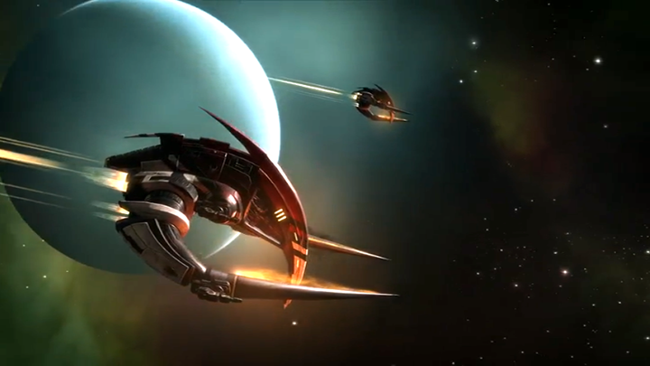

# Mithra's Gate

As Kalsibah woke up, a faint burning smell and a ringing in his ears first alerted him that something was wrong. Realizing through his waking confusion that not only was he sitting upright but also couldn't move, Kalsibah began to understand that he was no longer in his fortified dwelling hidden on the edge of the Curse region. He tried opening his eyes. No good. Something was preventing him from any deliberate use of his muscles. He was functionally paralyzed.

"He's awake." A female, otherwise neutral voice came from somewhere close behind Kalsibah. "All vitals are in the green." The speaker was evidently some kind of medtech. Kalsibah guessed that a nerve-blocker had been applied before waking him.

"Very good. You may relax the blocker's effects above, oh, the shoulders, I think." The second voice was quite different from the first. Apparently male, this speaker sounded quite relaxed in contrast to the first speaker's terse neutrality. For all of that, there was a hard edge of unmistakable authority to the voice. Clearly, this person was in charge here.

Kalsibah felt a sensation like a release of pressure in his lower neck and could suddenly move his head around. With the swiftness of the release he involuntarily opened his eyes, even as his head lolled forward before he caught the movement. The first thing he saw was the edge of the table that the chair he was sitting in was facing. As he raised his head, blinking away the last lingering fuzziness of sleep, he saw that a hooded figure was seated in the shadows on the other side of the table.

"I think that will be all for now. You may go." The figure seated in front of him was speaking to the person behind Kalsibah.

"I'll be next door then." A shuffling sound, footsteps, then the sound of a door unlocking and opening in a smooth sequence that implied an electromechanism. Another couple of steps and the door closed and locked behind the person that had just left.

Kalsibah had tried to look around but only the muscles of his neck and above responded, constraining him to look to one side and then the other. The room was quite dim apart from a pale, soft light that shone down from a lamp suspended just above head height over the table. He looked at the figure sat in the shadows and saw the light glint off his captor's eyes as they cocked their head to one side.

"Well, I'm sure you're wondering what all this is about," said the figure as he straightened up and leaned further forward into the pale circle of light. Within the folds of the hood was a face that was covered by a breather mask from the nose down. The eyes were very dark, seemingly black in the dimness, and narrowed as if their owner was deep in thought.

Kalsibah reviewed his options, decided he had little choice and steeled himself. He took a quick breath, closed his eyes and ran through a mnemonic sequence mentally. He frowned, nothing seemed to be happening to him. A chuckle from his captor interrupted him and Kalsibah opened his eyes to look at the masked figure sitting opposite him.

"I think perhaps we should get the formalities out of the way so that we can proceed without any illusions on your part," said the hooded man, his voice tinged with amusement. "You are Erik Kalsibah, known under various other names at various times and places. Most pertinently for today's discussion, until some time ago you went under the alias 'Rezhwan' and were apparently a member of the pirate gang known as 'Sariel's Flames'. Of course, we both know that wasn't quite the truth, don't we?"

As shocked as Kalsibah was, he had enough presence of mind to take another breath, close his eyes and run through a different mnemonic trigger sequence. The result was as bafflingly negative as before. Kalsibah opened his eyes to see the other man shaking his head in evident amusement.

"No, I'm afraid that you won't be able to trigger any of the various amnesiac conditionings that you acquired in your climb up the ranks of the Cartel. Let me also disabuse you of the idea of activating a suicide failsafe you might have embedded in your nervous system somewhere. None of that will work." The masked figure sat back and gestured airily with his right hand around the room. "As you've probably realized, we have access to considerable resources here. You have quite a medley of chemicals and nanotech coursing through your veins but I'll draw attention to three specific substances.

"First, you've been dosed with a standard but powerful anticonvulsant. This means that it is quite useless to continue attempting to trigger an epileptic seizure and neuron-firing cascade as part of your amnesiac protocols. Second, a very powerful neurosynaptic booster has been introduced into your system. This one enhances episodic memory, just to be sure that you don't forget anything we might be interested in." The man had been ticking off his points on the fingers of one gloved hand with the other and now raised three fingers in the air. "Third, an anti-thanatropic psychoactive is rather neatly suppressing the slightest inclination to seek your own death that you might have. While we don't have time to neutralize the various means by which you might commit suicide, we can block the impulse very satisfactorily."

Kalsibah found his voice at last. "If you're that well-equipped, and thorough, I'm surprised you don't just rip the information you want out of my brain. You people are running quite a bill in high-end drugs. Surely you can afford a burning scanner?"

"No doubt that would be the approach tried by some but, as you noted, we here like to be thorough and a burning scanner has the disadvantage of being a rather destructive and one-time only method of data extraction. Not to mention that running a burner on your brain would garner little more than a very large amount of very scrambled data, due to the counter-intrusion nanolace that's wrapped around and through your cerebrum.

"We have gone to some considerable time and trouble to bring you here, Kalsibah. We are not about to waste all that by attempting to use a burning scanner on you. No, my dear Kalsibah, that would not do. Besides, I am a strong believer in simple conversation producing the best results."

"Do you have a name?"

"Ah yes, my apologies. Call me, Narisaf."

"Narisaf, uh huh. Well, Narisaf, do you really think I'm going to tell you anything? Anything at all?"

Narisaf cocked his head slightly and appeared to reflect a moment before replying, "You surely have realized by now who I represent in this matter? Surely that is clear?"

In fact, the possibility that this Narisaf was hinting at had crossed Kalsibah's mind already, much to his discomfort, but he wasn't about to let his captor know that. "You could be working for anyone. What's to say this isn't a DED holding facility? Maybe a SARO black site? You could be a Feddy or a Botherer. You could be Guri. You could be a damned to the hells Sansha for all that it matters."

Narisaf regarded Kalsibah silently for a moment. Then he leaned forward and folded his gloved hands together on the table, before quietly saying, "Oriel seraphim eo potesta."

Kalsibah felt himself mentally reel and for a moment feared he would fall forward out of his chair, perhaps saved only by the continuing paralysis of his body below the neck.

"Now," said Narisaf. "Tell me all about Mithra's Gate."

* * *

Mithra's Gate is a sungrazer. It's a comet. One of those that swing in very close to the primary star out of a high orbit in their system. Sariel had information about it. It’s an old legend in the Cartel because of where it appears. But you know that, right? Right.

Well, Sariel had figured like everyone else that it was one of the wandering stars from the old Amarr myths of the Early Reclaiming. The stories go that every time the Amarr "reclaimed" a star system back then, they would wait for a divine sign and then along comes a comet and its track points in the general direction of the next target for the "exploration fleet". Yeah, well, that's a nice story and probably it went over well with the faithful.

But Sariel kept thinking about it more and more. Why "Mithra's Gate"? That name niggled at him. He said it was a very old name as well, "Mithra", that is. Much older than the Early Reclaiming. Older even than the Conquest of Athra. It's the Amarr, we said, they use a lot of old names all the time. But he said this one wasn't used much at all. Why's that? Well, he found out why. And that's when he really got excited. You know why? Yeah, I figured.

The Flames had some trouble not long after. Had to deal with it and we didn't hear him talk about Mithra's Gate for a while. But he'd been digging into it quietly. I think he'd grokked that the Flames were uneasy about it. We might not have been Cartel anymore but still, you learn to respect that kind of thing, and you remember the lesson even after you've left the Cartel behind you. Anyway, despite that we found it. Well, he found it. He got the orbital elements of the comet from a source in the Mandate. An old freelance archaeotech buddy of his.

That was it. Sariel insisted on going and needed a team. There were thirteen of us. Pilots, archaeotechs and some ground muscle. We took four Dramiels and a Wreathe along. Pretty standard crew for a pick and strip operation.

Mithra's Gate was way up towards the top of its orbit. It still is. It'll be up there for years before it swings back towards the primary. The orbital inclination is something like fifty degrees. Well we made fine time. We force-locked the warp drives onto celestial co-ordinates on the orbital path close enough to where the comet was. Got up there Drammies, Wreathe and all. Then it was a burn after the comet for the final stretch.

It didn't take long. Well, not for Sariel and me. We took our Drammies ahead and left the other two with the Wreathe. Just to be safe. Approaching a comet on full burn should be a show, right? Yeah, not so much when it's over a hundred AU away from the primary. That ball of ice and rock is frozen solid up there. No outgassing.

Sariel though, he put on his own show. He was excited. He fired up the plasma torches on his Drammy's tusks. Nobody to see them but us. He always was a bit loco though. We all liked using the burners to put the fear on and distract rubes but he liked to fire them up just for the sport.

Well, anyway we caught up with the snowball soon enough. Except of course it wasn't just a snowball. Oh sure, it was a comet. Pretty big one, but a comet. At least it seemed likely it was originally a standard comet in a sungrazer orbit. Of course, Sariel wondered if that was the truth of it. But that was beside the point when you realized that someone had carved a large tunnel along its main rotational axis and then dug out a vault, right into the core of the thing.

That access tunnel was large enough for the Drammies to travel down it with a fair bit of clearance. Obviously, whoever built it had intended it for small ships. We weren't going to get the Wreathe in there though. Which suited us fine. Sariel had been thinking that a structure might be on the surface or behind a manhatch. If we could even take the Dramiels inside it would be a bonus.

I didn't really understand how we were going to get the hangar doors open though. They were obvious enough, even when Sariel shut his damned burners down and relied on his Drammy's spots. My thinking was that we'd cut in through an access hatch. There were a few of them around the edges of the hangar doors. But it turned out not to be necessary. A few minutes after we got close, the doors opened and we took our Dramiels inside.

Sariel said he'd hacked his way in. Maybe he did. But it spooked me some. This was an old vault. Ancient. You can hack in eventually, if you know your stuff. But he had the doors open in a few minutes. It didn't sit right with me.

* * *

Narisaf held up a hand to pause Kalsibah's account. "You say Sariel had the main doors open within minutes?"

"Yeah. I wouldn't have thought it was enough time to work out the handshake protocols, let alone hack the system. But he got them open anyway."

"No, it probably was just about enough time to transmit a handshake, wake the system up fully and send over a valid access code. He could not possibly have hacked that security in mere moments. Your friend Sariel had the code. The question is, where did he get it from?"

"I don't know. I mean, he had the location. Maybe," Kalsibah's voice trailed into silence. He shook his head doubtfully, would have shrugged but for the nerve blocker.

"You mentioned a contact in the Mandate. An old archaeotech friend of Sariel's. You were at the meeting with this person?"

"What?" Kalsibah blinked. Had he said that? Probably. He wasn't holding anything back what with the drugs and the knowledge of who Narisaf represented. "Well, yes, I guess I was there when Sariel met up with him."

"Tell me about this meeting."

* * *

Sariel's contact was based in Khabi. It's a big system, lots of belts and moons. A lot of miners, salvagers, all sorts of scratchers and looters. The Mandate's mostly inactive out there. Ammatar Fleet has a couple of listening posts, a few patrol boats. That's it. No orbitals. No stations. A couple of dirtside bases. Khabi VIII is a temperate but it's basically a huge jungle. Hot, humid. Mining at the poles though. Most of the barrens have something going on like that. The moons and belts are where the action is though. The gas giant systems are where it's all going on.

Then there's Khabi XIII, the little outer barren. It has a couple of decent underground cities. The miners and such from all over the outer planets use them for extended downtime. Anyway, we went to the third city. It's not much more than a transit launch station with a town built under it. They didn't even bother to change the name from "Basecamp 3" like the two big cities did. Well, everyone just calls the place "Basecamp", of course.

The town's as you'd expect. A dump. There's a lot of flophouses and coffin-racks for miners and the like to stay in. There's a couple of hotels for the factors and merchants. The residents live deeper in, where it's quiet and away from the bars. There are ten or so bars. They're all dives and full of scum. If you're tough enough you might get a decent drink in a couple of them. We were meeting Sariel's guy in one that had backrooms where factors would meet mine chiefs to haggle over ore weights and prices.

Sariel's contact was waiting for us in a room he'd already secured. The guy was dressed in a survival suit. Full armor with a duster over it all. Good armor too. Not bulky. Flexible where it needed to be, hard as tungsten carbide where it counted. I took him for a beltborn or something like it. Space-adapts don't take to being in a gravity well without a support system too easily. It's impossible for some of them. He was sitting in the corner there, fiddling with pads, some trinkets, all sorts of bits and pieces. I marked him for an archaeotech straight away. I guessed he was a specialist in space-archaeo. Good work if you have a decent rep. He had money from the look of his rig.

Sariel wanted to talk to him quiet like. So, I just sat over by the window. But I kept my eye on them both. I could see they were arguing about something. Nothing heated though. It sounded and looked more like haggling. The archaeotech swapped a datastrip for a bit of blacktech I knew Sariel had pulled out of a dead rogue hive a while back. Sariel asked the archaeotech a couple of questions. Well, I knew Sariel wasn't happy with the answers but the guy was shaking his head. Then Sariel pulls out a trinary laminar cryschip. I had to hold myself down. Trinary laminar will go for millions on the black market.

The archaeotech just looks at Sariel holding the cryschip under his nose for a second. Then he picks up something. I couldn't see properly from where I was. Couple of trinkets or something, and he throws them onto this flat dish he's got on one side. Then he nods, takes the cryschip, holds it to the light and then puts it on that dish. I saw him pick his trinkets up and kind of fiddle with them in one hand for a minute. Then he picks the trinary laminar back up and gives it back to Sariel.

Then we left. In a hurry.

* * *

When Kalsibah finished his account of the meeting on Khabi XIII, Narisaf drummed the fingers of his right hand on the surface of the table for a span of seconds. "You mentioned some 'trinkets' that Sariel's contact was playing with. You didn't see clearly but if you had to guess what they were, or if they even reminded you of something, what would that be?"

"Well," began Kalsibah slowly. "I suppose they reminded me of something I've seen in Ni-Kunni clubs now that you press me. There's a game they play. For money. You know what the Ni-Kunni are like. I've seen them play it. Maybe some of the Caldari guys play a game where they throw these counters around. I don't bother with it, cards are more my speed. Or maybe a little cutout-clash."

Narisaf slowly nodded to himself and said nothing more for a few minutes. "Well, I think I've heard enough about this archaeotech. Back to Mithra's Gate. You got inside, what then?"

We landed the Drammies under manual thrust. Whatever hacking or, yeah, maybe codes, Sariel had used got us in the door and through the hangar locks but that was it. I guess the landing plats had plenty of guidance and autonav tech built in but none of it was working. Of course, there weren't any ships in there. Not even a shuttle. Nobody gets that lucky, whatever anyone tells you five bars later and two hours from dawn.

Well, we were a team of four to start with. Sariel and me. Pulasi, our best archaeotech, had come in on Sariel's ship. I had Laselle, one of the combat engineers with me. The rest were back with the Wreathe and we'd commed the other Dramiels to ferry them in.

Internal doors kept working as we poked around, so we made our way deeper in. Laselle wasn't happy about the pace we made but Sariel wanted to hustle. He had the idea there was something important in there. I thought he was probably right. The whole place had the feel of a standby facility of some kind. Couldn't figure out the era though. It felt old. But someone had used it relatively recently. There was a lot of adapted tech engineered on top of the original build. That new stuff was Third Empire. You couldn't mistake it. The substructure and facilities tech was harder to place.

Of course, the probability was it was some faction of Second Empire Jove. Definitely not one of the main factions. Had to be pre-collapse by some way. We assumed someone from the Third Empire had tracked the place down. Maybe found a reference in some surviving records. Then came out here and took whatever was useful to them. I doubted we'd find much that was really valuable. The Third stuff that was bolted on was mostly power and environmental tech. Almost all of it was standard tech that the Directorate or Society had shared a long time ago. Some bits we could salvage for good money though.

Sariel was sure we'd find something worth our while. He had our team of four going in and down to the core while the others were still ferrying in. The deeper we went the more things were missing from the original build. Looked to me like a lot of data storage and processing hardware had been pulled. No surprise. The Third Empire had always gone hard after that kind of thing in archaeo sites they'd located. There was some very strange manufacturing and power rigging in places. It was original stuff. Some pieces were taken out of the setups. Probably local processors and storage.

We got to the central facilities hub after a couple of hours. The rest of the crew were in the hangars and taking it slow from there. Sloppy logistics. Two groups bunched up at either end with no runners or stringers in between. Laselle was close to pitching a fit by now but Pulasi was full-on with Sariel. Kept talking about it being a kind of biotech facility but industrial, not a research lab or anything. The place did have a lot of nanofab capacity by the look of it. Some very weird nanofabs but still, heavy-duty and backed with a lot of power generation. All dead without the processors and fuel cores though. Yeah, they seemed to have been pulled too, far as we could tell.

Then we got to the morgue. Well, more like it was a bank or library. Sariel thought so at first. No bodies but a lot of coffin capsules racked all the way up three walls of that place. It was big. Hexagonal plan. Two entrances. A whole wall filled with biotech and huge nanofabs. And three walls of empty coffins. And then there was the thing in the center of the room.

The back wall was a clone blank printing fab. Had receptacles for running off three blanks at a time. Full rig in triplex. Could obviously print everything from the bones to a synth-synaptic gel-brain or some equivalent. Some pieces were missing, of course. Pulasi thought all the cyber-implanting gear had been stripped out and the base pillars were empty. Data stores and processing taken again.

But so what? The thing in the center, man. A quantum entangled 4-helium engine with tripled outputs. Just sitting there. The motherlode. More than a motherlode. Steal enough QE 4-He and you're a billionaire, maybe better. But if you have a QE 4-He engine then you're not just a trillionaire, you're a power. True independence. And this thing was small. I mean, QE facilities are big. Dedicated orbitals or fab bunkers. We could take this with us.

Laselle wondered why it had been left behind. Sariel and Pulasi didn't care about that. But I thought Laselle had a point. It was ancient tech. It looked intact. The thing still had all its storage and processing. When you took a look inside it you could see why it hadn't been stripped. The storage was biotech, synth-synaptic or maybe even cultured. You couldn't pull it without destroying it. I looked at the output arrays too. Honestly, I didn't like what I saw. I think it was designed to implant the QE 4-He using nano-adapted biotech.

Fact is, I think it was a transfer setup. I think the whole place was basically a transit station for moving people around using QE transfers. Moving personalities around. And it was way beyond us. Sariel decided we'd take the engine out of there. It could be uncoupled from the substructure. But I wondered why it had been left in place.

* * *

"Did you keep wondering?" Narisaf had leaned forward to stare into Kalsibah's eyes.

"Yeah, no. When I saw the data conduits and couplings were intact all the way down, I pretty much didn't wonder anymore. There were vaults down there. Left alone. Probably a lot of stuff deeper in had been left alone. Maybe the whole FTL transfer system was still intact. The Third Empire people had wanted to keep that functional. At least until they'd had a chance to come back, I guess."

"Which chance you presume they never got?"

"We'd have gone back if we had the chance. The Thirds? I think only one thing would have stopped them going back."

Narisaf leaned back and exhaled hard, the sound of it rasping through his breather mask. "Yes, only one thing. One way or the other. But you didn't get the chance either, did you?"

Kalsibah grimaced. "No. No, we didn't get the chance."

* * *

With the whole crew down there, we managed the job easily enough. The couplings on the QE engine were straightforward. A rig, some muscle and a gravsled did the rest. We loaded the engine into a thrust box. From there it was just a case of sending it on out for the Wreathe to pick up. We stripped out whatever else looked like it would fit into our other thrust boxes and the frigate holds. Then we got out of there.

Where did we go? Yeah, well, we shipped out of there quick. The plan was to roll through some wormholes rather than take a gate out. So, we did that. Took a few hours but we got close enough to base. Then we took smuggler gates and slipped through. Got pretty close to home.

We got in sight of home. Before we were ambushed.

The cruiser came out of nowhere. Someone had talked. Someone had set us up. It was a Vigilant, must have been egger-piloted with its speed and agility. Came in close, webbed one of the other Drammies and blasted it apart before we knew what was going on.

Sariel called us onto the Vigilant while the Wreathe tried to get away. It was already on a heading for our cargo facility. Sariel was crazed though. He fired up his plasma torches and went screaming in after that cruiser. Me and the other Drammy followed him in.

It was a hard fight, we were running scrams and webs too. Sariel's strat was sound. Get under the guns, orbit at super high-speeds. Problem was, it's a Vigilant. It's an egger Vigilant. And the pilot was no rube. Must have been a veteran. They knew what they were doing. I got taken out next, shot up on the turn. Plasma ripped through my engines. You know the Drammy's a good ship. Tough. We had escape cockpits too. Pretty good chances. I blew the cowling and plates, and got the hell out of there.

Those escape cockpits don't really give you a good view of things with their own sensors. No ship sensors or cam drones makes for a fuzzy sense of what's happening outside at a thousand meters a second. Far as I could tell the Vigilant was winning.

The base was a bust but we had our own bolt holes all over the system. My escape cockpit took me to one of mine.

Sariel? I guess he got away. He's still running the Flames. I don't know what happened to the Wreathe. I cleared out of the system. Lost local contact but I heard over chatter that Sariel suspected a mole so I pulled the plug on my infiltration mission. Cartel were pretty happy with Sariel's operation in that region being splashed.

I didn't report the whole story. I thought that'd be a quick trip into an interrogation cube. Guess I ended up in one anyway.

* * *

"Of course, you remember the orbital elements," said Narisaf expectantly.

"The orbital elements?" Kalsibah looked confused.

"For Mithra's Gate. The comet's orbital elements. As you might guess, we have an interest in visiting it."

"Um, no, I don't think I ever knew them."

"You flew a Dramiel there. You warped to co-ordinates on its track."

"I guess Sariel fleet-warped us there."

"You're in the habit of using fleet-warp on archaeotech expeditions? Come now."

Kalsibah frowned. "I, no. I mean. I don't know them. I've forgotten them."

Narisaf stared at Kalsibah. "No, I don't think so. Forgotten? No. Had the memory of them removed is more like it."

Kalsibah shook his head in confusion.

Narisaf drummed his fingers on the table again. "Well, you remember enough, I think, to work back through all this. Let's talk about the meeting with that archaeotech friend of Sariel's again."

"Wait, wait, how long is this going to go on for?"

Narisaf sat back, steepled his fingers and gave a Kalsibah a dispassionate look. "Oh, it's going to go on for as long as it takes. And, Kalsibah, I'd hope your memory isn't too patchy if I were you. For your sake. Now, tell me about Khabi XIII again, and this time, don't leave out a thing."

~*~
